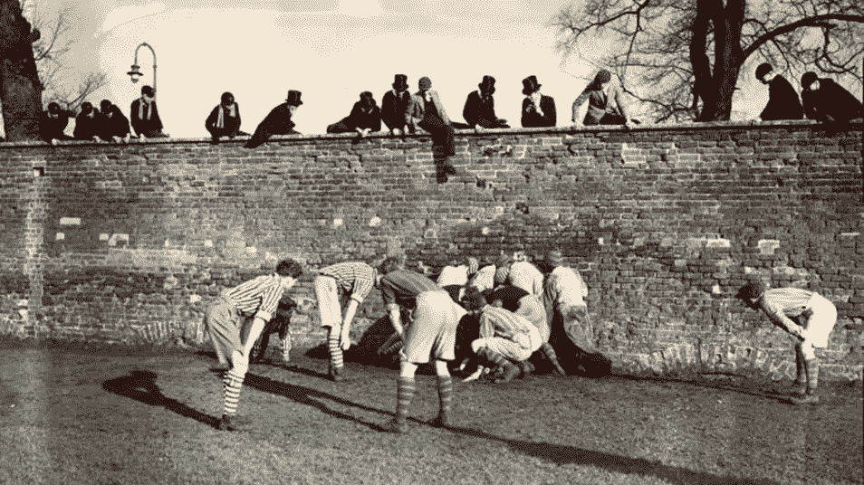

# 我们是不是故意对学术出版需要的转变视而不见？

> 原文：<https://medium.com/swlh/are-we-being-wilfully-blind-about-the-transformation-thats-needed-in-scholarly-publishing-d0bfb61d1f05>

## 开架借阅

在这篇文章中，Toby Green 探索了最近流行的“变革性的”阅读和出版协议，并怀疑它们是否真的是提供负担得起的开放存取所需要的。

Eton Wall Game, 1936\. Photograph by Stanley Devon/Times Newspapers.

足球和橄榄球等全球性运动起源于 19 世纪的游戏