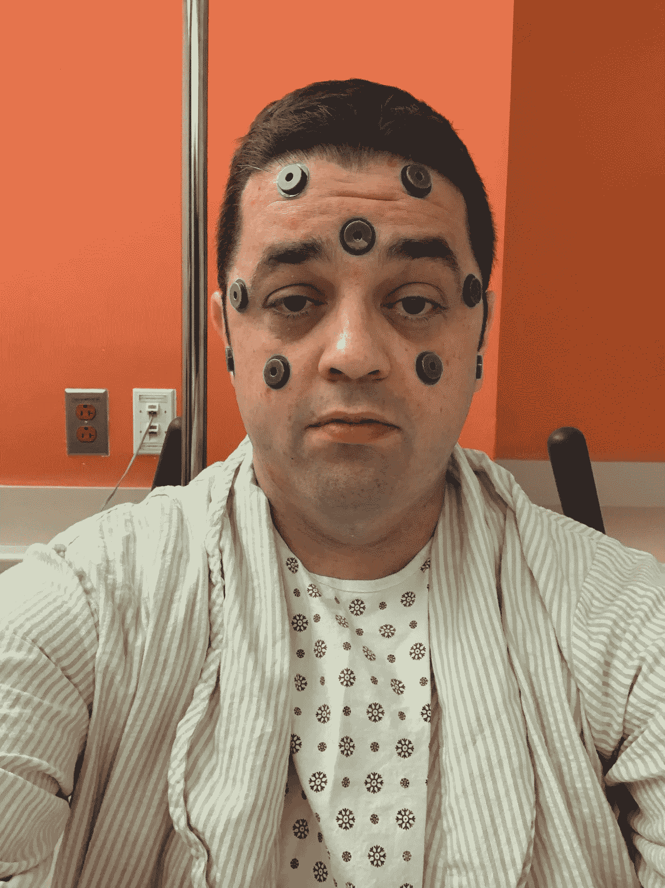

# 我们是我们的伤口吗？

> 原文：<https://medium.com/swlh/are-we-our-wounds-eb6cbe97ff21>

## 创伤问题以及它在我生活中扮演的核心角色

Awaiting my third neurosurgery — October 11th, 2018

这篇文章讨论了全身性创伤、身体和精神疾病、自杀意念和性暴力。如果这些主题中的任何一个正在触发你，请小心。]

我直到两年前才知道“创伤”这个词的全部含义。我以为它的意思是“一种…的状态”