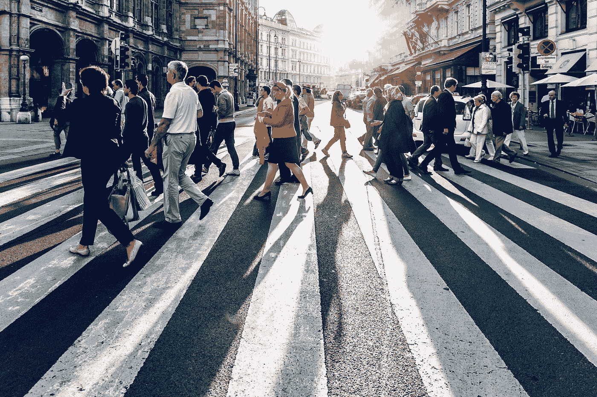

# 我们正在梦游进入一个控制社会吗？

> 原文：<https://medium.com/swlh/are-we-sleepwalking-into-a-control-society-b7156b803ba6>

城市数据用于追踪问题，甚至在问题发生之前。听起来很安慰？除非当局打算干预我们的预测行为。

Photo by [Jacek Dylag](https://unsplash.com/@dylu?utm_source=medium&utm_medium=referral) on [Unsplash](https://unsplash.com?utm_source=medium&utm_medium=referral)

从市民那里产生的数据有很长的历史，用于了解城市生活、制定政策、解决城市问题、指导运营治理、模拟可能的未来以及解决各种各样的其他问题。因此…