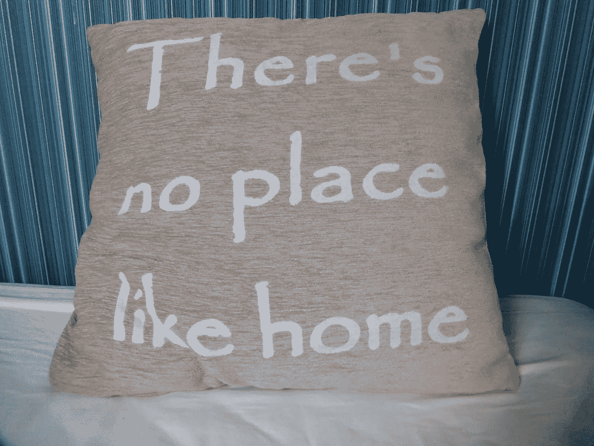

# 我们现在真的处于末世吗？

> 原文：<https://medium.com/swlh/are-we-truly-in-the-end-times-now-73a44cfde85f>

你工作的哪一部分能影响小领域，进而影响大领域？

*第六次灭绝，我们共同的气候改变世界的时代，就在这里，但对于大多数技术和科学来说，这是一个更好的方式的开始*

## 第六次灭绝

伊丽莎白·科尔伯特获得普利策奖的书，*第六次灭绝*，概述了人类如何…