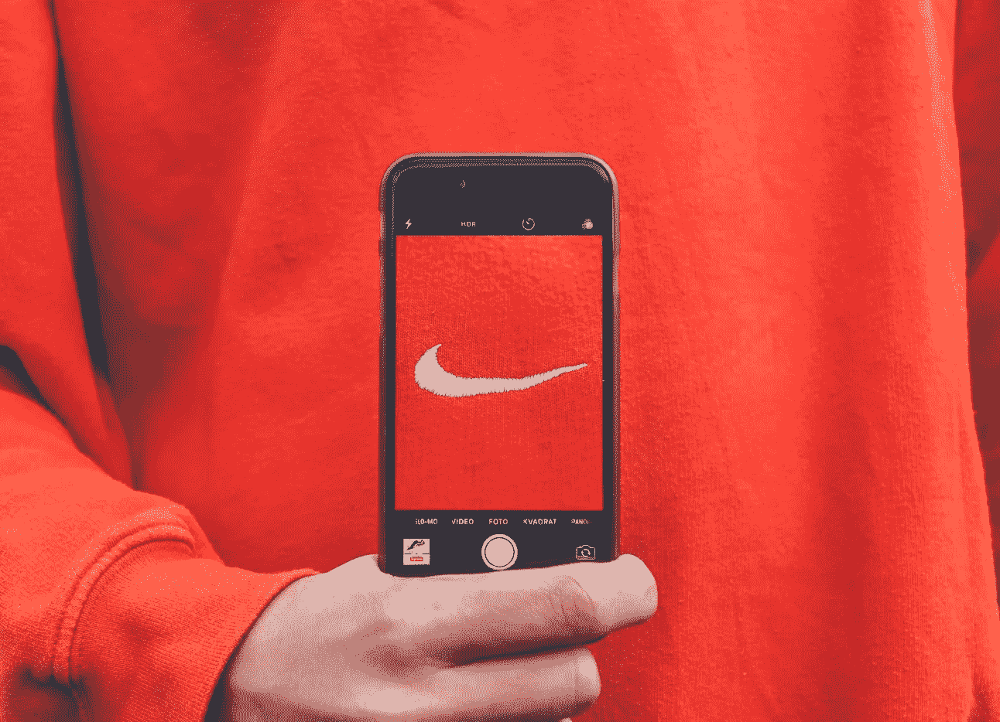

# 你是否为自己公司的糟糕品牌感到内疚？

> 原文：<https://medium.com/swlh/are-you-guilty-of-bad-branding-for-your-startup-b7980586bf9b>

Do you recognize this tick? Branding at its finest.

> **77%的 B2B 营销领导者认为品牌对增长至关重要—** [**圈子研究**](https://www.circle-research.com/wp-content/uploads/B2B-Branding-Research.pdf)

然而，尽管品牌在任何公司中都有着举足轻重的地位，但它在一个商业领域却常常被忽视。

# 创业公司。

我看到的常见误解是**‘我们是一家初创公司，我们需要首先专注于我们的产品’。**