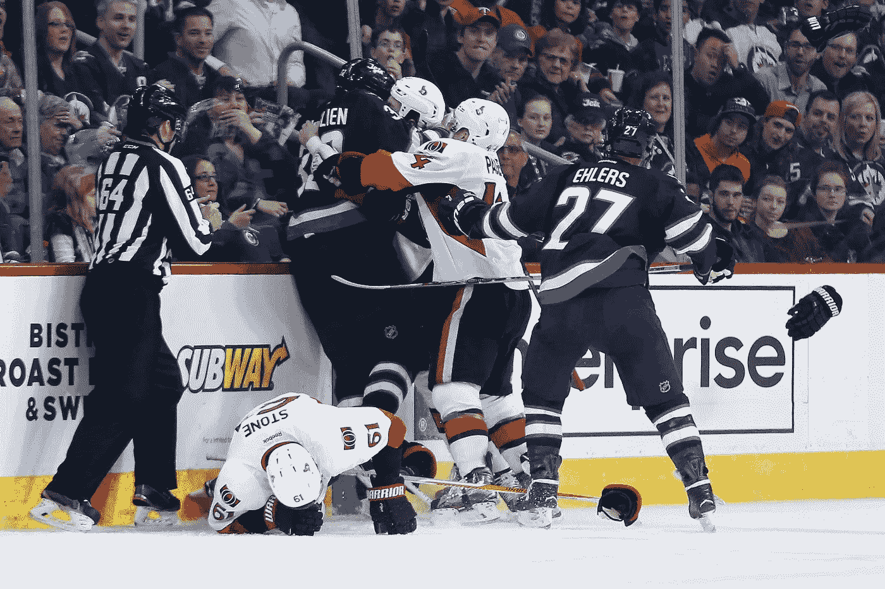

# 一个不科学的幸福公式。

> 原文：<https://medium.com/swlh/are-you-happy-now-c68631825fb1>

## 因为没有苦，宝贝，甜就没有甜。

Photo by [Andre Hunter](https://unsplash.com/@dre0316) from [Unsplash](https://unsplash.com/)

在一句日本谚语和我父亲的建议之间的某个地方，在另一个队的一个大孩子完全毫无悔意地把我打得屁滚尿流之后，我想我已经想通了事情。跌倒七次，站起来八次。除非什么东西坏了，或者你看到了重影，否则马上站起来，就像它不会影响你一样我相信获得幸福的关键在于有能力振作起来，掸掉短裤上的灰尘，继续前进。不管有多痛。除非什么东西坏了，站起来。

所以我学会了承受打击。

Dustin Byfuglien on Mark Stone

就像我刚进入广告业时，我在市里一家顶级机构的实习被取消了，因为两个员工搞砸了。我又站了起来。

当我搬到蒙特利尔加入我梦想中的公司仅仅 7 个月后被解雇时，我又重新站了起来。(4 个月后被重新雇用。唷…)

甚至当我因为在院子里小便而在周五晚上在同事面前被赶出酒吧的时候…(等等。我想说的是，浴室已经满了，所以我出去在雪地里撒尿。我们都经历过。)

你明白了。

事情是这样的。我以为我已经想通了，但是当我准备迎接下一次打击的时候，我错过了确定幸福对我来说到底意味着什么的机会。也许有一次当生活让我焦头烂额的时候，我应该停下来想想我真正想要的是什么。当然，后见之明是二十对二十，但它帮助你用更清晰的眼睛看到未来。

我也没有意识到理解你想从生活中得到什么并不容易。所以我收集了这些完全不科学的原则来引导我们这些吃屎的人去 Smilesville。

# **1。找到值得失败的东西。**

正如金·凯瑞在他传奇的[毕业典礼演讲](https://www.youtube.com/watch?v=V80-gPkpH6M)中给 2014 届圣雄管理大学毕业生的建议:*“你可能会在你不想做的事情上失败，所以你还不如冒险做你喜欢的事情。”*

所以暂时忘记未来吧。我不是说停止回收，我只是说计划不会保护你。有一个可能是一种解脱，但是计划失败了。思想会改变。最糟糕的事情莫过于在努力完成一半的时候，却发现事情并不是你所期望的那样。不过没关系！我们都会失败。重要的是花时间弄清楚什么是真正值得首先失败的。

# **2。你自己想想。**

好莱坞知道，Instagram 和脸书也知道。就连那个面霜也知道你到底想要什么。那你为什么不呢？也许这是源源不断的理想素材，永远推动着众所周知的目标，只是稍微有点遥不可及，决心让我们在追求幸福的过程中成为被动的观察者？但是快乐不是一项观赏性运动。所以，想想你的生活，你需要什么，什么会让它变得精彩。为了*你*。留出时间为自己考虑。

# **3。专注于你想要的。**

想知道自己如何符合标准是很正常的。如果你天生好胜，这几乎是不可能避免的。问题是，没有尽头。总有人比你拥有更多，或者看起来比你更了解。有一天你会在你漂亮的房子里醒来，穿着漂亮的衣服，你会想你的生活去了哪里。成功不等于幸福。朝着你想要的努力，而不是你没有的。

# **4。解决过去是不可能的。在场。**

也许你因为一段失败的感情而错过了一个职业机会。也许你把自己限制在社区大学，数学不及格，然后在暑期学校转到“大学水平”，因为暑假！！！也许决策对你来说是一个致命的弱点。随便啦。这些都不重要。试图弥补过去的错误永远不会让你快乐。从你的决定中学习，做出更好的选择。专注于你今天能做的事情。

现在你知道了。也许你和我一样，仍在试图找出你对幸福的理解。或者也许你已经知道了，你正试图找出如何得到它。无论如何，我祝你在未来的战争中好运。记住，唯一真正的智慧是知道自己一无所知，琼恩·雪诺。所以，为你优柔寡断的悟性感到安慰吧。

> 字幕引用电影《香草的天空》中卡梅伦·克罗的话。