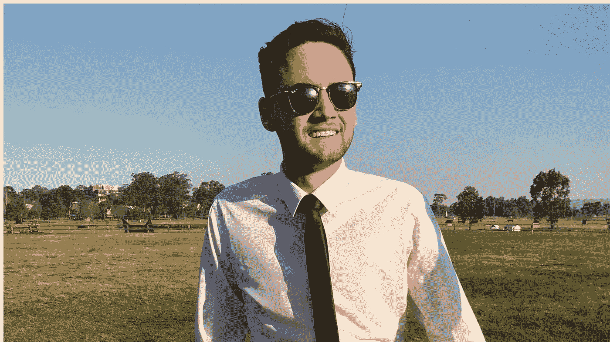
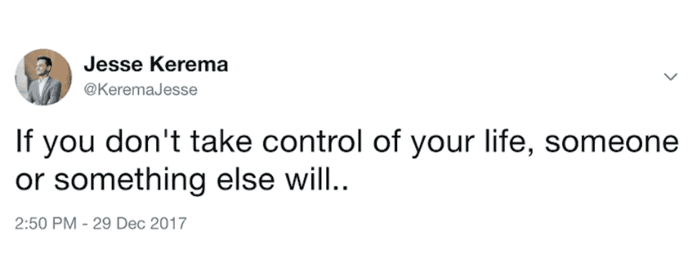

# 你今天过得不好吗？有一个解决办法

> 原文：<https://medium.com/swlh/are-you-having-a-bad-day-3d34914d9eeb>

关于糟糕的日子，我学到了一件事，那就是它们不会就这样发生。

你不只是“过了糟糕的一天”，这不是什么不幸的事情。

你对你经历的每一个*糟糕的一天*负有直接责任，而每一天都是可以避免的。

我讨厌听到人们的借口，把它归咎于“过了糟糕的一天”。

一旦你掌握了发生在你身上的一切，你就不再找借口，开始着手解决问题。

我有一个朋友因为在平安夜超速行驶被警察抓住了。你知道他说了什么吗？他们的圣诞精神呢，我只超速了 12 公里。在他心里，其实是警察抓他超速的错，不是他超速的错。

# 糟糕的日子是生活的一部分！

我最近过得很糟糕。

我糟糕的一天的简要概述如下:

由于前一天没有吃药，我醒来时感到非常不舒服，我因为没有在我的车上挂“P”牌而被拦下来(幸运的是我没有得到罚单)，我错过了为我的溃疡性结肠炎进行输液的预约。

一开始，我把这一切都归咎于糟糕的一天，但后来我开始思考，并注意到所有这些事件都是可以避免的。

*   我在吃药前睡着了。当我睡着的时候，我在想我应该如何服药。第二天，我付出了代价。
*   我已经有几个月没戴上 p 牌照了。在某个时刻，我注定会被抓住。
*   我以为我的约会是第二天，甚至没有检查。

**我的一天不是“一群混蛋”，而是我懒惰。这不是糟糕的一天。我在不知不觉中为失败安排了一天。**

对于你经历过的每一个糟糕的日子，我保证你可以追溯到你做的某个糟糕的决定。

# 你不配拥有更多！

我希望你能更进一步。我希望你把它应用到你的生活中。

你在你应该在的地方，你得到了你应得的。不多不少。

你越早意识到这一点，你就能越早开始改善你的未来，但你需要首先承担起责任。

换个角度来看，如果你信任某个人，而他没有兑现。是的，信任他们是你的错。所以把它当成一次学习，不要再相信他们任何事。

如果你冒着超速的危险准时到达某个地方。是的，不管现在是什么时候都是你的错。

在我的结肠炎中，我经历了一个将我的疾病归咎于一切和所有人的巨大阶段。总是别人的错。这意味着我经历了“为什么我不能”的阶段。

为什么我不能像其他人一样每个周末都喝酒？

为什么我不能在耀斑期间喝咖啡？

嗯，答案是‘因为我不能’。这就是生活。我会经常做一些我知道自己做不到的事情，然后假装很惊讶自己突然爆发了。一旦我意识到我是问题所在，我的情绪爆发就很少了。

# 那么，如何获得更多呢？

没你想的那么难。

人们经常会迷失方向，陷入更深的漩涡。

嗯，至少他们认为他们知道。

而事实上，一个简单的思维转换就能解决所有问题。

你要做的一件事是:

> 承担责任！

主要的问题是人们喜欢责怪他们周围的人。

他们正在考虑任何事情来确保他们实际上不必为他们的集群乱搞承担任何责任。

虽然这给了你一点短期的安慰。

这对你的个人成长是灾难性的。

看，责备别人并不能解决问题，你只是在隐藏它。

> 发生在你身上的任何事情都是你的错。

如果你依靠你的朋友为你完成某件事，而他们完全忘记了这件事。那是你信任他们的错。

*如果你经营一家电子商务商店，而支付系统出了问题。那就是你没有备份的错。*

你越早意识到这一点，你就能越早开始取得重大进展。

从现在开始，你需要停止责备任何人和任何事，开始负责任地对待。否则，你将永远无法专注于解决方案。

# 如果你喜欢这篇文章，给它 50 个赞，这样那些心情不好的人就会看到它！

## 这篇文章发表在[《创业](https://medium.com/swlh)》上，这是 Medium 最大的创业刊物，有+415，678 人关注。

## 在这里订阅接收[我们的头条新闻](http://growthsupply.com/the-startup-newsletter/)。

