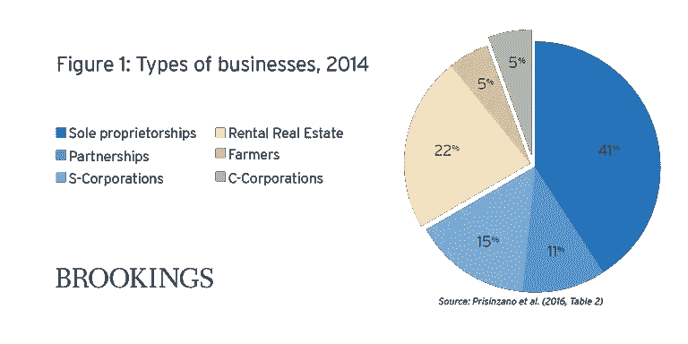

# 你达到新的 49.5%税率了吗？(提示:你可能是)

> 原文：<https://medium.com/swlh/are-you-hitting-the-new-49-5-tax-bracket-hint-you-might-be-2225b953037b>

**Photo by** [**stevepb**](https://pixabay.com/en/users/stevepb-282134/) **on** [**Pixabay**](https://pixabay.com/en/)

当国会通过 2018 年减税和就业法案(TCJA)时，其意图是降低所得税。一般来说，这正是所发生的事情。

不幸的是，法律的复杂性创造了一个(可能是无意的)“危险区”收入等级，边际税率接近 50%。这意味着，在这个收入范围内，每挣 1 美元，就有近 50 美分要缴纳所得税。

## 快速背景

新税法给予 C 类公司(想想卡特彼勒、福特和沃尔玛)40%的大幅减税。最高企业所得税税率从 35%降至 21%。这个想法是为了帮助美国跨国公司在全球舞台上更有效地竞争。

然而，一大部分美国私有公司并不是 C 类公司。根据布鲁金斯的数据，只有 5%的美国公司是 C 类公司，其余 95%是 S 类公司、合伙企业和独资企业。

Source: [Brookings](https://www.brookings.edu/research/9-facts-about-pass-through-businesses/)

构成 95%的这些实体被称为“直通”。这是因为企业本身并不缴纳所得税，而是将它们的应税收入“转嫁”到所有者的个人纳税申报单上。

个人税率降低了，但没有 C 公司税率那样显著。由于转手所有者根据个人税率纳税，如果不进行干预，新法律将会不公平地偏袒 C 类公司。

为了有助于保持公平，新法包括了针对转手车主的**税*扣除*** 。扣款是他们转嫁收入的 20%。例如，如果一家 S 公司只有一个所有者，应纳税所得额为 100，000 美元，那么该所有者只需缴纳 80，000 美元的税款。(**请记住，本文中的所有插图都过于简单，并且明显忽略了规则的可能例外**)。

这里有一个大问题:对于某些类型的服务行业(如咨询、健康、会计、法律、金融服务、体育等。)，**20%的扣除开始消失**单身纳税人的应纳税所得额为 157，500 美元，已婚共同(MFJ)纳税人的应纳税所得额为 315，000 美元。

## 为什么这很重要

让我们比较两个不同的纳税人，乔丹和萨姆。乔丹从一家咨询公司获得 315，000 美元的收入。Sam 从类似的业务中获得 415，000 美元的收入。

为了简单起见，让我们假设两个纳税人的业务收入恰好等于他们的应税收入(扣除 20%之前)。此外，他们都提交了已婚联合(MFJ)报税表。

乔丹有资格获得 20%的扣除，这使他的应税收入降至 252，000 美元(315，000 美元 x 80%)。应用税率表，他的总税额为 49，059 美元。

Sam 的收入为 315，000 美元，还欠 49，059 美元。不幸的是，对于每一个超过 315，000 美元的收入，Sam 开始失去 20%的扣除额。当他的收入达到 415，000 美元时，20%的扣除额将完全取消。

由于 Sam 的收入为 415，000 美元，因此他没有资格获得 20%的扣除，即使是收入的前 315，000 美元。应用税率表，他的总所得税将是 96，629 美元。**山姆只比乔丹多挣了 10 万美元，却多欠了 47570 美元的所得税**。山姆对额外的 100，000 美元的有效税率基本上是 47.57%！

情况变得更糟。

## **儿童税收抵免**

新税法慷慨地将每个合格儿童的儿童税收抵免从 1000 美元增加到 2000 美元。在这方面，淘汰也是从一定的收入水平开始的。对于这种信用，当修改后的调整后总收入(MAGI)达到 400，000 美元时，逐步淘汰开始。在这一收入水平上，超过 40 万美元的收入每减少 1000 美元，儿童税收抵免就会减少 50 美元。

假设萨姆和乔丹都有三个孩子有资格享受儿童税收抵免。这意味着乔丹将从上面计算的 49，059 美元的税单中获得 6，000 美元的儿童税收抵免。这项抵免使他的总税额降到了 43，059 美元。

萨姆将得到他的 6000 美元儿童税收抵免的一部分，但不是全部。他修改后的调整后总收入(MAGI)为 439，000 美元，因此**他将损失 1，950 美元(39 x 50 美元)的 6，000 美元信贷**。这使他的儿童税收抵免降至 4050 美元。他将欠 92，579 美元的所得税(上面计算的 96，629 美元减去 4，050 美元)。

萨姆现在欠了 49，520 美元(他的 92，579 美元减去乔丹的 43，059 美元)(T10)比乔丹多交了税(T11)。这意味着他多挣的 10 万美元中的 49.52%将用于缴纳所得税。这还只是联邦税！

## 州税

如果 Sam 住在有州所得税的州(大多数州都有)，他必须将他的有效州税率加到 49.52%的联邦税率上。很有可能，这将使收入在 315，000 美元至 415，000 美元之间的人的总税率达到 55%，甚至更高。

请注意，当 Sam 超过 415，000 美元的门槛时，他的边际税率将回落到 35%或 37%的税率表税率。极高的边际税率特别适用于收入范围在 315，000 美元至 415，000 美元之间、拥有以个人服务为基础的企业和子女的企业主。

## 规划机会

为了逃避交税而逃避挣钱是没有意义的。然而，让我们假设你处于萨姆的位置，除了你今年挣 415，000 美元，但明年只有 215，000 美元。

根据这一事实模式，如果两年的总收入都是 315，000 美元(两年的总收入相同，只是在这两年间相等)，则两年间支付的总税收将显著减少。你可以考虑安排你的事务，以平滑每年的应税收入。

## 最终外卖

1.  弄清楚你的转手业务是否要逐步取消 20%的扣除额(许多业务，如制造和建筑公司，甚至奇怪的是工程公司，都不在逐步取消之列)。
2.  确定你的收入水平是否会偶尔落在“危险区”的收入范围内。我的意思是这一年你在范围内，第二年就不在了。
3.  如果前两个问题的答案是肯定的，那么明智的做法可能是寻找机会，在几年内更平均地分配收入。这是你和你的税务会计师之间的讨论。

**作者注:感谢您今天的阅读。如果您有任何问题或意见，请随意写在下面的方框中。我会尽快回复。否则查我通过**[**【toptal.com】**](https://www.toptal.com/finance/resume/scott-hoover)**。**

## 这篇文章发表在 [The Startup](https://medium.com/swlh) 上，这是 Medium 最大的创业刊物，拥有+417，678 名读者。

## 在这里订阅接收[我们的头条新闻](http://growthsupply.com/the-startup-newsletter/)。

