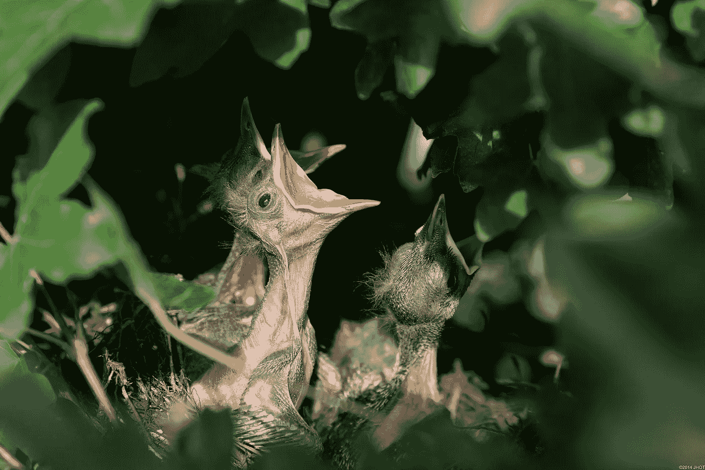

# 你是我的人吗？

> 原文：<https://medium.com/swlh/are-you-my-people-bdbcc6881d28>

## **一个我们需要多问的问题**

Image by [Jan van Oosthuizen](https://pixabay.com/users/147685-147685/?utm_source=link-attribution&utm_medium=referral&utm_campaign=image&utm_content=384896) from [Pixabay](https://pixabay.com/?utm_source=link-attribution&utm_medium=referral&utm_campaign=image&utm_content=384896)

我们很多人都很熟悉《你是我妈妈吗？在这个故事中，小鸟从它的巢里跳出来，开始问各种各样的动物它们是不是它的妈妈。

小鸟不停地尝试。

许多企业也是如此。他们不停地问“你是我的顾客吗？”当每个潜在客户走进门时…