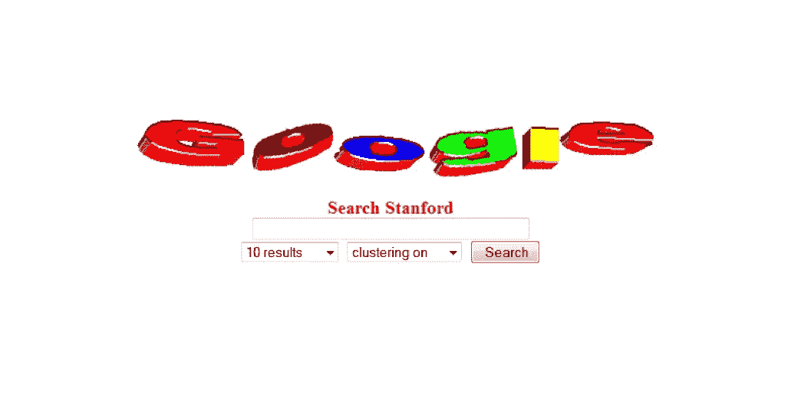
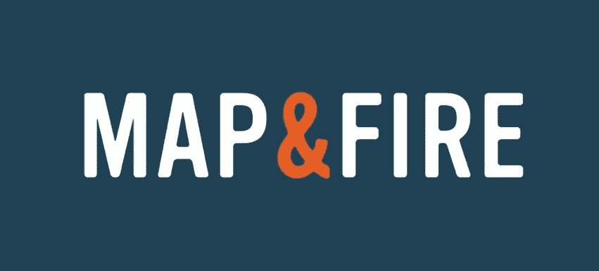
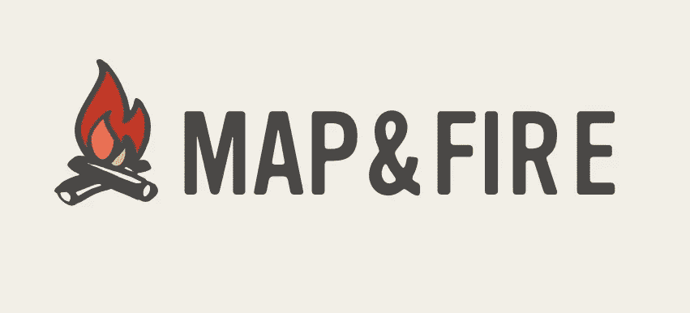
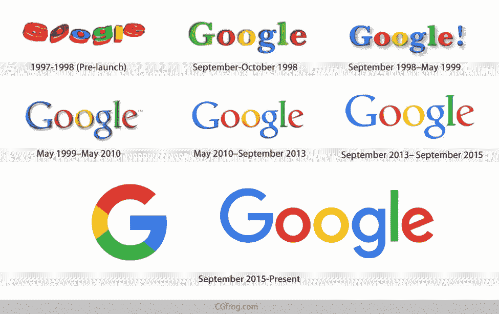
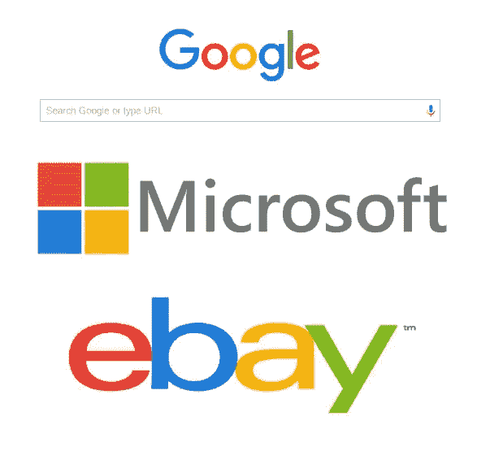
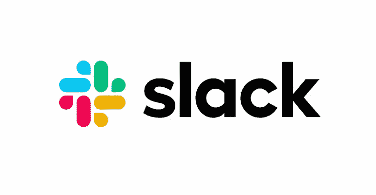

# 你的品牌颜色准备好升级了吗？

> 原文：<https://medium.com/swlh/are-your-brand-colors-ready-for-an-upgrade-b554aa25046f>

The very first Google in 1997, via [fineprintart](https://www.fineprintart.com/art/history-of-the-google-logo)

最近，我和一位好朋友兼品牌战略家同行 [Gil Nevo](http://brandschool.live/) 聊天，他提到了我的公司 [Map & Fire](https://mapandfire.com/?utm_source=blog&utm_medium=article&utm_campaign=brand-colors) 的调色板。

他用非常友好的语气建议我重新审视这些颜色，因为它们感觉有点过时了。

说到品牌和营销策略，这触及了我最喜欢的两个概念:

1.  外界的观点对于发现你的品牌中的机遇*和问题*是非常宝贵的
2.  你的品牌和业务总是在发展

这些都是我一直宣扬的观点，但这并不意味着我能完美地将它们应用到我自己的工作中。(参见，[鞋匠的孩子](https://www.psychologytoday.com/us/blog/credit-and-blame-work/200812/cobblers-children-syndrome-in-the-workplace))

当他这么说的时候，我的第一反应是，“哇。我已经有一段时间没有认真思考我们的品牌形象了。”

事实是，这些颜色是在 4 年前《地图与火》刚成立时设定的。我的意思是 4 年前没有苹果音乐，谷歌不是 Alphabet，杰夫·贝索斯只是世界上第十大富豪。那是一个永恒！

重点是地图&火从那以后已经进化了。开始的时候，对于谁是我们的理想客户并没有一个清晰的概念。在最初的几年里，我们与各种规模的企业合作，从创意阶段的初创企业到财富 500 强企业。

对于较大的企业客户，有深蓝色的品牌。这意味着向习惯于与大机构合作的客户展示一种更传统、更值得信赖的身份。

对于创业公司来说，橙色突出显示了那个世界需要的大胆的能量。橙色也与公司名称的“火”部分一致。

组合是互补的，感觉很好。

Map & Fire, Started in 2015

但正如我的朋友指出的，它受到了 4 年前更常见的调色板的影响。避免你的品牌标识过于新潮是很好的，但同时它需要让你的客户感觉与今天的*相关*。

如果你的品牌看起来属于另一个时代，甚至是最近的某个时代，它会给人一种你的产品或服务也过时的印象。

所以，是时候刷新一下了。

Map & Fire, 2019

Map & Fire 越来越注重与中小型企业的创始人合作。该品牌的基调是友好、平易近人和聪明。火的更明亮、更温暖的颜色提供能量，而灰色和褐色让一切都接地。

这是一种希望与 2019 年更加一致的调色板。

# 每个品牌都在发展

即使我们认为是常青树的品牌也会随着时间的推移而演变。

谷歌的标志在其相对较短的历史中不断得到完善。与此同时，颜色也发生了变化。

Via [cgfrog.com](https://cgfrog.com/)

当然，他们对原色的关注要经典得多。他们的改变更多的是细微的调整，而不是大规模的升级。但是即使有了这些核心色，仍然可以感觉到基调是如何随着时代而改变的。

他们不具威胁性的身份是流行的全球企业技术外观的主要例子。

via [stackexchange](https://ux.stackexchange.com/questions/84503/having-4-colors-in-logo-like-google-microsoft-and-ebay-for-which-kind-of-com)

这些颜色可以解释为信任(蓝色)、成长(绿色)、兴奋(红色)和温暖(黄色)的混合。它们共同呈现了一种良好、安全的混合，可灵活用于多种产品扩展，并避免了不同人群之间的潜在误解。

最新加入安全的四色公司技术空间的是 Slack。

无论你是否觉得这些品牌的一致性有点无聊，关键是颜色既与商业目的有关，也与时间点有关。

# 意义与时代

如上所述，有大量的心理和文化联想被应用于颜色。每种颜色都有各种积极和消极的联想。

几个常见的:

红色:爱，力量——愤怒，危险

**绿色**:成长、健康——嫉妒、贪婪

**蓝色**:力量、信任——冷漠、悲伤

粉红色:快乐、健康——虚弱、不成熟

紫色:有创造力、独立——喜怒无常、古怪

**棕色**:粗犷、谦虚——保守、沉闷

**黑色**:阶级，优雅——阴郁，未知

**白色**:真诚、平静——孤独、空虚

你可以在地图&消防网站上阅读这些更详细的[。](https://mapandfire.com/field-guide/brand/?utm_source=blog&utm_medium=article&utm_campaign=brand-colors#color-psychology)

虽然你应该考虑这些联系，但你也应该有所保留。

没有完美的颜色组合总是以同样的方式传达给每个人。但是你仍然应该考虑如何选择他们。

当你提炼你的品牌识别颜色或第一次挑选它们时，需要考虑一些问题:

*   **谁:**我的目标受众可能会以正确的方式解读这些内容吗？这些颜色能让我们的产品或服务更容易被接受吗？
*   **哪里:**这些颜色适合我的竞争空间吗？他们是否以任何有意义的方式与行业对话？或者它们在我的空间里被过度使用，因此应该被避免？
*   **什么时候:**颜色的深浅与此时此刻相关吗？他们会让我的品牌感觉太新潮吗？过时和脱离接触？还是刚刚好？

所有这些问题的共同点是，它们与你最喜欢的颜色不相关。它们是关于你的品牌如何最好地联系你的客户的战略决策。

它们说明了颜色的含义和它们被使用的时间。

如果你对这些决定深思熟虑，并把你的顾客放在第一位，你的品牌形象会成为建立信任和发展业务的真正资产。

# 准备好自己的身份升级了吗？

如果您需要更新品牌或刚刚开始，我们有循序渐进的资源来帮助回答有关您的品牌和业务的重要问题。在下面注册，您将免费获得一套 7 张工作表，帮助阐明您的品牌身份、客户以及更多更多内容。

# 如果你读到这里，请在下面给这个故事一些掌声:)

*原载于 2019 年 2 月 8 日*[*【mapandfire.com*](https://mapandfire.com/blog/are-your-brand-colors-ready-for-an-upgrade/)*。*

## 这篇文章发表在 [The Startup](https://medium.com/swlh) 上，这是 Medium 最大的创业刊物，拥有+421，678 名读者。

## 在此订阅接收[我们的头条新闻](https://growthsupply.com/the-startup-newsletter/)。

