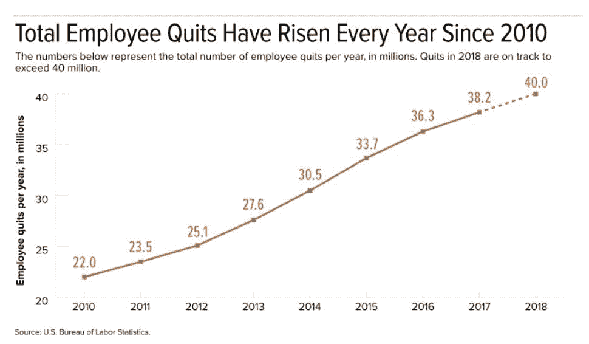

# 你的员工辞职了吗？以下是十大原因

> 原文：<https://medium.com/swlh/are-your-employees-quitting-here-are-the-top-10-reasons-why-6a2da89c5568>

如果你正在阅读这篇文章，那么你已经知道什么是“自然减员”以及它对你的公司意味着什么。你的流失率与你的管理质量直接相关。

每次有员工离职，公司都会损失一大笔钱。雇佣和培训新员工是有成本的。如果不能避免，也很容易降低成本。