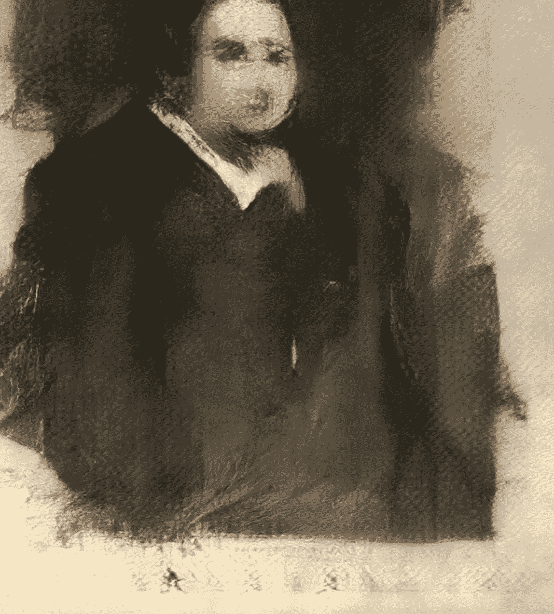

# 人工智能与艺术

> 原文：<https://medium.com/swlh/artificial-intelligence-art-3876fc5a0a40>

## 法国艺术集体以 43.2 万美元出售人工智能生成的肖像，引发了创意编码社区的**个问题**

*Portrait of Edmond Belamy | Obvious website*

2018 年 10 月 25 日，克里斯蒂的纽约拍卖行出售了被宣传为人工智能(AI)创造的第一件艺术品。