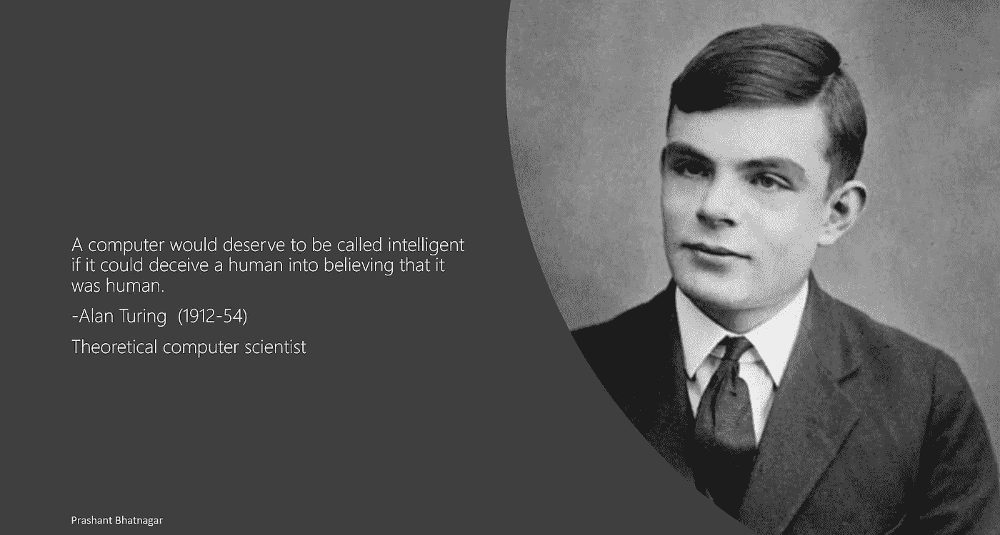
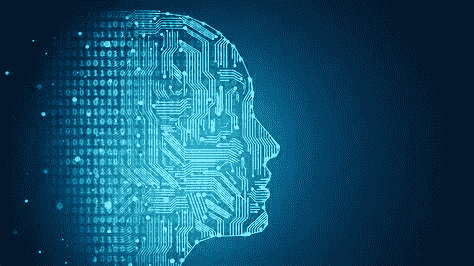

# 人工智能:盲人和大象的故事。

> 原文：<https://medium.com/swlh/artificial-intelligence-the-story-of-blind-men-and-an-elephant-5781812d5554>

*盲人和大象*是一个几千年前的古印度寓言(故事的第一个版本可追溯到公元前 500 年的佛教文献*乌达那 6.4* ，甚至更早于公元前 1500 年至 2000 年的*梨俱吠陀*文献】 ,讲述的是一群盲人从未见过大象，但他们通过每个盲人触摸大象身体的不同部位(象鼻、腿、腿)来了解大象)并根据他们的经验形成对大象的看法。他们中的每一个都是事实上正确的，但是对大象的样子和感觉有完全不同的理解。

那么，古代盲人的故事与人工智能的现代技术趋势有什么联系呢？背景可能不同，但故事的寓意是一样的。#人工智能是当今世界上最热门的话题之一。人工智能这个词给不同的人带来了不同的含义。在快速发展的技术环境中，新术语和用例令人困惑，理解和解释人工智能到底是什么、它如何工作、如何利用它以及它将对我们的社会产生什么影响变得极具挑战性。在当今世界，不同的利益相关者对人工智能的概念有不同的理解和解释。那么，真正理解 AI 最好最简单的方法是什么呢？计算的伟大先驱艾伦·图灵在近 70 年前给出了人工智能的一个最佳定义。如果一台计算机能够欺骗人类，让他们相信它是人类，那么它就应该被称为智能的 艾伦·图灵也在 1950 年提出了著名的“图灵测试”。这项测试是图灵在 1950 年的论文《计算机械与智能》中提出的，当时他在曼彻斯特大学工作。迄今为止，艾伦给出的定义和随后的艾伦图灵测试可能是在通用层面上理解 AI 的最简单方式。

但是，描述和理解人工智能的一种更现代的方式将是陈述人工智能是基本上模仿人类智能和思维的*计算。它指的是根据收集的数据、使用分析和其他观察，无需明确编程就能改变行为的系统。*

**

*理解人工智能的一个简单方法是将其与人类智能进行比较，因为两者在收集和解释数据，然后根据数据采取行动的方式上有很强的相似性。人类的身体和大脑通过感官感知(视觉、听觉、嗅觉、触觉)从环境中收集数据，然后人类的大脑存储和处理这些信息。经过处理的信息为我们提供了各种选择、意见和决策，人类据此采取行动。然后这些动作通过我们的表情、言语、语言、情绪、肢体动作等呈现出来。*

*现在，让我们将此推断到人工智能的技术世界。计算机接收各种形式的数据，结构化的和非结构化的，就像人类通过眼睛、耳朵、皮肤和鼻子接收信息一样。这些计算机数据可以是数字表格、文本、音频、视频文件等。*

*接收到的数据通过云计算在一个大型数据中心存储和处理，就像我们人类大脑存储和处理信息的方式一样。然后，这些数据通过软件程序和算法进行管理和处理，就像每个人基于其生活经历、教育、周围环境等理解和解释信息的方式一样。就像人类一样，我们越有经验，拥有的信息越多，我们在工作中就会做得越好。例如，我们“ ***学习*** ”驾驶汽车，并随着我们在不同环境中体验更新的场景而不断提高我们的驾驶技能。同样的情况也发生在人工智能中，我们让计算机通过更新的信息和数据摄取来“学习”。因此，我们用术语“ ***机器学习*** ”来表示算法。*

**

*这就把我们带到了另一个需要很好理解人工智能概念的问题上。在他最新的畅销书《21 世纪的 21 个教训》中，尤瓦尔·诺亚·哈拉里(Yuval Noah Harari)以一句非常有力的话开始了这本书，*“在一个被无关信息淹没的世界里，* ***清晰就是力量****”。这句话可能更适合人工智能领域，而不是当今技术世界的任何其他领域。原因很简单。其他技术领域，即 IT 基础设施、应用程序、IT 服务、社交媒体平台、网络和通信、设备已经存在了相当一段时间，它们的标准、协议、交付方法、治理已经稳定，创新目前正在增加，直到下一次突破。**

**数据和 AI 相关的技术就不是这样了。每天都有新的用例被识别和实现，在这些用例中，人工智能可以产生影响。此外，人工智能的冲击和影响不像过去那样仅限于技术领域，而是在技术世界甚至无法想象的领域产生了更广泛的社会影响。人工智能的影响已经在隐私、伦理、经济、医学、职业、地缘政治叙事等问题上感受到了。**

**在这种情况下，对人工智能的组成有更广泛的认识是极其重要的，以便在技术世界和更广泛的社会中进行知情的辩论。缺乏对人工智能的明确性可能会导致每个利益相关者共享正确的基于事实的信息，但人工智能的承诺仍然无法实现。这可能导致人工智能项目的成本被夸大，或者给利益相关者留下印象不深的体验。由于缺乏一致的理解，我们社会中的所有人都可能错过这一惊人的技术革命的好处。**

**我们已经意识到人工智能项目遭受损失或被推迟或没有发挥其全部潜力的情况。大多数场景中的根本原因是对人工智能的各种构建模块的部分理解，或者对人工智能能提供什么和不能提供什么缺乏清晰的认识。正如尤瓦尔·诺亚·哈拉里所说，“清晰就是力量”。让“*《瞎子摸象》*的寓言不断提醒我们对人工智能全局理解的重要性。**

***本文仅代表作者个人观点。我 2019 年 5 月的文章将是“为什么人工智能现在发生而不是更早”。***

***原载于*[*https://www.linkedin.com*](https://www.linkedin.com/pulse/artificial-intelligence-story-blind-men-elephant-prashant-bhatnagar/)*。***