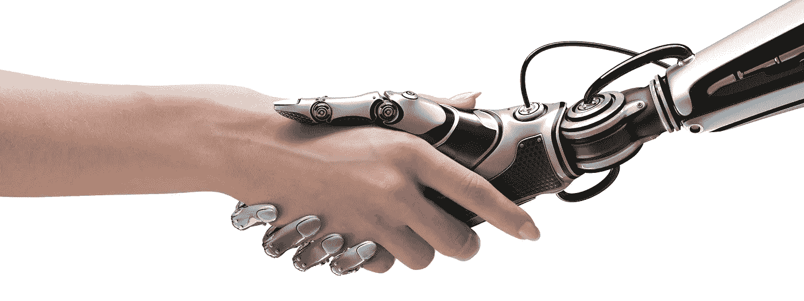

# 人工智能对人类元素:机器将如何影响我们的未来？

> 原文：<https://medium.com/swlh/artificial-intelligence-vs-the-human-element-how-will-machines-impact-our-future-8d195ca3776c>

# **AI 的目的是什么？**

人工智能(AI)正在制造“智能”机器——或使用模式和数据来预测和产生最佳结果，并将事情做得更好。《连线》杂志创始人凯文·凯利在他的 TED 演讲“人工智能如何带来第二次工业革命”中，将人工智能定义为…