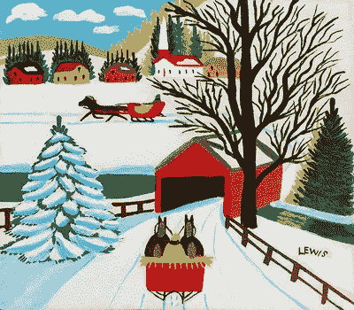

# 艺术家:乔布斯和刘易斯

> 原文：<https://medium.com/swlh/artistic-beings-jobs-and-lewis-f37a74444652>

## 寻找我们伟大的作品

两位创意人留下的礼物。

[Covered Bridge in Winter](http://www.mastersgalleryltd.com/artists/maud-lewis)

一个画中没有阴影的艺术家，一个穿着黑色高领毛衣的创作者。莫德·刘易斯和史蒂夫·乔布斯很难被认为是同时生活在同一个世界的一对。

刘易斯出生于 1903 年，乔布斯出生于 1955 年。他们一起在地球上走了十五年…