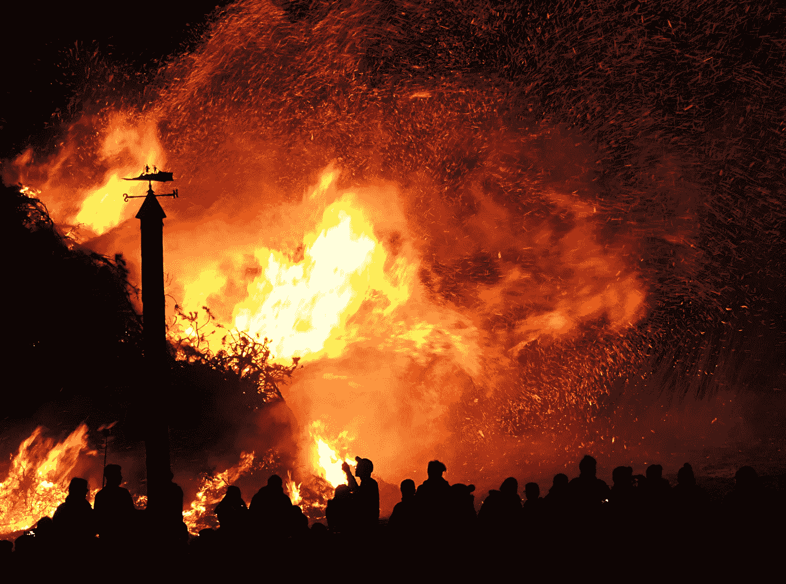

# 火山灰下降

> 原文：<https://medium.com/swlh/ash-fall-675f06a210d3>

有毒的烟雾和煤烟飘散开来，奏响了一曲动荡的交响乐。

风给风景涂上了橙色和黄色的色调，贪婪地吞噬着扎根的民居的骨骼。那些身材高大的人为饥饿的余烬提供了额外的燃料。

轮胎尖叫着，品尝着最后一口气，在融化和与沥青融合之前被火焰之手释放出来。所有汽车中最昂贵和功率最大的也没有动摇宽恕的心。

大火始于富裕的社区，被不公正和不平等的挫败感点燃；一场在不幸的美国人背上溃烂的起义。

富人区着火了。大多数白人家庭流离失所，无家可归，忍饥挨饿。成千上万的人只穿着衣服走在街上，他们的孩子穿着睡衣，手里抓着烧焦的泰迪熊，眼泪顺着被烟熏黑的脸流下来。

一周之内，数以百万计的房屋就像一本废弃的涂色书上烧焦的轮廓。第二次内战爆发于美国和加拿大的经济阶层之间。

消防员、紧急救援人员和军队放弃了他们的岗位，回到了他们的家人身边。他们还没来得及战斗，水就干了。他们被彻底的破坏压垮了。

最终，白宫着火了，当最后的支柱倒下时，对权力和金钱的贪婪也随之倒下。贫富之间的巨大差距模糊成一堆灰烬和悲伤。

历史上，当蓄意的仇恨和无知的力量压倒同情和怜悯时，无辜的人丧生；所有这些都是为了保护他们继承的特权的繁荣。

由于担心自己的生命，流离失所的家庭开始向南迁移，到曾经令人恐惧和轻视的邻居那里寻找慰藉。

当他们接近边境时，一堵高耸的墙挡住了他们的去路。当他们抬起头意识到他们所做的事情时，失望的浪潮席卷了整个部落。在这个结构的顶部有几个大大的金色字母:T、R、U、M 和 p。