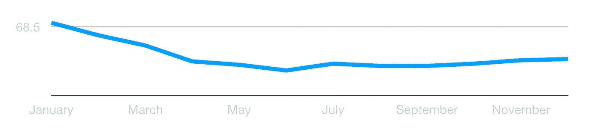
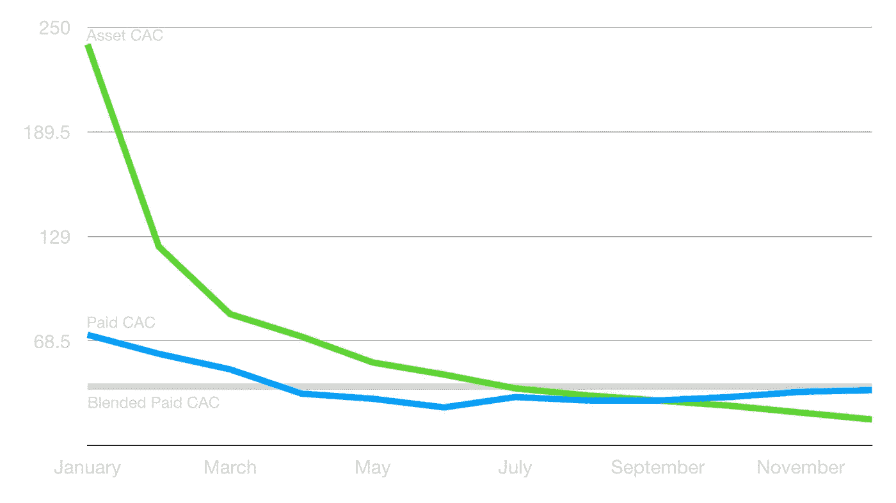
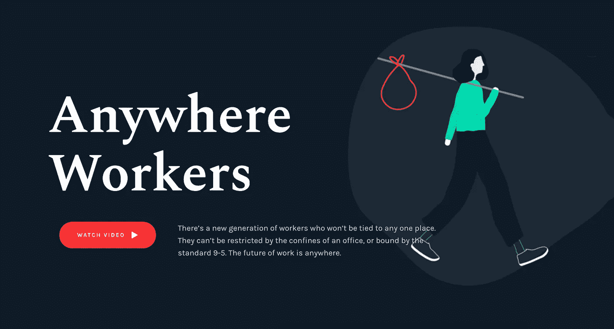
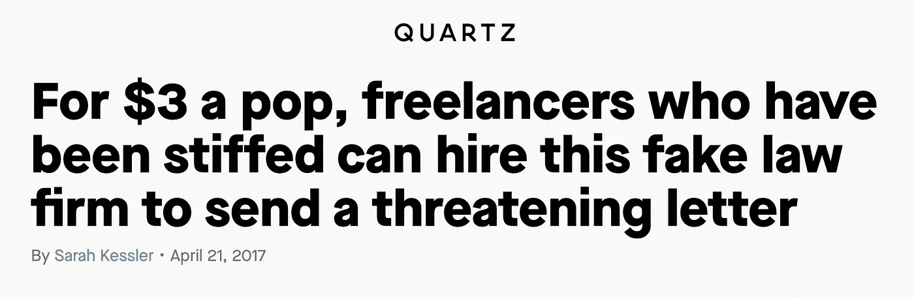
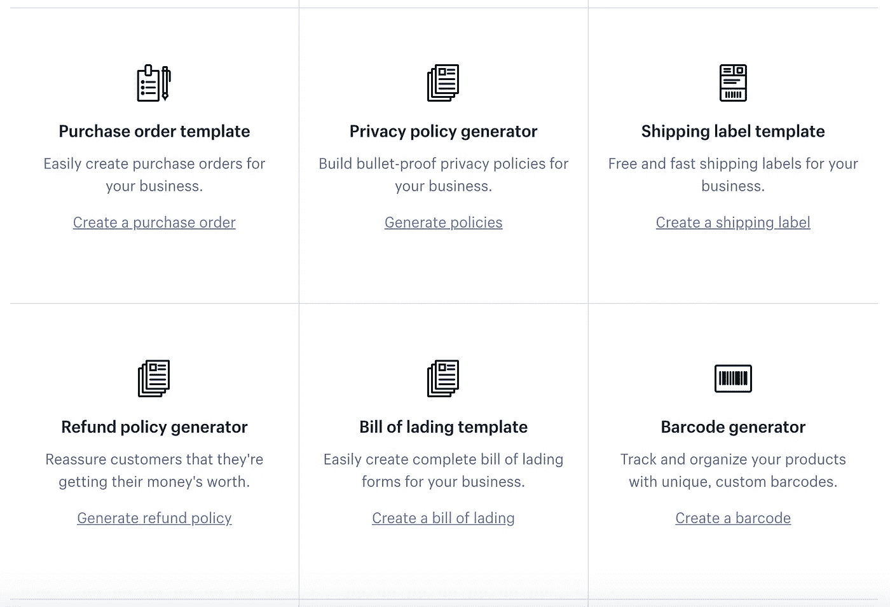
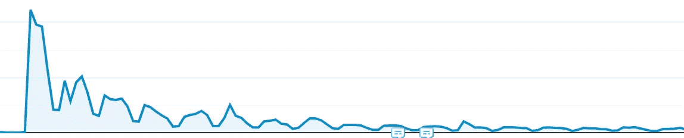
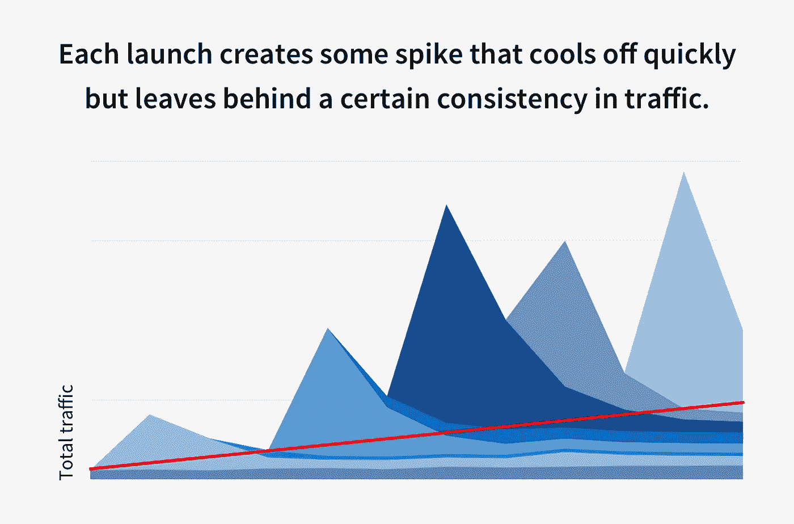

# 资产营销:创建常青树收购渠道

> 原文：<https://medium.com/swlh/asset-marketing-creating-evergreen-acquisition-channels-b11c7e6fbfd8>

大多数付费营销渠道，如社交和搜索广告，可以带来快速和可扩展的流量。但它们也只有在你持续消费的情况下才会带来流量。拉动消费，拉动流量。

你还处于持续的竞争中，这意味着你的收购成本总是在一定程度上波动。

Typically CAC on social or search ads caps out over time or even goes up

这些付费策略将永远是大多数增长战略的重要组成部分，并能快速产生效果。重点是>快速<./>

# On the other end: Asset Marketing

> Asset Marketing is the mindset of investing marketing dollars, versus burning marketing dollars, to receive long-term dividends in form of **常青交通**。

花一次钱，永永远远获得流量。你在前期投资了一次钱，但是流量一直在增加，因此你通过资产获得的 CAC 会随着时间的推移而下降。

Money on assets is only invested once, therefore the overall CAC drops over time

在短期内，投资于资产营销可能不会超过脸书公司的标准绩效广告，但从长期来看，他们可以超过这些广告。然而，它们更难扩展。

# 资产营销的例子

投资资产心态的关键是专注于本质上常青的事物。比如:不要赞助每日新闻，赞助一个一般话题的讲解者视频。新闻明天就会过时，解释者的视频四年后仍然相关并收集观点。

大多数资产的目的是吸引眼球和点击，并将它们重定向到您的产品。这意味着大多数是间接收购驱动因素，而不是直接收购驱动因素。

# **拥有常青树内容**

这些可以是研究，电影或常青树解说视频。在大多数情况下，资产的生产质量越高，回报的时间就越长，因为竞争对手越难创造出更好的东西，越难从你手中抢走流量。此外，在大多数情况下，高质量的内容更有可能获得大量的份额和压力。Doh。

在[和 CO](https://www.and.co) ，我们有很多这样的例子:

**任何地方的员工|** [**访问**](https://www.and.co/anywhere-workers)与远程年一起，我们发起了一项研究，收集了全球 4，000 多名远程员工的意见。它在近一年前推出，如今仍被新文章引用。

**SOLO NYC |** [**访问**](https://www.and.co/solo)一年前我们发布了 SOLO NYC，这是一部记录纽约一些知名自由职业者的短片。这部电影的浏览量超过了 250，000 次，并被评为 Vimeo 员工推荐影片。直到今天，我们还将其作为入职电子邮件系列的内容。

六位数自由职业者| [**访问**](https://www.and.co/six-figure-freelancer)
最近我们推出了一个音频课程，又名播客，讲述如何成为六位数的自由职业者。它包括对该领域思想领袖的采访，这些思想领袖也分享了他们的经历。该资产被定位为“课程”,其内容是常青的，目的是创造有可能成为有价值的营销资产的东西。

# **赞助长青内容**

资产的另一种形式可以是赞助现有的常青树内容。一个很好的例子是 SkillShare 似乎在 YouTube 上的 explainer 视频中做了很多。比如这个:

但同样，并不是所有两个 YouTube 视频都是一样的。赞助每日视频博客是一种广告，但赞助常青树教育视频可能是一种资产。这不是关于广告渠道的选择，而是关于广告内容的选择。废话。只要记住:常青，常青，常青。

# **微型工具**

微型工具是迷你产品，可以吸引你的核心目标受众，创造口碑，甚至有公关潜力。把它们想象成特洛伊木马。**它们是旨在征服新用户的礼物。**

**威廉姆斯&哈里克斯|** [**拜访**](https://www.and.co/williams-harricks)
获得报酬是自由职业者最大的痛点之一。这就是我们推出 Williams&ha ricks 的原因，这是一项向尚未付款的客户发送催款信的服务。这个微型工具在发布当天的产品搜索中排名第二，从 Quartz 和其他人那里获得了文章，甚至卖出了足够的信件来收回最初的投资。

**套牌栈|** [**访问**](https://www.and.co/the-deck-stack-v2)
连同死亡股票照片，我们推出了两个版本的套牌栈。它们只是用于演示的免费设计模板。在其首次发布时，我们在两天内获得了超过 15，000 次下载。

# **SEO**

显然，你建立的任何在搜索中排名的东西也是资产营销。最简单的形式是你博客上的长尾内容，更复杂的是它的整个微工具。

AND CO 最成功的工具之一是[自雇税计算器](https://www.selfemployment-taxcalculator.com/)。这是一个超级简单的工具，可以粗略估计你的自雇税，它已经成为我们的第五大交通驱动因素。

Shopify 创建了一整套这些工具，看起来是出于 SEO 的原因。

Shopify’s lengthy list of microtools

# **营销资产就像 90 年代的男孩乐队**

这些事情的成功往往是无法预测的，你必须建立一大堆这样的东西来找出最终的工作。我喜欢把这比作 90 年代的男孩乐队:往墙上扔 10 个，7 个会失败，2 个可能会有热门单曲，1 个会有大突破。

## 击中斯派克后死亡。大突破万岁。

这些点击会暂时增加交通流量。他们可能登陆 Reddit 的主页，成为 HackerNews 的第一名，甚至参观早间节目。

大突破也可能会出现峰值，但它们也会一直存在，给你带来源源不断的流量。

forever and ever

作为一个例子，让我们来看看 Anywhere Workers 的流量图。这个的时间框架是大约一年，在开始的时候，它明显飙升，但它仍然每个月收到数以千计的访问。

A year of traffic on Anywhere Workers

Illustration to explain how each successful asset adds consistent traffic

# 投资常青树

如果你从这篇文章中学到了什么，记住:投资常青树。你建立的每一个常青树流量驱动都会增加你可预测的有机流量。

拿出一部分预算，扮演 90 后男孩乐队制作人。创造一些资产，把它们扔向墙壁，看看有什么能坚持下来。你可能会成为下一个 NSYNC。

**感谢阅读！**
**在推特上关注我:**[https://twitter.com/leifthunder](https://twitter.com/leifthunder)

如果您有任何问题和建议，请随时联系我们: [leif@tbd.xyz](mailto:leif@tbd.xyz)

你可能也喜欢阅读

*   [信任领导的效率:为什么取消政策是值得的](https://hackernoon.com/the-efficiencies-of-leading-with-trust-1649149ccc83)
*   [反馈漏斗:持续的反馈如何建立更强大的文化](https://hackernoon.com/the-feedback-funnel-how-constant-feedback-builds-a-stronger-culture-a50f2ab1a8fe)
*   [这对一家使命驱动型公司来说意味着什么](/swlh/what-it-really-means-to-be-a-mission-driven-company-549fa98b2fd4)

呜哇呜。

## 这篇文章发表在[的《初创企业](https://medium.com/swlh)》上，这是 Medium 最大的创业刊物，拥有+433，678 读者。

## 在这里订阅接收[我们的头条新闻](https://growthsupply.com/the-startup-newsletter/)。

