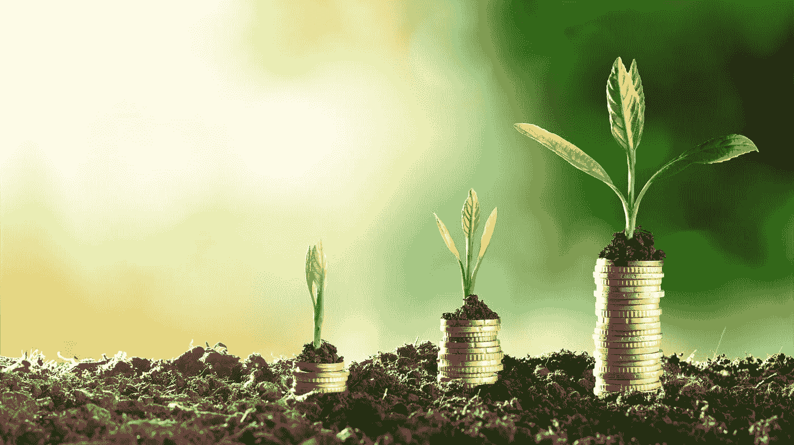

# 资产、负债、现金流和净值

> 原文：<https://medium.com/swlh/assets-liabilities-cash-flow-net-worth-a1cd8a470b4c>

## 他们如何一起为你和你的家人建立一个安全的财务计划。

多么令人兴奋的话题啊！我知道，我知道…可能没那么多。但我知道的是——如果你不花时间去理解资产、负债、现金流和净值的基本知识，以及它们是如何运作的，这将在财务上伤害你。

我们每一个人，不管我们喜欢与否，都以这样或那样的方式受到它们的影响。那些花时间学习，学习如何管理他们的资产和负债的人将能够把它们变成更高的现金流和更大的净值。

> 现在相信我……最后一部分是你可以并且应该感到兴奋的！！

我在大学里花了整整一个学期的时间来研究这个课题，但我们对其中的每一个话题都只是浅尝辄止，更不用说完全理解它们了。因此，认为我们可以在一篇简短的文章中非常详细地讨论每件事情是疯狂的。

然而，就个人而言，由于金融一直是我学习更多知识的热情所在，十多年来，我读了数百本书，听了数千次音频，参加了无数次研讨会，并接受了这方面专家的指导。

因此，尽管我不是注册财务顾问，也不是这方面的所谓“专家”，但我觉得我已经对这些特定主题有了很好的理解，我今天的目标是收集所有这些表面上看起来复杂的信息，并使其变得更简单，与不想成为会计师或财务规划师的普通人更相关。

> 因此，在这篇文章中，我们将分别讨论每个主题，解释它们是什么，以及它们如何与你的日常生活相关联。
> 
> 然后，我会总结一些简单的建议，告诉你如何让他们成为你的朋友，并以积极的方式为你工作。

# **资产**

资产的定义是一个实体拥有、受益于或用于产生收入的有价值的东西。

基本上，你拥有的有价值的东西。

有许多不同种类的资产，特别是如果你开始谈论会计或金融术语，清单和类别开始变得很长很复杂。

我在这里并不是要给你一个会计学位，所以最简单的分类是两类资产……它们被称为**有形资产和无形资产。**

两者之间的主要区别在于:

*有形资产本质上是实物，而无形资产本质上是非实物。*

*有形资产的一些例子是现金，或诸如房屋、商业建筑、营地、土地等财产。车辆、工具、电子设备、船只、家具、收藏品、珠宝和艺术品。*

*这些都是你可以用来交换或交易其他有价值的东西或现金的资产，本质上也是实物。*

**无形资产更多的是商标、专利、品牌名称、网络、客户名单、歌曲、手稿、版税或发明。**

**很难对它进行估价，因为它不那么有形。自然界中没有任何有形的东西，但它与知识产权有着更多的联系。**

**然而，这些可以而且往往是最有价值的，对于那些可能从物质财富方面起步很少的人来说，可能有更好的机会通过无形资产创造财富。**

**首先利用他们的想象力、创造力和才能来建立无形资产，这些资产不需要花费太多的钱来创造，然后再将这些财富转化为其他有形资产。**

**在 20 世纪 90 年代，迈克尔·乔丹可以说是这个星球上最好的篮球运动员，如果不是最好的，也是当时最受认可的运动员之一。**

**然后，他利用这种无形资产(他的篮球天赋)，这不是他可以卖给别人的东西，他必须用它来让它有价值，并作为一名运动员获得报酬。但他把自己变成了一个品牌，彻底改变了运动员作为一个品牌营销自己的方式。**

**想想耐克，飞人乔丹，佳得乐，麦当劳。所有使用乔丹品牌来推广自己产品的公司都成功了。**

> **乔丹品牌作为一种营销资产比他实际的篮球天赋更有价值。但他最初的篮球天赋是一项资产，后来变成了一项更大的资产。**

**我的一个朋友写广告词，然后每当有人在广告或电影中使用它们时，他就从中获得版税。**

**以音乐为例，通常情况下，歌曲作者比真正的歌手更富有，因为他们可以为多位艺术家创作。所以即使当一个艺术家“过时”了，他仍然可以继续为新人写歌。**

**总而言之，资产要么是有形的，要么是无形的，是有价值的东西。**

# ****负债****

**负债的定义是对别人的义务或你欠别人的东西。**

**实质上，负债是一张借据。**

**在会计术语中，有三种类型的负债:**

**1.**当期**:应付票据、短期借款、银行透支、应交所得税、利息**

**2.**非流动:**抵押、长期应付票据、租赁**

**3.**或有:**可能会发生也可能不会发生——诉讼、产品保修、可能拖欠的未来奖金。**

**积累了太多债务的个人，欠条——或者用其他术语来说——***债务***——将会看到他们的信用评分受到负面影响，他们的借贷能力下降，他们的生活成本上升，通常坏事会开始发生，直到最终破产，这本质上是一个破产点。**

**基本上，即使你卖掉了所有的东西，继续工作，你仍然不能偿还你所欠的。**

> ****这里有一个快速练习可以帮助你理解这一点:****

**在一张纸上，在左上角写资产，在右边写负债。**

**然后在中间画一条直线。**

**在资产项下，你想把你拥有的任何有转卖价值的东西加上一美元的价格。**

**现在公平地说，你最喜欢的海报或童年泰迪熊可能对你有情感价值，但除非它是一件具有收藏价值的物品，并且形状很好，否则它可能没有很高的转售价值。**

**评估你的“东西”是否真的值得的一个好方法是去 craigslist、易贝、Kijiji 等二手网站看看。它会给你一个好主意。**

**仅仅因为你 6 个月前花 500 美元买了你最喜欢的游戏机，并不意味着今天市场会愿意花那么多钱买它，所以尽量准确。**

**你可能会说查尔斯……我 18 岁、19 岁或 20 岁，我真的没有任何资产。事实是你拥有的可能比你想象的要多。**

**即使你还没有房子或汽车，你也可能有一些电子产品、收藏品、艺术品、唱片收藏，也许还有一辆自行车、书籍、运动装备等等。**

**如果你有更多的东西，比如房子、投资组合、贵金属、设备，把它们都加起来。你当前银行账户中的任何现金也算在内。把所有这些都加在这一页的第一面。**

**在另一面写上你所欠的一切。**

**这可能是你给家庭成员、银行或贷款人的个人贷款。**

**信用卡余额或未支付的电话账单。学费、房租、保险或车贷，如果你有的话。**

**财产税或所得税。**

**再一次，把账本右边的数字加起来。**

# **净值**

**当你把你所有的资产加在一起，并把每项资产的美元价值加在一起，你就会得到一个总数。，然后在另一边做同样的事情，加上你所有的负债，这样你就有了你所欠债务的总美元价值。最后，从你的总资产中减去你从负债中得到的数字，你就得到所谓的——**净资产**。**

**这是你的价值(不是你真正的个人价值……那是无价的),但从纯粹的物质角度来看，这是一个神奇的数字。**

## ****这很重要，原因有二:****

**1.让我们了解一下你目前的财务状况。我的净值是正的还是负的？如果我卖掉了我拥有的所有东西，付清了我欠的所有东西，我还会剩下钱吗？还是我还会欠一些钱？**

**2.它给你一个参考点来衡量你的目标进展。你的净资产是在向好的方向发展，还是在倒退？**

**真正知道的唯一方法是看数字和做这个练习。我建议至少每年做一次，如果不是每 6 个月或更长时间，这取决于你的情况和它的稳定性。**

**一个简单的 excel 电子表格，你更新的数字会给你一个清晰的画面，你的情况一目了然。或者更好的办法是，通过[职业年学院](https://www.careeryearacademy.com/contact)联系我们，我们将为您提供免费的模板，让您可以轻松跟踪自己的进步。**

**密切关注你的净资产，看着它上升，这是一个很好的方法来知道你是否在正确的财务轨道上。**

# **现金流量**

**最后，最后一个话题是现金流…什么是现金流？**

**简单地说，就是你在一个月或一年或一段时间的开始时有多少现金，与你在那个月或一年或一段时间的结束时有多少现金相比。**

**如果你月底的现金比月初多…你就会成为 ***现金流正*** 。**

**如果你的期末现金少于期初，你的现金流就会为负。**

**换句话说，它是每月现金收入(收入)和现金支出(支出)之间的差额。**

> **那么，净值和现金流的区别是什么？**

**净值是你的资产总值减去你的负债…**

**现金流是你每个月有多少现金，例如，除了你的生活费用。**

**举例来说，我可能有很高的净资产，但它被套牢在一家公司里，或者股票或房产里，而不是现金。**

**另一方面，我每月开销大，可支配收入不多。**

**你会把这种情况称为资产丰富——现金流贫乏。**

**我的一个老上司就处于这种情况，原因有几个。他建立了一个成功的公司，价值数百万美元……当他要卖掉它的时候。**

**但在他卖掉公司之前，他的大部分收入都被再投资到了公司内部，他的实际税后工资要低得多。**

**他的生活方式也与一个大房子和公寓联系在一起，这花费了他大部分的收入来偿还抵押贷款。**

**现在，如果他要卖掉他的公司和财产，他的账面净值是数百万。然而，由于他的处境和生活方式，他每月的现金流实际上相当差。**

**有时我们也会用“穷人之家”这个词。它的意思是定义那些拥有并居住在比他们目前的现金流所能承受的更大更贵的房子里的人。**

**这意味着他们的大部分收入都用来支持他们的抵押贷款和维护他们的房子，只剩下很少甚至没有钱剩下来做其他事情。因此有了“穷人之家”这个术语。**

**关于资产和负债，有会计术语和规则来说明它们应该如何分类。**

**然而，也有其他人，比如他的著名系列丛书《富爸爸穷爸爸》和《现金流象限》的作者罗伯特清崎，以及其他许多人认为，只有为你创造财富的资产才是资产。**

**以汽车为例，它是资产还是负债？**

**可能两者都有…如果你的车卖了比你现在欠的钱还多，那么从会计的角度来看，它会被认为是一项资产**

**如果你欠的车款比你卖的车款还多，如果……再次从纯会计的角度来看，这将是一项负债。**

**当你把新车从经销店的停车场开出来的时候，它往往会平均损失 25%的价值。你还必须支付汽油费、修理费、保险费、执照费，也许还有停车费。所以它每个月都要花费你的钱，降低你的现金流。因此，你的车是一种成本……一种负担。**

**房子呢？房子不是资产吗？清崎可不这么认为。它们通常会升值，但正如我们在几次衰退中看到的那样，情况并非总是如此。**

**另一件要考虑的事情是保养、维修、保养、税收，你为房子支付的利息每个月都要花掉你的钱……所以从定义上来说，它变成了一种负债。**

**让我举两个例子来说明如何将负债转化为资产，反之亦然。**

# **从 5 个室友变成 1 个**

**当我 20 岁上大学的时候，我在学校附近买了一套房子，有 4 间卧室和 2 间楼下公寓。**

**我每月用于支付抵押贷款、税收和维护的费用达到每月 1000 美元左右。我出租多余的房间和公寓的月收入是 1450 美元。**

**因此，我的房子每月为我提供 450 美元的正现金流，此外，它还让我可以免租金生活，同时付清我的抵押贷款。**

**因此，即使房子的转售价值永远不会上升，它在各种意义上仍然是一种资产。**

**几年过去了，我卖掉了那栋房子，用出售所得的利润支付了在渥太华买一栋新房子的首付，这样我和我未来的妻子就可以一起住了。**

**这个里面没有室友；)**

**但是也没有租金收入！**

**现在，我必须每月支付抵押贷款、税收和费用，并将我的租赁资产变成了每月都要花钱的资产。**

**或者就像清崎所说的……一种负担。**

# **从代托纳到航空之星**

**同年，我买下了出租的房产，我还开始了绘画和景观美化的生意。**

**当时我有一辆很酷的 1988 年道奇戴通纳车，但现在我需要更强劲的车来帮助我经营我的生意，所以我用这辆车换了一辆 1988 年的福特 Aerostar。这是一种漂亮的双色——棕色和铁锈色。我爸爸帮我把后座拿出来，这样我就可以用内置储物空间来存放我的工具和绘画用品。梯子的金属车顶架和侧面的标志，如果你能看到图片，这真是一个令人眼花缭乱的东西。**

**两辆车都有运行成本…但只有货车有能力，在这种情况下，帮我赚钱。只有货车可以作为资产和营业税注销。所以双倍奖金。**

**所以在这个例子中，我把一项资产——我的汽车(或者像 Kiyosaki 所说的负债，因为它每个月都要花费我运行和维护的钱)变成了一项资产，一项帮助我的企业创收的工具。**

> **资产把钱放进你的口袋…负债把钱从你的口袋拿走。**

**总结一下，我能给你的最好建议如下:**

**1.不要在人生的早期积累债务。如果你这样做了，你将会花费大量的时间、精力和金钱试图回到正净值。**

**2.**努力工作，尽早获得正的现金流状况。**即使这意味着一开始就削减一些小奢侈品。然后用这些现金流购买创收资产。**

**3.**只有当你的资产每月支付给你的金额超过你的生活成本时，你才应该开始改善自己的生活方式。理解这种心态的好书是《隔壁的百万富翁》。你愿意看起来很富有，还是很富有？****

**如果你保持你的 *c* ***灰流为负*，**随着时间的推移你的负债会增加，你会 ***失去生活方式*** 。**

**如果你保持你的 ***现金流为正*** ，随着时间的推移你的资产会增加，你会 ***增加你的生活方式*** 。**

**就像我一开始说的，这不是世界上最令人兴奋的话题…但是相信我，如果你能理解这些复杂但简单的应用概念…你将有更多的选择在未来过上令人兴奋的生活！**

**[www.careerexpertsecrets.com](http://www.careerexpertsecrets.com)**

**[www.careeryearacademy.com](http://www.careeryearacademy.com)**