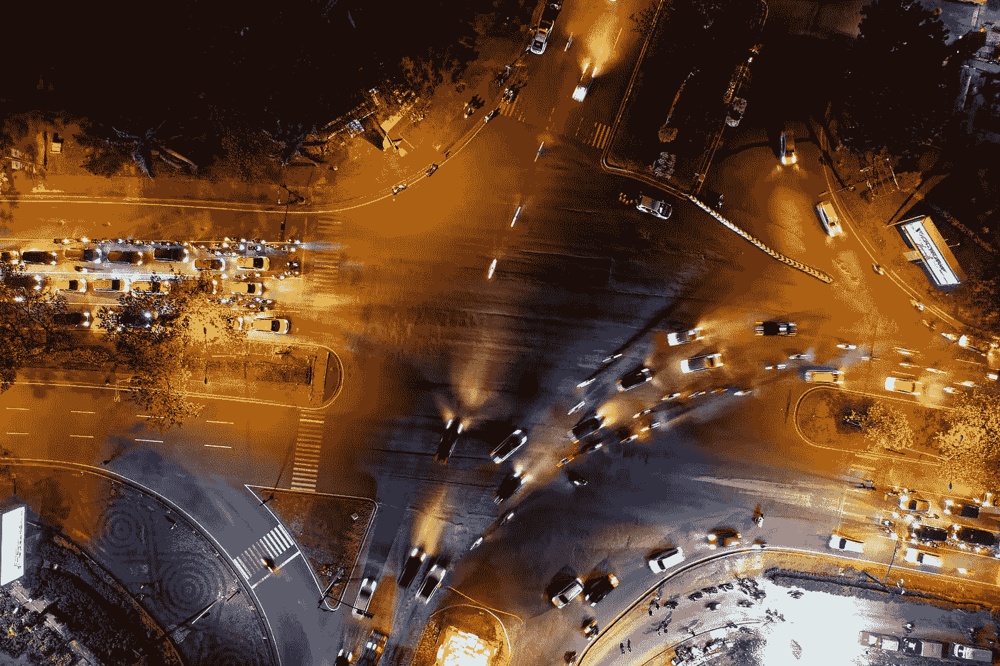

# 在人性和自动化的角落

> 原文：<https://medium.com/swlh/at-the-corner-of-humanity-and-automation-59cff736288>

我们都听说过，一个无处不在的自动化时代即将到来。我们看到它正在发生。一点一点，一个工作一个工作，新的自动化技术正在跨越工作领域。似乎不可避免的是，机器将能够做任何人能做的工作，对吗？然而，对于许多潜在的角色，人类固执地绕着任何可能的机器替代品打转。找出人类擅长的工作…