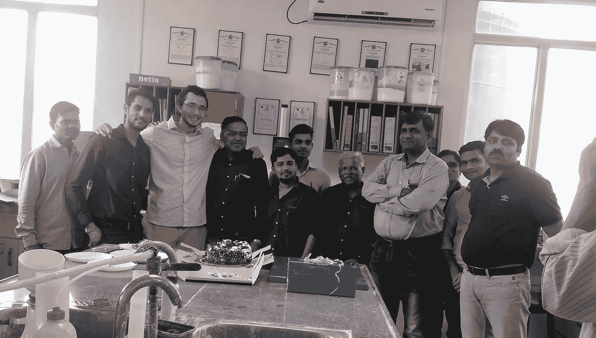

# 真实文化与全球化。应该有区别吗？

> 原文：<https://medium.com/swlh/authentic-culture-vs-globalization-should-there-be-a-difference-5788155851af>

## 我们什么时候开始关心国界了？是什么让文化变得真实？

*“喂小辉，请吃点柴，你为什么要工作？就请喝酒？”*

Vishal 会说。然后实验室经理告诉我，如果我不这样做，会很不礼貌。

Farewell party

然后助手会在实验室的水槽里用手洗出别人的茶杯，因为我们只有 3 个杯子。他会给我端茶，只点头微笑，看着我喝。

我会说 *dhanyavaad，*但是一个月后我意识到没人知道我在说什么，因为我把发音改得一团糟，每个人都已经从电视上知道了“谢谢”这个词。

Surekaben (maid and mother away from home)

我在古吉拉特邦松加德的时候，每个人都会在上午 10 点左右停下工作，一起喝茶。会有典型的流言蜚语。对老板的抱怨。谈论政治和道路有多脏。

当天晚些时候，每个人都会停下来，我们会再做一次，如果首席执行官在，晚上还会有下午茶时间，晚上可能还会有下午茶时间…

每天早上，女仆给我一杯茶，然后给我端上早餐。

到了回家过圣诞节的时候，我问在哪里可以买到最好的柴茶，这样我就可以给父母带礼物了。

*“你在这里喝不到最好的茶。你会发现英国最好的茶"*。

茶对印度文化来说可能是必不可少的，但我被告知去找印度的前帝国主义统治者。茶是英国殖民者强加给他们的，但它仍然受到欢迎。

## 巴拉克·奥巴马的《我父亲的梦》

前总统奥巴马的父亲来自肯尼亚内罗毕，是卢奥部落的一员。当奥巴马去法学院之前访问肯尼亚时，他想探索拥有非洲血统意味着什么。

他发现自己很失望，问题比刚来时更多了。他问他的大家庭，为什么许多非洲裔美国人在访问非洲时感到失望？

> “因为他们来这里寻找真品，”她说。“那必然会让人失望。看看我们正在吃的这顿饭。很多人会告诉你，罗人是吃鱼的人。但对罗来说，情况并非如此。只有住在湖边的人。即使对那些罗人来说，情况也不总是如此。在他们定居在湖边之前，他们是牧民，像马赛人一样。现在，如果你和你的妹妹表现好，吃适当份额的食物，我会给你茶。你会注意到，肯尼亚人非常喜欢吹嘘茶叶的质量。但是当然我们从英国人那里得到了这个习惯。我们的祖先不喝这种东西。”
> 
> ——巴拉克·奥巴马的《我父亲的梦》

似乎你现在只能从欧洲国家买到正宗的茶了…

Tea house at the Imperial Garden in Tokyo

这是 19 世纪晚期欧洲殖民主义的结果。世界被帝国主义的贪婪所塑造。现在当他问及殖民主义如何影响肯尼亚土著人时，奥巴马了解到，

> “不幸的是，白人让我们变得非常具有防御性。我们最终会执着于各种已经失去效用的东西。一夫多妻。集体土地所有权。这些东西在当时很管用，但现在它们最常成为滥用的工具。被男人。各国政府。然而，如果你说这些话，你已经被西方意识形态感染了。”
> 
> ——巴拉克·奥巴马的《我父亲的梦》

如果第一批欧洲人从未到达或不受欢迎，肯尼亚将会怎样？奥巴马说他的父亲*“加入了第一波被派遣去掌握西方技术并带回以打造一个新的、现代的非洲的非洲人”。*

教育天生就是殖民技术吗？我希望不是，我相信这是授权。如果这是一项殖民技术，我想接受它。

## 为什么边界很重要？

> *“生物使能，文化禁止”——尤瓦尔·诺亚·哈拉里《智人》*

自从我们成为智人以来，我们的文化一直在变化。当我们处理其中的矛盾时，它们是不断变化的。

矛盾的一个例子是我们的创始价值观。

> “全世界的人们逐渐将平等和个人自由视为基本价值观。然而，这两种价值观相互矛盾。只有通过限制富裕者的自由，才能确保平等。保证每个人都能自由地做自己想做的事，不可避免地会损害平等。”-尤瓦尔·诺亚·哈拉里的《智人》

在某种程度上，人们相信如果你杀了别人的女儿，他们可以伸张正义，杀死你的女儿。这是公元前 1754 年古巴比伦的汉谟拉比法典。

 [## 我们时代的现代神话

### 讲故事和为什么人权需要讲故事

medium.com](/lucas-moyer/modern-myths-in-our-era-62bc881964b4) 

另一方面，人们相信独裁统治和对少数民族的压制。那是 1920 年的纳粹法西斯主义。令人难以置信的是，在 2017 年的夏洛茨维尔等地，这种做法至今仍在实施…

什么是真实的，什么是合适的，这个观念一直在变。

美国的民主建立在人道主义和基督教价值观的基础上，认为我们都是平等和独立的人。这些价值观在全球范围内不断争论，导致了多次战争。

在未来，人工智能可能会继续与我们对民主的信仰相矛盾。现在让我们把注意力集中在现在。

在后冷战时期，美国希望将民主传播到每个国家，同时保持他们的“T4 主权”。

我们的主要信仰中存在矛盾，我们一直在争论这些矛盾。100 年前，允许妇女投票被认为是疯狂的，现在我们有了最高法院的女法官，在国会任职的女性比以往任何时候都多。

目前，我们正在讨论国家应该如何与世界其他地区互动。有英国退出欧盟和川普的边境墙等呼吁民族主义的例子，也有欧盟和巴黎气候协定倡导全球主义的例子。

一些美国人在我们的信仰中发现了矛盾，想要专注于我们的边界，而不是传播民主。

## 作为一个国家意味着什么？

如果你真的想要“真实的”印度，并拒绝英帝国主义，你会试图复活 16 世纪入侵“印度”的莫卧儿帝国。那么，在英国和莫卧儿帝国入侵印度之前，真正的印度会是什么样子呢？泰姬陵应该被印度民族主义者拒绝吗？

Muslim imperialism

## 唤醒推特

我有点惭愧地说，但我可能会从 Twitter 上获得大部分新闻。

我读到一些批评，说人们需要保持一些地点的真实性，而不是洗白。

保持从所有人群的上一代传下来的故事是重要的，但我担心当我们想要保持夏威夷和我们认为的夏威夷一样时，所画出的固有边界。请记住，自智人定居以来，夏威夷或其他地方的文化一直在变化。

冷战后的美国想要一个全球民主，但现在我们被英国退出欧盟、欧洲移民危机和特朗普的边境墙等问题所困扰。

我更喜欢哥伦比亚大学的全球化方式，而不是用随着时间推移而不断变化的无形边界来分隔我们。

## 为了文化——Migos

我的一个最好的朋友喜欢取笑我，因为每当我说日语时，我都使用美国口音。我只从日本学前班和我的日本妈妈那里学的，所以不是最好的，也不想假装是正宗的。

Me doing touristy things in Japan since it’s my second time visiting

我不想谴责我的家乡在二战期间有日本集中营，那是历史。与 80 年前相比，贝尔维尤华盛顿现在对我来说更重要。

我的父亲来自蒙大拿州，但我不同意那里的人的政治观点、对打猎的热爱以及对荒野的欣赏。

我希望我的文化被定义为一个生活在西北太平洋的日裔美国人。

## 那又怎样？我们应该如何看待文化

文化在历史上不断变化，而我们的生物却在过去的 10 万年里保持不变。

全球化已经成为文化的前沿。古代文明很少互相交谈。在互联网出现之前，美国人很少能和肯尼亚人交谈。现在我们有机会成为全球公民。

其他人发现了矛盾(这种矛盾将一直存在)并回到民族主义。

如果你读了比尔和梅林达·盖茨 2019 年的信，他们学到的一课是 [**有一个民族主义的全球主义**](https://www.gatesnotes.com/2019-Annual-Letter) **(见惊喜#6)** 这为帮助我们自己同时仍然是全球公民的矛盾提供了解决方案。

梅林达·盖茨说:

> “像美国这样的国家投资对外援助的原因是，它增加了国外的稳定和国内的安全。加强海外卫生系统降低了埃博拉等致命病原体成为全球流行病的几率。确保世界各地的每一位父母都有机会养育安全、受教育、健康的孩子，这样他们就不太可能踏上绝望的旅程，去其他地方寻求更好的生活。”-gatesnotes.com

尽管关注的焦点是全球健康，但人们还是将这些问题与当今的政治环境联系起来。

虽然保持真实的文化很重要，但现在是我们拥抱成为全球公民的时候了，而不是处理我们眼前新闻中的矛盾和划定边界。

## 这篇文章发表在 [The Startup](https://medium.com/swlh) 上，这是 Medium 最大的创业刊物，拥有+425，678 名读者。

## 订阅接收[我们的头条](https://growthsupply.com/the-startup-newsletter/)。

