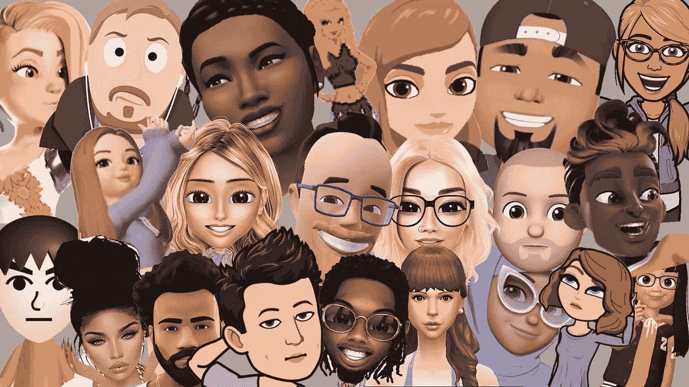

# 化身在这里停留。

> 原文：<https://medium.com/swlh/avatars-are-here-to-stay-985114fcb973>

随着人们越来越适应自己的数字自我，苹果、Snap、脸书、微软、谷歌和更多公司都在竞相创造自己的虚拟形象，希望推进数字人类互动，但哪家公司会胜出，为什么？

头像并不是什么新鲜事物。事实上，它们已经存在了相当长的一段时间；通过视频游戏和在线聊天室的使用而普及。只是在最近的历史上…