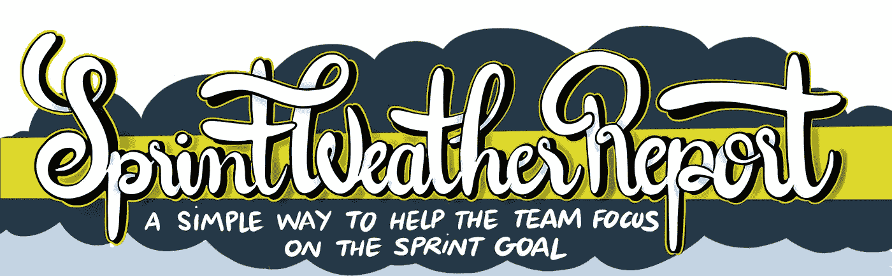

# 避免 Scrum 僵尸:用冲刺天气报告帮助团队专注于冲刺目标

> 原文：<https://medium.com/swlh/avoid-scrum-zombies-help-the-team-focus-on-the-sprint-goal-with-the-sprint-weather-report-a7a0781e0cc>

Sprint Weather Report 是一种简单有效的方法，可以帮助团队专注于 Sprint 目标，从而改善您的日常站立会议。

这是一个图文并茂的指南，向您展示如何以及为什么您可以在自己的团队中使用 Sprint Weather Report。

