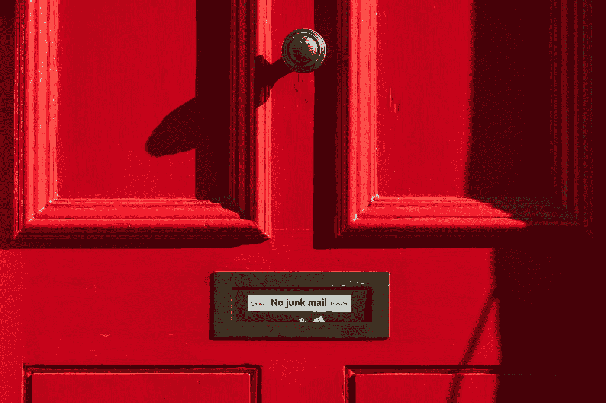

# 避免垃圾邮件文件夹，提高投递率，并确保您的订户看到您的电子邮件

> 原文：<https://medium.com/swlh/avoid-the-spam-folder-improve-deliverability-and-make-sure-your-subscribers-see-your-emails-6336097087d9>

Photo by [Pau Casals](https://unsplash.com/@paucasals?utm_source=medium&utm_medium=referral) on [Unsplash](https://unsplash.com?utm_source=medium&utm_medium=referral)

你有一个很棒的优惠或促销信息要发送给你的订户，或者你有一些关于你公司的好消息要分享。你启动电子邮件编辑器，撰写邮件，添加一些图片，然后发送出去。结果没有出现。你会收到很多垃圾邮件投诉，或者你的打开率很低。发生了什么事？