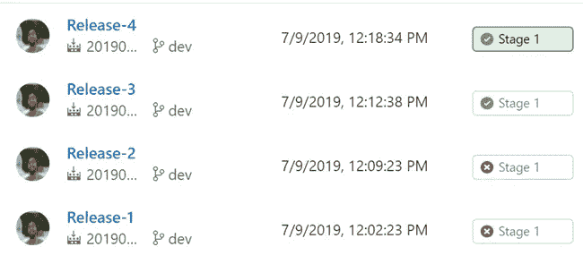

# Azure DevOps CI CD 中的 Azure 函数构建和发布管道

> 原文：<https://medium.com/swlh/azure-function-build-and-release-pipeline-in-azure-devops-ci-cd-974ed28d2ac4>

Release Pipeline Azure Function — Azure DevOps

# 介绍

玩 Azure 函数总是一种很好的感觉，为你的所有应用程序配置构建和发布管道是非常重要的，Azure 函数也不例外。在本文中，我们将看到如何在 [Azure DevOps](https://sibeeshpassion.com/tag/azure-devops/) 中为我们的 Azure Function 应用程序创建构建和发布管道。我希望你会…