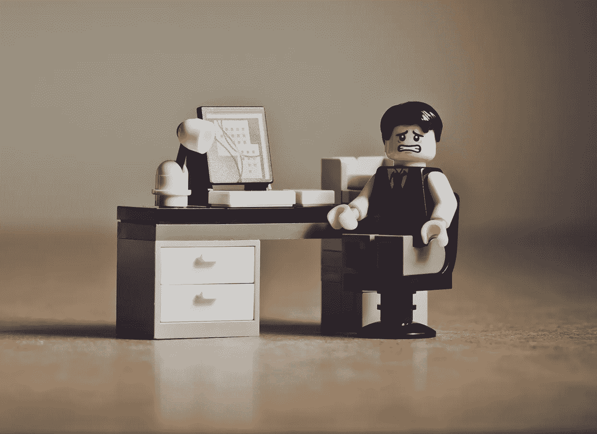

# 坏老板正在毁掉好员工

> 原文：<https://medium.com/swlh/bad-bosses-are-destroying-good-employees-f8911daf00bb>

## 为什么所谓受重视的员工没有得到更多的尊重？

Image by [www_slon_pics](https://pixabay.com/users/www_slon_pics-5203613/?utm_source=link-attribution&utm_medium=referral&utm_campaign=image&utm_content=2261021) from [Pixabay](https://pixabay.com/?utm_source=link-attribution&utm_medium=referral&utm_campaign=image&utm_content=2261021)

## 最初几年:

从床上滚起来，不再害怕新的一天。用“早上好”和微笑问候我的同事。尽我所能帮助他人。为我被选中承担不同部门的工作而自豪。