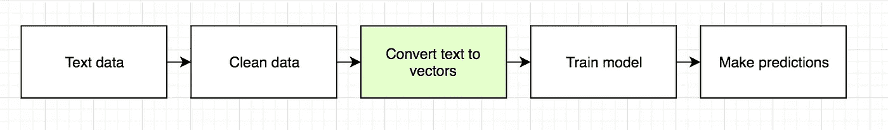

# 机器学习中的词汇袋

> 原文：<https://medium.com/swlh/bag-of-words-in-machine-learning-13c1de579d2d>

## 机器学习模型如何理解文本

**An overly simlified pipeline for training a model. We’re only covering converting text to vectors here.**

今天我们将讨论单词袋的内容和原因。

机器学习模型需要数字数据作为输入。我们称这些数字表示为“向量”。因此，如果您正在处理文本，您需要在将文本输入到模型之前将其转换为向量。