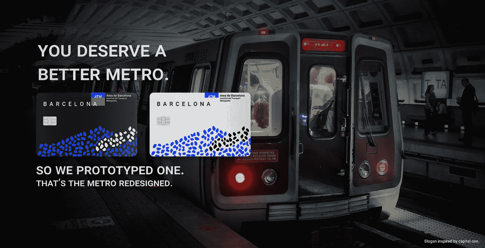

# 巴塞罗纳地铁卡再设计——UX/UI 案例研究

> 原文：<https://medium.com/swlh/barcelona-metrocard-redesign-faeeea186bba>

Barcelona MetroCard redesigned using Figma and metro background image. Illustrated by Ilma Bilic.

塑料芯片传感器地铁卡将减少黄金乘车时间的交通堵塞，增加可持续性努力和整体乘车体验。我把团队构思阶段的草图和想法转化成数字产品。

**我的角色:**用户访谈、素描、线框、视觉设计、交互设计、Figma 原型、3D 建模
**团队:** Ilma…