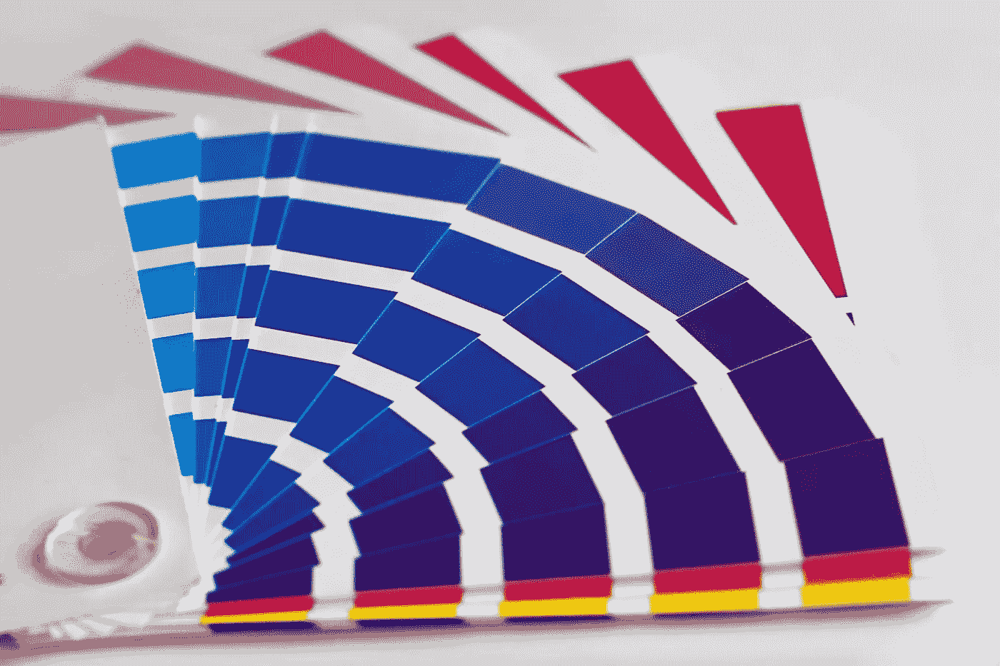

# 色彩理论——每个人都应该知道

> 原文：<https://medium.com/swlh/basic-color-theory-everyone-should-know-303e77aef542>

## 详细的快速颜色研究

Saturation of blue.

我们无时无刻不在感知颜色，无论我们是否意识到，它都会影响我们。由于色彩理论的知识，艺术家和设计师通过和谐的色彩组合拥有最佳的色彩感觉。

色彩理论是一个经验丰富的和有益的指导，通过混合艺术和科学来确定应用…