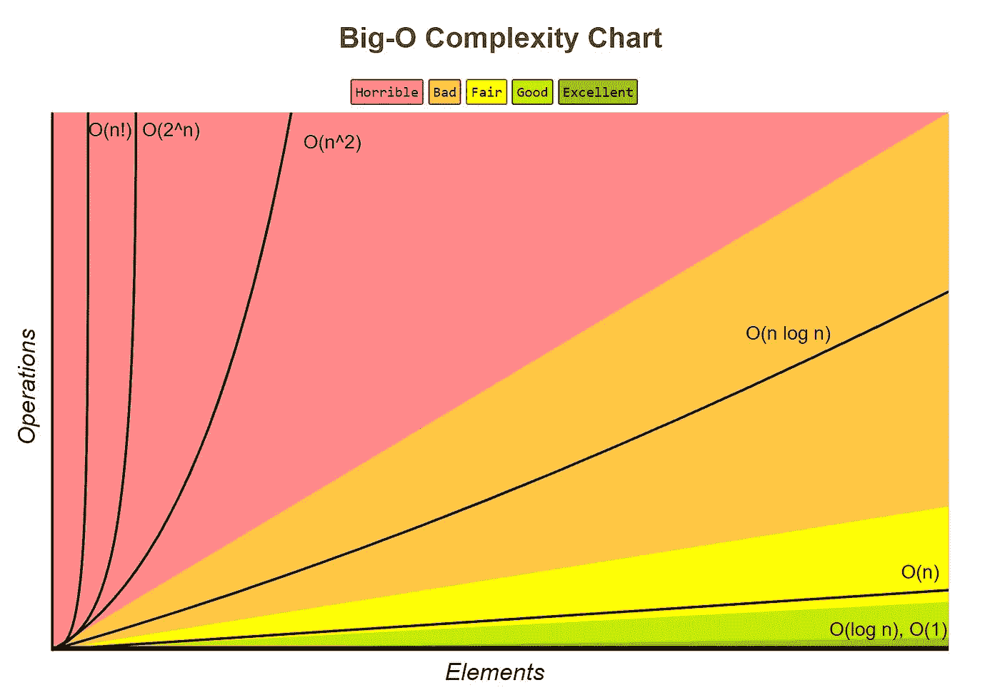

# 大 O 符号的基础

> 原文：<https://medium.com/swlh/basics-of-big-o-notation-7d5d905d058d>

我以前写过关于算法的文章，也提到过算法是为了提高代码效率。然而，有一个特定的术语来描述一个函数的效率，我没有提到。那个术语是大 o。


Wait a minute…

不是那个。



There we go!

大 O 符号描述了一个函数/算法的复杂性，或者是它的运行时间(一个算法完成它的任务所花费的时间)或者是空间复杂性(一个算法使用的空间量)。它用于查看当输入增加时，算法还需要做多少工作。该符号被简化为关注输入大小(n ),因为基于 n 的增长会掩盖静态值，所以像 2n 这样的东西被简化为 n。它采用 O 的形式(相对于输入所需的步数)。

上图显示了一些通用的符号，以及 w̶h̶i̶c̶h̶̶c̶o̶l̶o̶r̶̶o̶f̶̶t̶h̶e̶̶r̶a̶i̶n̶b̶o̶w̶̶t̶h̶e̶y̶̶a̶r̶e̶̶m̶o̶s̶t̶̶c̶l̶o̶s̶e̶l̶y̶̶a̶s̶s̶o̶c̶i̶a̶t̶e̶d̶̶w̶i̶t̶h̶，无论它们随着输入大小的增加而伸缩得好(占用的时间/空间增加少)还是差(占用的时间/空间增加多)。下面我将给出一些函数的例子，它们具有上表中所列的复杂性，以及为什么它们具有这种复杂性。

1.  O(1)“恒定时间”是最简单的算法，并且在一个步骤中完成所有事情，而不管输入如何增加。

```
function printArray(array) {
   console.log(array)
}
```

这个函数将打印整个数组一次。

2.O(log n)“对数时间”不如常数时间好，但仍然相当不错。对于对数时间，函数以更多的步开始，但是步数随着接近目标而迅速减少。这意味着，如果您增加输入，初始步长将会增加，但函数在向前移动时会再次快速降低步长。对数时间函数的一个例子是二分搜索法。

```
function binarySearch(array, value) {
   let desiredValue = value let newArray = array let currentValue = null while (currentValue !== desiredValue) {
      if(newArray.length > 1) {
         currentValue = newArray[Math.floor(newArray.length/2)]
         if (currentValue > desiredValue) {
            newArray =  newArray.slice(0, Math.floor(newArray.length/2))
         } else {
             newArray.slice(Math.floor(newArray.length/2) + 1,   newArray.length)
         }
      } else {
         currentValue = newArray[0]
      }
   }
   return currentValue
}
```

二分搜索法每次会切掉数组的一半，所以即使数组的初始大小增加了，它也会很快将数组切回原来的大小。如果您从 5 个项目[1，2，3，4，5]开始，最慢的可能搜索(4)将需要两步，第一步将数组切割为[4，5]，下一步找到 4。如果大小增加到 10 [1，2，3，4，5，6，7，8，9，10]并且您要搜索 4，它仍然只需要三个步骤[1，2，3，4，5] > [4，5] > 4。如果大小增加到 20，它仍然只增加一步[1，2，3，4，5，6，7，8，9，10] > [1，2，3，4，5] > [4，5] > 4。您可以看到，即使大幅增加输入的大小，所需的步骤也只是略微增加。

3.O(n)“线性时间”对于输入大小的每次增加需要一个额外的步骤。如果输入增加了两项，则多走两步，如果增加了 7 项，则多走 7 步。

```
function printArray(array) {
   array.forEach((element) => {
      console.log(element)
   })
}
```

对于上面的函数，对于添加到数组中的每个项目，该函数将执行一个额外的步骤，即控制台记录该元素。

4.O(n log n)“线性”、“对数线性”、“拟线性”(这个有很多名字哈？)合并排序就是一个例子。

```
function mergeSort(array) {
   if (array.length === 1) {
      return array
   } let middleNum = Math.floor(array.length / 2)
   let leftHalf = array.slice(0, middleNum)
   let rightHalf = array.slice(middleNum) return merge(mergeSort(leftHalf), mergeSort(rightHalf))
} function merge(leftArray, rightArray) {
   let newArray = []
   let leftIndex = 0
   let rightIndex = 0 while (leftIndex < leftArray.length && rightIndex < rightArray.length) {
      if (leftArray[leftIndex] < rightArray[rightIndex]) {
         newArray.push(leftArray[leftIndex])
         leftIndex + 1
      } else {
         newArray.push(rightArray[rightIndex])
         rightIndex + 1
      }
   } if (leftIndex < leftArray.length) {
      return newArray.concat(leftArray)
   } else {
      return newArray.concat(rightArray)
   }
}
```

Merge sort 接受一个数组并将其分解为单个元素，然后通过将每个元素与相邻数组中剩余的最小元素进行比较，慢慢地将它们重新组合起来。第一个函数“mergeSort”将接受一个数组；如果收到的数组长度为 1，它将返回数组，否则它将数组分成两半，并调用合并函数，该函数接受两个数组。但是在这里，它将通过数组的两半传入自身的结果，导致它递归调用自身并分解，直到每个数组只包含 1 项。一旦数组中有一项，merge 函数将最终开始生效，并从每个数组的第一个开始比较每个值，并将较小的值放入一个新数组中，然后在一个数组中的项用完之后，它会将另一个数组的剩余值添加到新数组中并返回它，给你一个排序后的数组。这个过程将一直重复，直到它组合成原始数组的排序版本。

如果你从[6，5，3，1，8，7，2，4]开始，它将被分解，直到元素是[6，5，3，1] [8，7，2，4] > [6，5] [3，1] [8，7] [2，4] > [6] [5] [3] [1] [8] [7] [2] [4]。从这里开始，元素将通过与它们旁边的值进行比较来重新组合，并将较小的值放在下一个组合数组的前面。[5, 6] [1, 3] [7, 8] [2, 4].这里将比较最左边的元素，因为它们已经被定位为较小的元素，并且被最后放置在下一个数组中，这个步骤将被重复，直到一个数组为空，之后该数组的其余部分将被添加到下一个数组的末尾。1 比 5 小，所以下一个数组是[1]，3 比 5 小，所以[1，3]，然后将剩余的数组添加到后面的 so [1，3，5，6]，另一边也是如此，所以[1，3，5，6] [2，4，7，8]。现在 1 < 2 so [1]，2 < 3 so [1，2]，3 < 4 so [1，2，3]等等，直到它们组合成[1，2，3，4，5，6，7，8]。

5.O(n)是“二次排序”。大小每增加一次，所需的步骤数就增加 n。因此，如果数组大小增加 2，就需要 4 个额外的步骤。一个例子是最坏情况下的冒泡排序。

```
function bubbleSort(array) {
   let newArray = array
   let swapped = true while(swapped === true) {
      swapped = false for (let i = 0; i < newArray.length - 1, i++){
         if (newArray[i] > newArray[i+1]) {
            let var2 = newArray[i+1]
            array[i+1] = array[i]
            array[i] = var2
            swapped = true
         }
         i++
      }
   }
   return array
}
```

冒泡排序遍历并比较每个项目与其旁边的一个项目，如果它较大，则与下一个项目交换，如果它较小，则留下它，以便在一轮结束时，最后一个项目将位于其正确的位置。然后对第二个项目进行这样的操作，如此等等，直到完成所有的操作。冒泡排序应该有一个机制来阻止它，如果它通过一次并且没有交换的话，但是在最坏的情况下，每个循环中的每个项目都必须交换，这将是一个二次排序。如果一个项目被添加到数组中，它会再添加一个项目，每一个其他项目都必须在循环中与它进行比较，并且为新项目添加一个额外的循环，其中它必须与每一个其他项目进行比较，从而给它 n 个额外的步骤。

6.O(n！)“阶乘排序”，也就是俗称的蛮力法。这就像试图创建一个函数，通过遍历并生成每一种可能的组合来破解只包含字母表中字母的 8 个字母的密码。

希望这篇文章能帮助你更好地理解 Big O，以及它和一些常用算法一起使用的一些例子！