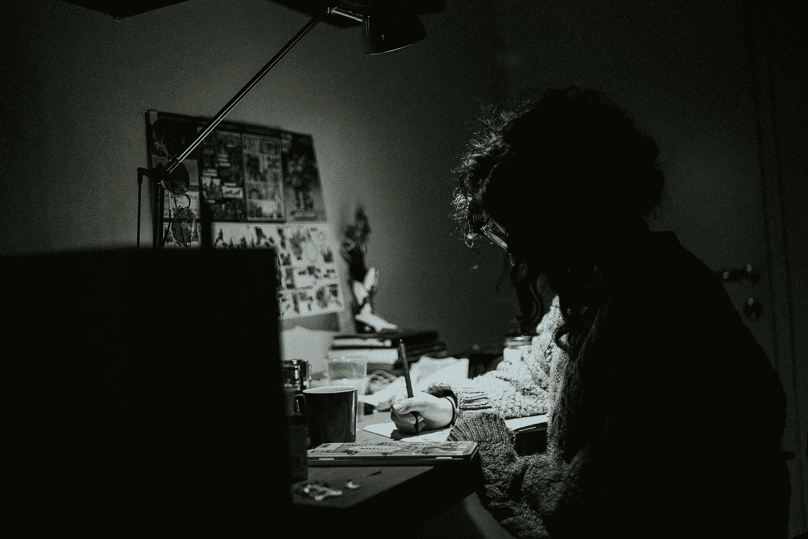

# 写黑仔故事的基础

> 原文：<https://medium.com/swlh/basics-to-writing-a-killer-story-2dba6f305067>

## 这可能就是你错过的。

## 有想法却不知道从何下手？这是给你的。

Photo by [Florian Klauer](https://unsplash.com/@florianklauer?utm_source=unsplash&utm_medium=referral&utm_content=creditCopyText) on [Unsplash](https://unsplash.com/search/photos/typewriter?utm_source=unsplash&utm_medium=referral&utm_content=creditCopyText)

你坐在你的房间、房子、汽车或任何你有时间思考的地方。然后一个想法像一个坏兆头击中了你。“我会读类似的东西，”或者“我会看那个。”

你想把这个想法变成现实，但甚至不知道从哪里开始，所以你扔掉设计，等待一些专业人士把你的想法做成一个半成品。

首先，不要放弃这个想法，这就像扼杀你的创造力，其次，要为这个疯狂的想法感到自豪，因为正是这个想法给你正常重复的生活带来了一些新的东西。你只需要实现这个想法。

# 第 1 页

Photo by [NordWood Themes](https://unsplash.com/@nordwood?utm_source=unsplash&utm_medium=referral&utm_content=creditCopyText) on [Unsplash](https://unsplash.com/search/photos/waiting?utm_source=unsplash&utm_medium=referral&utm_content=creditCopyText)

现在，我知道你可能会想，到目前为止，这听起来像所有其他如何写一个黑仔故事的博客和文章。你没有错；我甚至把第一步改成了第一页，以帮助你看到一些新的东西。

差异。

我不会卖给你任何东西，我卖给你的唯一东西是免费的 clickbait 标题。理论上，我所提供的一切都将帮助你创造一个杀手级的故事，比如《权力的游戏》、《指环王》和《漫威电影宇宙》。但是，你要记住；一切都需要时间和练习。你不可能在几秒钟内成为职业选手。

> 简而言之，第一页是耐心，男孩，你需要它。

# 第 2 页

Photo by [Fabiola Peñalba](https://unsplash.com/@fabspotato?utm_source=unsplash&utm_medium=referral&utm_content=creditCopyText) on [Unsplash](https://unsplash.com/search/photos/reading?utm_source=unsplash&utm_medium=referral&utm_content=creditCopyText)

> 阅读。

【唉不过看 300+的小说就没意思了。]

好吧，你没有错，如果你不喜欢这本书，你读它将是一件苦差事。然而阅读是专业人士和业余人士的区别。

这个页面的目的是帮助你了解专业人士是如何做的。他们使用什么技能和技术，以及他们如何组织他们的书籍。

如果你不能分析一本书，不要担心，有大量的视频和指南可以帮助你理解这本书。

【所以我不用看书。]

你还是要读书。

# 第 3 页

Photo by [João Silas](https://unsplash.com/@joaosilas?utm_source=unsplash&utm_medium=referral&utm_content=creditCopyText) on [Unsplash](https://unsplash.com/search/photos/research?utm_source=unsplash&utm_medium=referral&utm_content=creditCopyText)

从我无数小时学习如何从大师班和有声书写一本书。这已经出现了很多。

> 研究。

现在，这可能意味着很多事情，我将告诉你两种不同的研究方法。

> 一个。

写故事的时候研究你不知道的话题。不要只是猜测。打开你的网络浏览器，查找主题。这有点像写一篇文章，唯一的区别是:你不必把资料放在你的书里，因为你在写小说。

这样做的原因是因为某个了解他的东西的家伙会给你写一封刻薄的信，告诉你无论你写了什么，显然是这样工作的。

> 两个。

研究故事的不同结构。试着去理解如何从头开始构建一个故事，不管这个故事有多小。*救救猫！写小说:杰西卡·布罗迪写的关于小说写作的最后一本书*是一本很好的入门书。这对小说写作和编剧都有帮助。还有一本有声读物。

【有赞助吗？]

不，我只是很喜欢这本书。

# 第 4 页

Photo by [Daniel Chekalov](https://unsplash.com/@dchuck?utm_source=unsplash&utm_medium=referral&utm_content=creditCopyText) on [Unsplash](https://unsplash.com/search/photos/practice?utm_source=unsplash&utm_medium=referral&utm_content=creditCopyText)

> 实践

无中生有，所以，作为一个有抱负的作家，你必须开始写点什么。如果很糟糕也没关系，第一稿总是如此，但记住你必须有所作为。你必须每天练习或者试着。甚至不一定要很多字。五百字是个不错的目标。

但是我甚至没有时间去做那件事。]

好了，现在听着，另一个我，你得腾出时间来写，即使只有 30 分钟，你也需要腾出时间来写，就像你做其他事情一样。

# 第 5 页

最后一页，我发誓。

> 老友记

Photo by [Priscilla Du Preez](https://unsplash.com/@priscilladupreez?utm_source=unsplash&utm_medium=referral&utm_content=creditCopyText) on [Unsplash](https://unsplash.com/search/photos/friends?utm_source=unsplash&utm_medium=referral&utm_content=creditCopyText)

现在交朋友很难，但你需要人们阅读你的作品，不是告诉你有多糟糕，而是什么令人困惑和难以阅读。这些人是你的编辑，而且不是所有的编辑都是一样的。对每一个批评都要有所保留。

找一些朋友告诉你这是怎么回事，而不是消极的来源，比如，“兄弟，这太可怕了，”和“你写这个是因为这就像喝我自己的呕吐物。”那些人可以回到他们来的地方，因为他们不会帮助你。

你需要批判性的批评，如果你找不到任何人，就用笔名写下来，让你的家人或陌生人阅读。别告诉他们是你。

# 结束了

希望这对你有所帮助，我正计划写一些关于故事结构的文章，但在此之前，请享受这些基础知识。保持开放的心态，你是人类，做人类最擅长的事情，讲故事。现在开始吧守护者们。

Photo by [Marina Vitale](https://unsplash.com/@marina_mv88?utm_source=unsplash&utm_medium=referral&utm_content=creditCopyText) on [Unsplash](https://unsplash.com/search/photos/eyes-up?utm_source=unsplash&utm_medium=referral&utm_content=creditCopyText)

【不能这么说。]

哦，别管我。