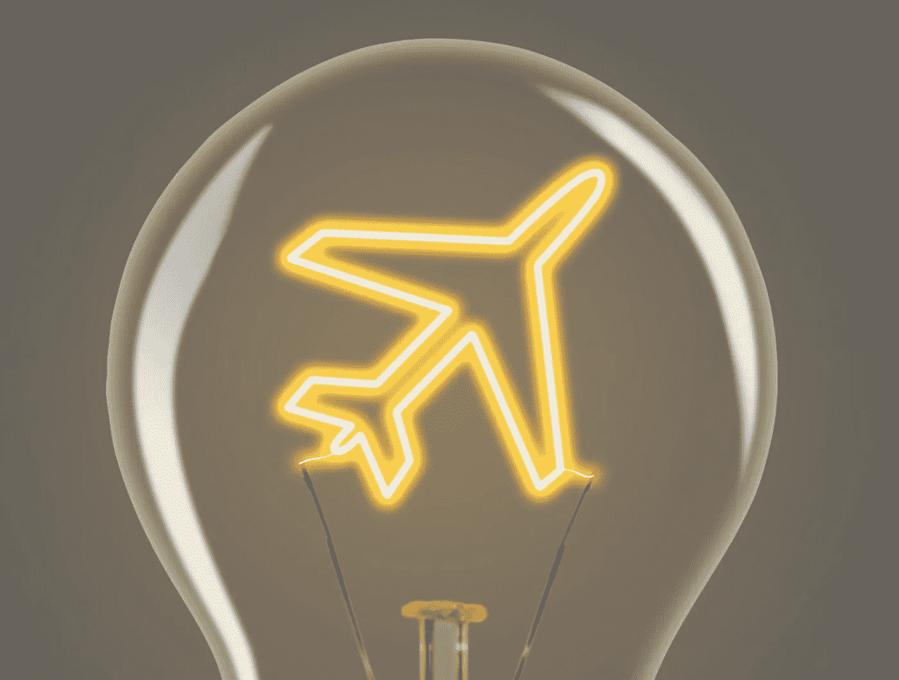

# 不含电池

> 原文：<https://medium.com/swlh/batteries-not-included-268d8671ee1e>

# 驾驭电动航空的浪潮

每两年，航空业的重量级人物都会带着他们最好最新的飞机参加巴黎航展。随着对巴西航空工业公司的收购和庞巴迪公司的撤资，现在的主要事件是波音公司和空中客车公司在布尔歇的停机坪上针锋相对，争夺大型航空公司订单。

阴云密布的氛围破坏了今年展会的基调，围绕波音公司最新版本的双引擎喷气式飞机 737 MAX 存在不确定性。然而，有一个亮点。

她的名字叫爱丽丝。

# 电动飞机

总部位于以色列的创业公司 Eviation 获得了一家主要航空公司的第一份订单，这是一架名为 Alice 的全电动飞机。总部位于美国的大型支线航空公司 Cape Air 订购了这款 9 座客机，订单量达到了两位数。

爱丽丝被设计为在充电前以每小时 276 英里的速度行驶 650 英里。如果按照预期在 2021 年获得认证，她将是第一架在主要航空公司服役的纯电动飞机。

虽然爱丽丝可能不会孤单太久。根据咨询公司罗兰·贝格的数据，电动飞机的研发比一年前增加了 50%。现在有 170 架在建，随着燃料价格的持续上涨，一些将开始受到航空公司的关注。据报道，Alice 的运营成本为每小时 200 美元，而类似的涡轮螺旋桨飞机的运营成本为每小时 1000 美元。

# 电动滑梯

政府间气候变化专门委员会呼吁到 2050 年实现碳平衡增长，这是一个崇高的目标；尽管如此，航空业可持续发展的经济激励措施依然根深蒂固。

自 1937 年以来，随着喷气发动机的发明，商用飞机的推进系统没有发生根本性的变化。然而，发动机效率已经大大提高，并将继续提高。

尽管飞机的燃油效率比半个世纪前提高了 80%,但预计未来 20 年交通流量将会翻倍。因此，当前的效率创新速度将无法吸收预期的增长。

这个问题在 4 月份引起了人们的强烈关注，当时总部位于爱尔兰的瑞安航空公司获得了一个可疑的荣誉，成为[第一家加入欧洲十大碳排放国名单的非煤公司](https://www.theguardian.com/business/2019/apr/01/ryanair-new-coal-airline-enters-eu-top-10-emitters-list)。

# 带头冲锋

斯堪的纳维亚在环境影响税方面走在了前列。为过度污染支付相当于额外费用的经济学有待讨论，但毫无疑问，这已经促使瑞典和挪威的公司探索降低燃料消耗的所有途径。

据 [Dezeen](https://www.dezeen.com/2019/05/27/electric-aircraft-norway-olaf-mosvold-larsen-interview/) 称，挪威的目标是在 2040 年之前让所有短途航班都采用电力驱动。

上个月在图卢兹举行的空中客车创新日上，北欧航空公司宣布与空中客车联合研究混合动力和电动飞机生态系统。

在巴黎，空客宣布他们希望在 2035 年以新飞机的形式将[混合动力和电动喷气式飞机](https://www.bloomberg.com/news/articles/2019-06-13/airbus-may-make-the-next-version-of-its-top-selling-jet-a-hybrid)推向市场，很可能在未来几十年取代 A320neo 机队。

拥有普惠发动机品牌的航空航天和国防公司联合技术公司(United Technologies)宣布，打算在三年内推出一款带有混合动力电动发动机的涡轮螺旋桨飞机。这种发动机将是“平台不可知的”,这意味着它可以进一步开发，并适用于几种不同的机身。

已经与空客合作开发混合电力推进系统的劳斯莱斯揭开了他们收购西门子飞机业务的面纱。劳斯莱斯称赞这是推进其电气化战略的一步，因为他们正在接近他们所谓的“第三航空时代”，这将迎来“更安静、更清洁的空中运输”

# 电池电量

不幸的是，电池还没有达到喷气燃料的纯能量输出。尽管锂离子电池的功率重量比和续航里程每年都在提高 1%或 2 %,但长途飞机将需要混合动力发动机。

由于起落架的负载限制，运输机起飞时可能比着陆时重。飞机经常带着比它们能着陆的更多的乘客和货物离开，因为它们在飞行中燃烧了额外的燃料重量。因此，航空公司在计算客运和货运航线的经济可行性时依赖于减少的负荷。到目前为止，电池不会因为失去电量而变轻。

所有这些意味着传统的涡轮风扇发动机可能会继续用于远程飞行。然而，不断改进的电池技术为纯电动马达打开了更小的通勤市场。

总部设在西雅图的电动汽车公司 magniX 将为 Eviation 的 Alice 提供发电厂。它还将为世界上第一支电动水上飞机商业舰队提供动力。

今年 3 月，拥有北美最大水上飞机机队的温哥华海港航空公司宣布与马格尼克斯公司合作，将他们的飞机转换成电动引擎。如果成功，30 多架燃气驱动水上飞机将安装 magniX 的 750 马力电动机。

# 基础设施

航空电气化不是万灵药。

电必须以足够轻的方式产生和储存，以便能被运送到高空。它还将提出一个问题，一旦飞机到达目的地，如何进行“加油”。

机场会有增压器吗？

*当几架飞机同时充电时，如何管理国际机场的电力负荷？*

此外，机械师将不得不接受全新型号发动机的培训。飞行员需要学习如何解决新问题。

所有这些都被认为是航空业的快速发展，随着电池技术的不断发展，本世纪下半叶应该会看到一些成熟的电力解决方案推动航空业向前发展。