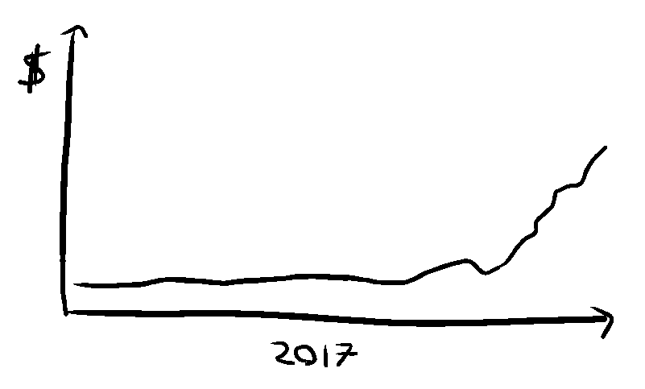

# 机器人之战:做市商如何在密码交易所一决雌雄

> 原文：<https://medium.com/swlh/battle-of-the-bots-how-market-makers-fight-it-out-on-crypto-exchanges-2482eb937107>

在 2017 年 12 月至 2018 年 3 月的几个月里，我构建了一个机器人，执行了价值约 5000 万美元的加密货币做市交易。这是我如何进入做市商的故事，机器人算法背后的理论，以及做市商之间的竞争。

## FOMO