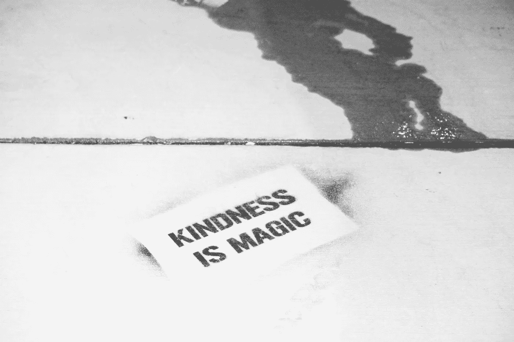
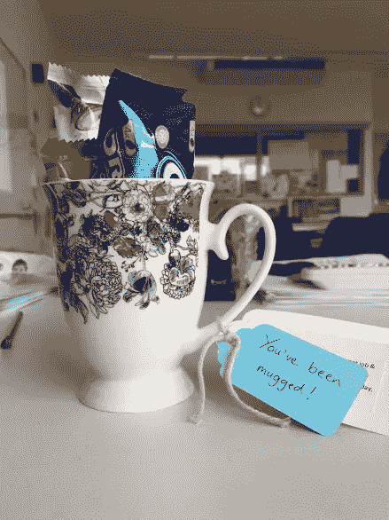

# 做一个真正的反叛者:善良

> 原文：<https://medium.com/swlh/be-a-real-rebel-be-kind-dc6eee6535f5>

Image by Robert Baker, Unsplash

如果你真的想惹我生气，你只需要说下面的一句话:

“你太善良了！”

“你真好！”

或者最无礼的说法:

你太好了，”

我一生中已经习惯了听到这样的话，作为对被视为某种无望的受气包的回击，这些年来我变得更加坚强，并坚持不让伤害过我的人进入我的生活。但是最近我决定做一个终极反叛者，重新变得善良。

我妈妈自己也去旅行了。她来到苏格兰时是一名 18 岁的孟加拉妇女，以前从未出过国。可悲的是，她一路上被各种不择手段的熟人和邻居敲了竹杠。

当我父亲失业时，我们居住的孟加拉小社区一点也不同情我。除此之外，我的一个兄弟患有自闭症，我妈妈为了给他获得正确的支持而不得不克服的障碍令人吃惊。

但我真正钦佩我妈妈的是，虽然她比任何人想象的都要坚强和有韧性，但她也非常善良。她会为她几乎不认识的人做大餐。她还每月捐钱资助孟加拉的家庭。

我的母亲也对她的社区表现出友好，她是一名“游击园丁”，在我们长大的灰色花岗岩议会庄园里随意种植灌木和外来植物。现在到处都是美丽的花朵，我们的一些邻居也开始了这项事业，在以前不被人喜欢的草地上种植自己的植物。

她从来不允许其他一些人过去对待她的残酷方式让她变得刻薄和节俭。也许是她作为一个虔诚的穆斯林的信仰帮助我妈妈度过了难关，但显然是她的慷慨和善良让她在情感上保持强大并充满希望。

**那么，善良意味着什么？**

字典上的定义是[友好、慷慨、体贴的品质。这也意味着做一件真正的利他行为，而不期望任何回报。](https://www.dictionary.com/browse/kind)

**什么叫‘善良’不是:**

这不是“太好”的问题。善良通常是告诉人们最残酷的事实——当然是以富有同情心和体贴的方式。在一个经常被误解并被视为弱点的世界里，善良需要很大的勇气。

**为什么善良对你有好处:**

根据英国心理健康协会的说法，友善[**“促进大脑中与快乐相关的积极生理变化。”**](https://www.mentalhealth.org.uk/publications/doing-good-does-you-good) 因此，它实际上影响你的身体健康的事实表明，善良对你是多么有益。

**为什么有些人不近人情？**

也许是因为我们一生中被教导的信息。在 80 年代成长起来的人都是“人人为自己”，要想在精英统治下生存，你必须照顾好自己。这种说法似乎是说，不从别人那里获取，你就无法获得财富。或者，如果其他人在他们生活的某个方面取得了成功，那么这应该被视为对你自己成功的威胁，而不是值得你庆祝和自信你也能取得成功的事情。或者“除非你知道别人会回报你，否则你不能对别人表示友好。”

**其他原因可能是:**

*   害怕被人认为“太好了”。这意味着你可能会被视为软弱和非常不酷，这是有史以来最大的罪过。
*   如果你真的很善良，那么你很可能是匿名做的，没有人会注意到——谁想要这样呢？
*   善良常常和讨人喜欢混为一谈。但取悦他人是指你看起来很无私，但实际上是为了得到别人的认可。
*   我们在新闻上看到的关于欺凌和公开羞辱的无休止的故事也让我们许多人转向内心，因为我们害怕被利用。

此外，我们都经历过的生活中的挫折会让我们更加厌倦同情他人。不幸的是，我从个人经历中知道，这种防御机制使我们更容易受到情感痛苦和疏远的伤害。

**如何做到善良:**

**先善待自己**

我们在生活中都会犯错，当我做了错误的决定时，我经常对自己说消极的话。但是责备自己只会让我对自己感觉更糟，让事情变得完全不成比例。这也意味着我没有完全和周围的人在一起。

真正帮助我的一个关键建议是思考:如果一个陌生人，甚至一个朋友以你对自己说话的方式对你说话，你会有什么感觉？

**善待他人——包括难相处的人**

作为一名教师，我知道当父母就他们孩子的教育进度向我提出质疑时，感觉就像是一种人身攻击。

但我不得不提醒自己，我们许多人这样做的原因是因为我们害怕，我们觉得没有人倾听我们。以一种敌对的态度看待那些挑战我们的人给了我们更理性地看待事物和解决问题的力量，而不是卷入某种毫无意义的情感斗争。

即使一个同事在工作中完全不讲道理，老实说，我不认为向他们表示善意有任何弱点——即使是看起来无关紧要的行为，比如仍然承认他们，并表现出文明和礼貌。如果你知道那个人想要故意伤害你，甚至恐吓你，这可能是一种巨大的利他主义行为。

这不仅意味着你在练习自我照顾，因为你没有让他们的行为影响你(太多)，也意味着你仍然友好地看待他们，作为一个肯定也怀疑一些积极品质的人。

**加号:**

让我感到惊讶的是，当你从我的一些同事身边走过时，他们不会说“你好”，即使他们和你有眼神交流。仅仅一个简单的确认或点头至少意味着你感觉被看见了。

真诚的赞美也能让某人开心一天；令人惊讶的是，这么多人会感到不舒服，但如果这是真诚的，发自内心的，那么就不会尴尬，只会让送礼者和接受者受益！

**随机善举**

这是个好主意。最近在工作中，我是这种随意善举的接受者——一个装满糖果的杯子。这当然让我很开心。

**在你的社区做志愿者**

通过参与当地的慈善活动，与你的社区建立更多的联系。如果不可能的话，就不必每周都去。可以是一个月去某个地方做一次志愿者。或者，如果有机会通过你的工作场所筹集资金或做志愿者，那么就把它建立起来，看看它是否能成为一个长期的承诺。

我很幸运，作为一名教师，我可以和我的学生们一起做这件事，他们非常热衷于为当地慈善机构工作。他们得到的巨大快乐和满足每次都提醒我，我们都将从更多地参与服务行为中受益。

出国做义工
你不一定要出国去从事国际慈善工作；现在，许多在线网站都在匹配能够支持海外社会企业和慈善机构的专业人士。

— -

你怎么想呢?你认为这个世界需要更多的善良，还是你认为这种信念过于简单化了？我很想听听你的想法。