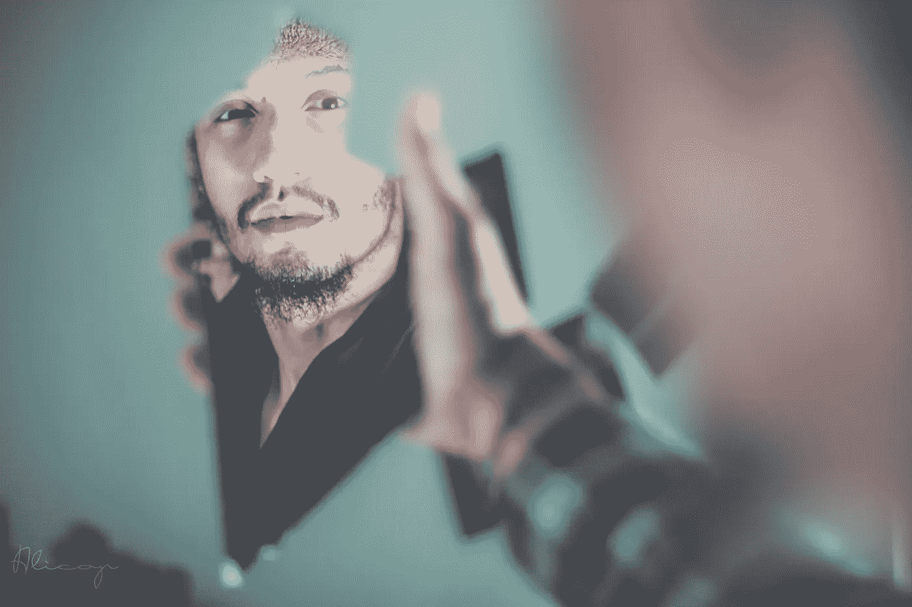

# 善待你的自我对话

> 原文：<https://medium.com/swlh/be-kinder-with-your-self-talk-578f5a60100a>

我经常发现自己对自己有不友善的、贬损的想法。你呢？

Photo by [Fares Hamouche](https://unsplash.com/photos/Xe9vkCD7_5g?utm_source=unsplash&utm_medium=referral&utm_content=creditCopyText) on [Unsplash](https://unsplash.com/search/photos/mirror?utm_source=unsplash&utm_medium=referral&utm_content=creditCopyText)

毫无疑问，我是我自己最糟糕的批评家。没有人能像我一样说我的坏话，诋毁我，让我难过。

这是一个老习惯，我正在努力克服和改变。