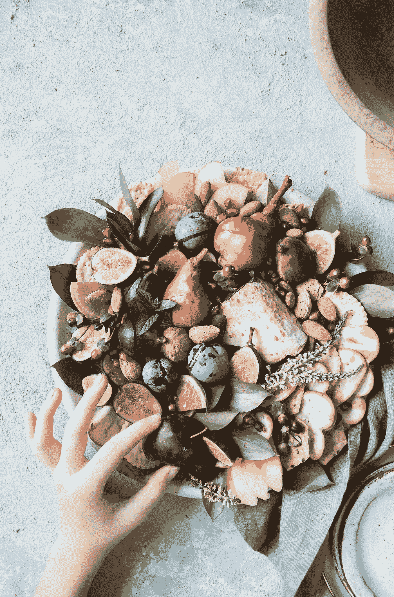

# 要挑剔。你只有一次生命。

> 原文：<https://medium.com/swlh/be-picky-youve-got-one-life-51af1e357604>

(image by Brooke Lark, from Unsplash.com)

我们不喜欢反复思考这个概念，因为它让人感到害怕和愤世嫉俗。它让我们紧张。然而，严酷的事实是，你在这里的时间是暂时的。这不一定是愤世嫉俗或消极的心态。相反，它可以给你的生活和决定带来生机、强烈的方向感和活力。

我们被赋予在地球上参与我们的活动的时间…