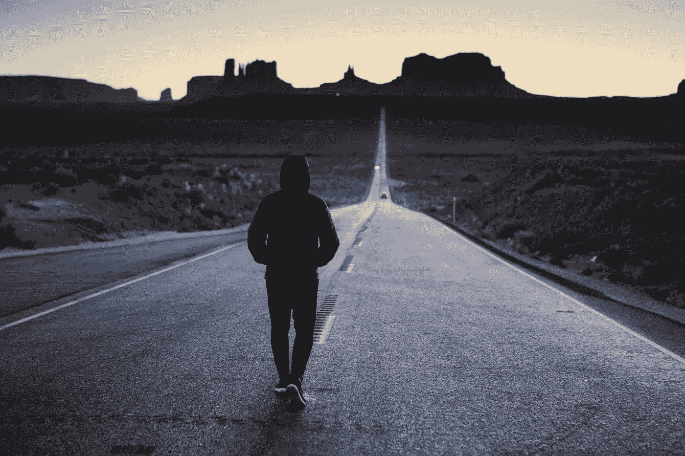

# 最擅长慢慢走

> 原文：<https://medium.com/swlh/be-the-best-at-walking-slowly-89524f304aa9>

Photo by [Tegan Mierle](https://unsplash.com/@tegan?utm_source=unsplash&utm_medium=referral&utm_content=creditCopyText) on [Unsplash](https://unsplash.com/search/photos/walking?utm_source=unsplash&utm_medium=referral&utm_content=creditCopyText)

天哪，我们周围的世界走得真快。

我们的待办事项清单*看不到尽头*，通知不断出现*，我们想看的电影或想读的书的清单越来越长*。**

**停一会儿，想想你想如何完成所有的事情。所有的一切。**

**我会等的。**