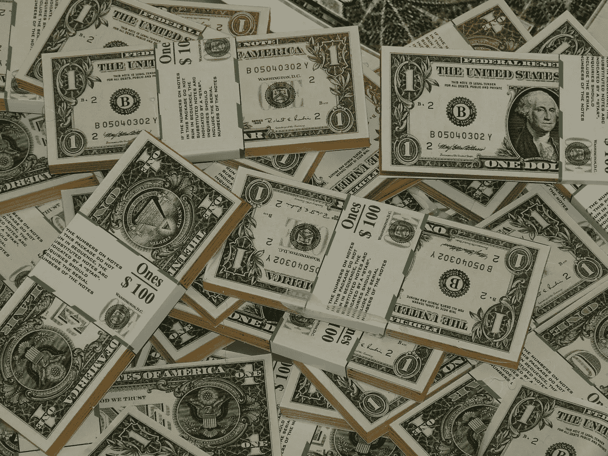

# 利用一个简单的原则，在 20 年内成为百万富翁

> 原文：<https://medium.com/swlh/become-a-millionaire-over-20-years-by-taking-advantage-of-a-simple-discipline-af672ce46882>

All the ones you use can become a million sooner than you think…

财富的创造以持续的实践为中心。一次大满贯，导致大比分的赔率低。我的习惯是赌对我有利。

> 我花了大约 14 年的时间建立了一个超过 100 万美元的房地产价值。