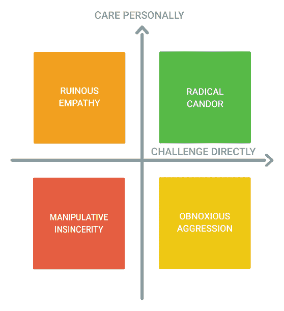

# 变得令人敬畏——创造持续改进的文化

> 原文：<https://medium.com/swlh/becoming-awesome-creating-a-culture-of-continuous-improvement-83a09d76e049>

持续改进是敏捷开发的核心。是文化和机制让团队适应不断变化的环境。然而，当团队对他们的敏捷开发方法沾沾自喜时，这往往是他们放弃的第一件事。设想一个理想需要努力，不断努力让今天的你比昨天的你更好。在快节奏和高压力的技术世界中，太容易陷入工作中，以至于忘记了工作流程。我想与大家分享我为所有客户做的一个练习，它创造了一种持续改进的基础文化，在此基础上我们所有的转型目标都可以成功。

# 创造持续改进的文化

持续改进远远超出了回顾。这需要团队受到鼓舞和激励，成为最好的自己。它需要团队内部、与公司其他部门以及与您的客户之间的信任和共鸣。它需要不断的反思和自省，并始终质疑既定的规范。

**牛逼的定义—** 要想精益求精，首先要设想理想。在这个独立的练习中，我们确定了体现最佳绩效团队的价值观、原则和行为。这成了一面镜子，让我们不断地审视自己，找出需要改进的地方。

**每日反思—** 每两周 30 分钟口头承诺持续改进是不够的。有多少次你出现在回顾会上，却不记得上一次冲刺中发生的任何有意义的问题？我们必须在这个时候确定问题。我建议在每天结束时进行五分钟的个人回顾，回顾一天的工作，记录下进展特别顺利或不顺利的事情。

**责任—** 责任意味着不仅对你自己，而且对整个团队的表现负责。当你与利益相关者一起工作时，你就代表了你的团队。当你和顾客一起工作时，你代表了你的整个公司。我们必须创造一种文化，以及奖励和激励制度，激励人们将共同目标置于自身利益之上。

**持续学习—** 当我们把所有时间都花在自己的泡泡里时，我们失去客观性的速度之快令人惊讶。我们不断在团队之外寻找知识，这一点至关重要。支持持续学习的文化，包括建立关系网、阅读、参加课程和探索新技术。鼓励队友与团队分享这些知识，并给他们时间来使用这些新工具或想法。

**挑战现状—** 持续改进的本质是不断问自己“我们能做得更好吗？”鼓励新的想法和工作方式。奖励冒险甚至失败。支持建设性的冲突，团队互相挑战以取得更好的结果。

**有效反馈—** 为了让团队快速提高，他们必须能够相互信任，并直接挑战对方。如果他们不能提供公开和诚实的反馈，这是不可能的。紧密的反馈循环是敏捷开发的核心机制，这同样适用于个人互动。我将在本文后面更深入地探讨这个主题。

# 有待改进的领域

一个团队可以通过许多不同的方式来提高。有些方式涉及技术，有些方式涉及人。留意这类问题，记下它们，并在回顾中寻找改进的方法。

## 沟通

**不明确的方向—** 我总是说，没有比做错误的事情更低效的工作方式了。我们的开发团队遇到的许多失败都是由于我们的领导和产品所有者没有明确的方向。缺乏远见或产品战略使我们无法提前计划。不清楚或不明确的用户故事和接受标准会导致我们错过目标。这个问题非常关键，已经成为我咨询实践的主要焦点。

**缺乏组织/协调—** 构建一个产品是一个困难而复杂的过程，并且会因为个人和团队之间缺乏协调而加剧。如此多的浪费是因为团队成员之间没有充分共享信息。筒仓效应是真实存在的，令人惊讶的是，在一个如此小的团队中，这种效应也会出现。

**个人冲突—** 萨特说，“地狱是别人。”你可以整天构建技术和应用流程，但是积极的工作关系是不可替代的。我们必须认真对待冲突，并在问题恶化和分裂团队之前解决问题。

**缺乏透明度—** 沟通是双向的。虽然工程师应该期待明确的方向，但他们也必须清楚地交流工作进展情况。很多时候，开发团队没有意识到实现他们的承诺的重要性，以及它对其他业务的影响。

## **工作流程**

**不完全移交—** 产品开发是将想法转化为可用技术的单一过程。每一次交接，从产品管理到设计，从设计到开发，或者从开发到 QA，都有失败的机会。在我的实践中，我非常仔细地观察团队之间的工作转换，经常发现界面没有很好地对齐。

**依赖延迟—** 每当团队之间进行交接时，通常都不清楚工作何时交付。我们都知道我们不擅长估计。寻找团队之间过渡的延迟。通常简单地尽早传达延迟将允许下游团队在其他事情上工作，而不会影响整体生产力。

**需求流失—** 方向不明确导致重复返工和延迟。看看一个故事在 sprint 中更新了多少次，或者在状态间摇摆了多少次。

**范围蔓延—** 范围蔓延是任何开发人员存在的祸根，它导致团队无法向客户交付价值。虽然在软件发布后对其进行更改是很好的，但是在发布周期中范围的不断增长会延迟客户价值的交付，而这是敏捷开发的核心原则。

## 技术

**技术债务—** 我在另一篇文章中写过关于技术债务[的文章，但我只想说它在某种程度上困扰着每一个产品，应该持续地管理和处理。](https://hackernoon.com/youre-not-paying-the-true-cost-of-software-development-and-it-s-killing-your-business-8d44b54be055)

**缺少合适的工具—** 任何时候你发现自己在做重复的、手工的或简单的任务，你都可能在浪费时间。寻找编写新工具的机会，或者在市场上寻找可以帮助简化工作流程的工具。

**需要改进架构—** 如果您发现您的系统架构在开发速度或可伸缩性方面阻碍了您，您可能需要改进您的架构。有了清晰的产品策略，CTO 应该能够管理他们技术路线图上的架构发展。

**对自动化的需求—** 测试和部署自动化允许更快的发布周期、更紧密的反馈循环、更一致的质量，以及更少的救火工作。一旦你的工作流程建立起来，你应该在自动化方面投入大量的资金。

## 技能

**学习曲线—** 当利用一门新的语言、工具或框架时，预计在评估和执行 sprint 时会有不确定性。相应地计划，并投入时间让团队学习。

**导师—** 团队通常有更多的资深成员和初级成员。为了团队的长期成功，资深成员指导和训练年轻成员以提高团队的技能是至关重要的。不要把高级会员挤得满满的。当初级成员需要帮助时，给他们时间来指导他们。

**交叉训练—** 你想在某个时候休假，对吗？t 型团队不仅在持续交付方面最有效，而且在不同技能的需求发生变化时也最有效。寻找结对计划和交叉培训的机会，即使这可能会暂时降低团队的速度。

**技能差距—** 有时候团队中缺乏某项技能。找出这些差距，或者投资培训，或者在团队中找一个有培训的人。

# 两种故障模式

我在团队中发现了两种主要的失败模式，它们阻碍了团队的持续改进。留意这些原型，并要求他们负起责任，努力改进。

抱怨者——这个人带来了所有的问题，却没有解决方案。他们相互指责，相互指责，对结果不负任何责任。没有责任，没有跟进，也没有改善的承诺。这个人也倾向于拖累其他人，创造一个有害的环境，这对士气是灾难性的。

自满者——这个人不想节外生枝。他们只是走走过场。他们出现在回顾会上，但没有提供任何有意义的反馈。他们不会在回顾之外花时间思考如何改进。他们不会不断学习或与团队分享新想法。他们也没有改进的责任或承诺。这个人也创造了一个消极的环境，我称之为“恐惧”

## 冠军

还有第三个原型，我喜欢称之为冠军。这个人体现了我一直信奉的所有原则。他们认为我们可以也应该做最好的自己。他们每天都有目的地见面，并设定明确的目标。他们反思自己的一天，并花时间思考改进的方法。他们为团队的成功承担个人责任。他们参与并支持整个公司的团队成员。他们被公司的使命所吸引，并且相信他们正在朝着一个有意义的目标努力。作为领导者，我们希望团队中的每个人都成为这种原型。

# 进行有效的回顾

有了持续改进的文化和对要解决的问题保持警惕的眼光，回顾会应该是一个生动和创新的会议，团队在这里互相挑战，成为最好的自己。基本结构可能很熟悉，但重点是根本原因和可操作的输出。如果不提出这样的问题，任何事情都无法摆到桌面上:“这次成功/失败的原因是什么？”以及“我们应该做些什么来加强/改善它？”

## 什么进展顺利，为什么？

很多时候，团队会说出一些已经发生的好事，然后就此打住。深入挖掘，试图理解是什么导致了成功。其中有一个教训应该被提出来，并可能与其他团队分享。在团队章程中记录原则或实践。

## 什么不顺利，为什么？

提出沟通、工作流程、技术和技能方面的问题。找出根本原因，不要害怕直接挑战别人。回顾会应该是一个安全的环境，人们可以开诚布公地谈论他们面临的问题，并合作解决问题。

## 我们应该有哪些不同的做法？

每一次成功或失败都应该有一个与之相关的行动。讨论如何解决问题或巩固成功，定义行动和负责人，并跟踪他们的进展。在 backlog 中创建故事，并在接下来的 sprint 中对它们进行优先级排序。如果是个人问题，获得双方改善工作关系的承诺，并让他们在未来承担责任。

## **展示和讲述**

如果团队在不断学习，他们会遇到相关的内容或技术，应该与团队分享。花几分钟时间进行回顾或演示，并提出可以立即实施的应用程序。

# 有效反馈

现在我们已经有了支持持续改进的文化和机制，还有最后一块拼图。挑战我们自己和彼此来做得更好是一个微妙的问题。我们必须能够在不产生负面冲突的情况下向彼此提供诚实而直接的反馈。

## 为什么我们不给出反馈

我们中的许多人选择不提供反馈，因为我们不想伤害他人的感情。我们可能害怕报复。我们可能害怕获得不满者的名声。提供反馈需要努力和风险。我们可能有一个个人的、以自我为中心的焦点(“那不是我的工作”)。我们过去可能尝试过提供反馈，但没有看到结果。这种有效的反馈模式允许人们以建设性的、非威胁性的、面向行动的方式分享他们的反馈。

## 彻底的坦白

这本书描述了公开和诚实反馈背后的原则。我不会说得太详细，但我们的目标是对我们的队友表示同情，同时就对团队产生负面影响的行为给出公开、诚实的反馈。我建议回顾一下这个模型，并与您的团队进行讨论。在我早期的失败模式中，抱怨者与令人讨厌的攻击性联系在一起，自满者与毁灭性的同理心联系在一起。

Care Personally and Challenge Directly

## 有效反馈模型

我使用的方法直接来自夫妻治疗。主要的想法是，当我们想要提供反馈时，我们是在遵循一个过程，这使我们脱离了正常的对话，并使我们处于一种不太可能将反馈视为人身攻击的模式。

**触发——**简单地说**“你愿意接受一些反馈吗？”**这让其他人参与进来，让他们知道我们即将开始这个过程。然后他们知道会发生什么，以及如何相应地行动。

**事实—“你还记得你做 X 的时候吗？”通过尽可能准确地陈述事实，你们双方都同意这件事。你可以辩论和澄清事实，直到你对现实达成共识。**

**影响—“当你做了 X，你因为 y 而影响了我/团队。”**反馈的目的是让其他人明白他们的行为如何影响了你或团队。不要妄下判断或解决方案。只需努力获得对影响的相互理解。

**可选建议——“以后，如果你改做 Z，我会很感激。”**除非你强烈感觉到他们应该如何与你互动，否则不需要建议新的行为。简单地提供反馈并让他们消化就足够了。作为工程师，我们倾向于提供解决方案。如果可能的话，给对方时间思考反馈。

**致谢——“感谢您的反馈。”**就这样。不要自卫。不要找借口。目前不要求他们做出任何承诺。对他们来说，感谢你有勇气让他们注意到这一点就足够了。

**跟进—** 在这个模型中，有一个隐含的约定，即他们现在对所提供的反馈负责。他们可以花时间思考反馈，并在下次回顾时提出解决方案。如果反馈与个人冲突有关，他们应该注意这种行为，以后不再重复。如果这个人没有从反馈中吸取教训，你应该在下一次回顾中向团队提出。如果消极行为重复出现，团队可以进行干预。如果这个人没有表现出改进的决心，他们可能会被永久地从团队中除名。虽然不是每个人都适合，但这是自我管理团队的巅峰。

# **结论**

真正伟大的团队的表现不是因为他们的过程，而是因为他们的态度。如果态度不好，你永远无法摆脱困境。有了正确的态度和持续改进的文化，无论你从哪里开始，你最终都会取得成功。

通过这个相当简单明了的模型，我已经能够将士气低落、表现不佳的团队转变为热切、敬业、高绩效、令人敬畏的团队。从“牛逼”的定义开始，定义你的原则和动机，创造一个建立信任和共鸣的环境，鼓励有效的反馈，给团队时间和自主权去创新和尝试新的想法，努力变得牛逼。

# 刚推出！获取免费的产品开发工具包！

我已经整理了一个完整的包来帮助企业家、初创公司创始人和首席执行官学习如何建立技术产品和业务。我免费赠送的第一部分是一个可定制的产品开发工具包。它包括我和我的真实客户一起使用的所有模板，帮助他们从想法到执行。[拿过来！](http://www.buildtherightthings.com/toolkit)

# 你可以帮助传播这个积极的信息。如果你做到了这一步，请疯狂点击！

## 这篇文章发表在 [The Startup](https://medium.com/swlh) 上，这是 Medium 最大的创业刊物，拥有+418，678 名读者。

## 订阅接收[我们的头条新闻](http://growthsupply.com/the-startup-newsletter/)。

