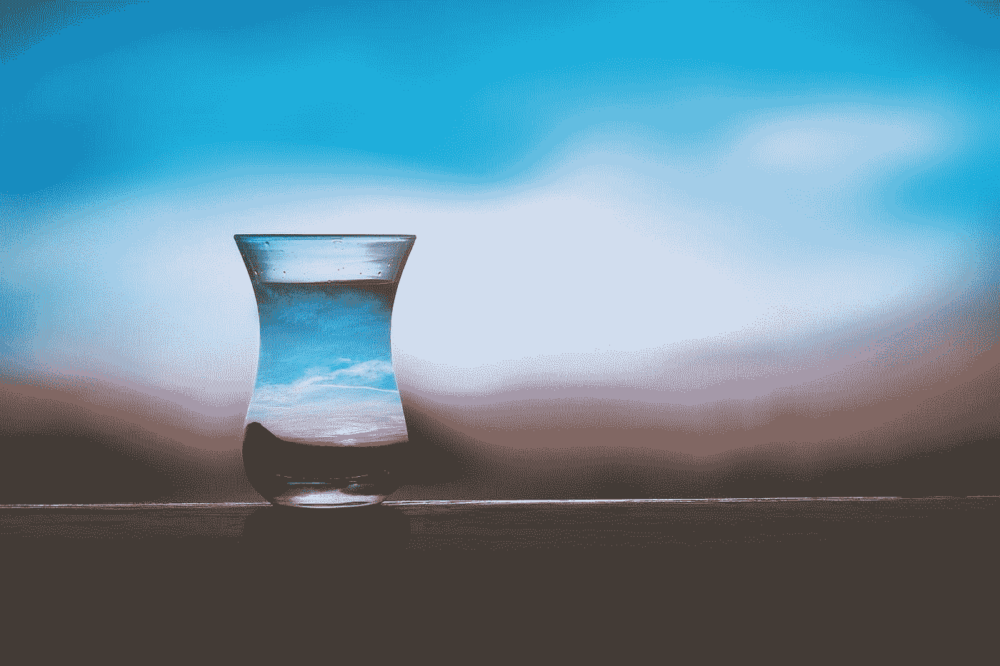

# 变得更加本质主义

> 原文：<https://medium.com/swlh/becoming-more-essentialist-d68254dcf516>

我是一个正在康复的“是”瘾君子。

FOMO 经常是我身边不受欢迎人。

然而，昨晚我做了一些不同的事情，一些感觉有点不舒服，完全不像我的事情。我拒绝了。我拒绝了一个我本想享受的真正有趣、激动人心的夜晚。

事实上，在计划的晚上之前，我已经有了一周的工作，这让事情变得更容易了…