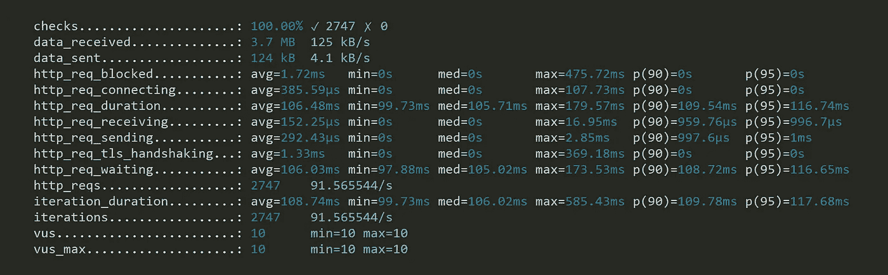
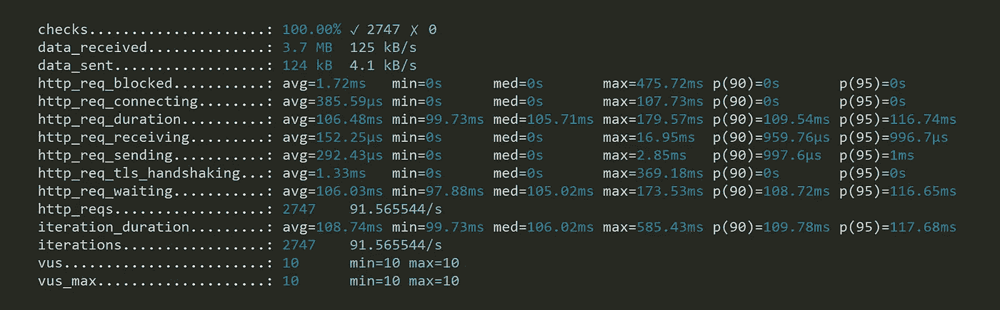
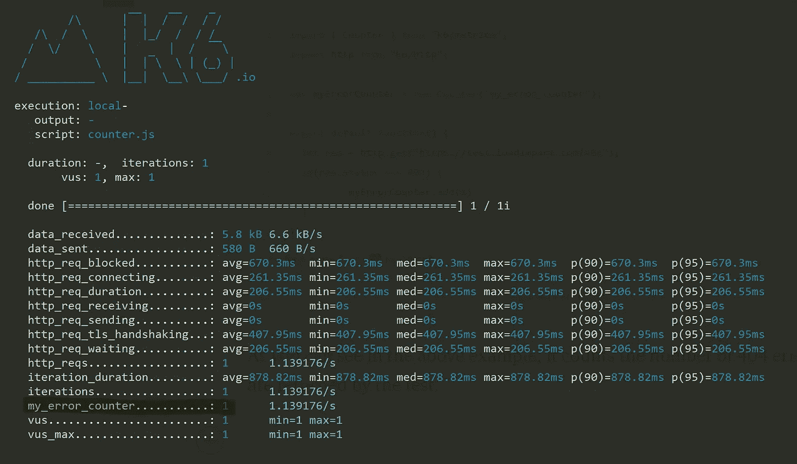
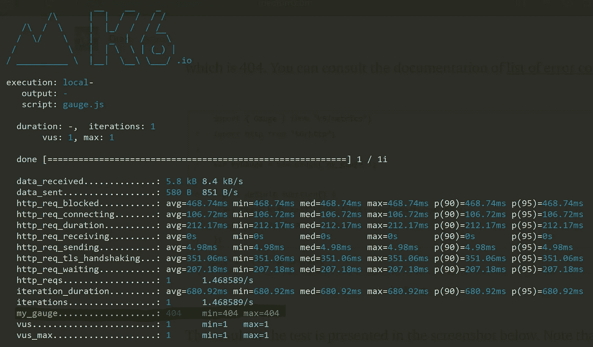
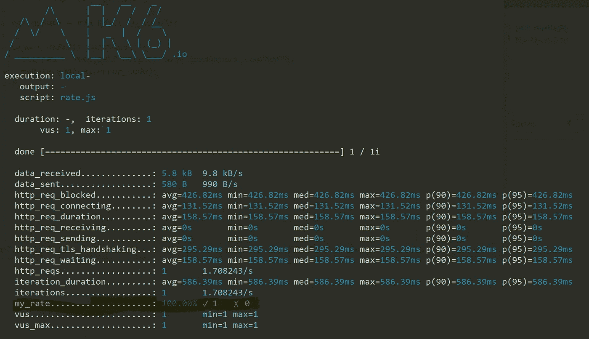
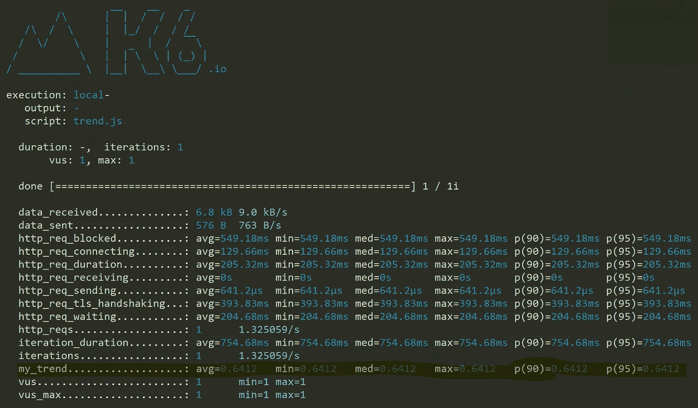

# k6 负载测试初学者指南

> 原文：<https://medium.com/swlh/beginners-guide-to-load-testing-with-k6-73d55ee23723>

## 第 2 部分—绩效目标和 k6 指标

性能测试是一组测试的总称，包括许多类型的测试，正如在本系列的第一部分中所讨论的。每种测试类型都试图回答一组问题，以使性能测试过程更加面向目标。这意味着仅仅运行测试是不够的，你必须有一套要达到的目标。

由于我们正在测试一个 API 或一个网站，以下目标可能是相关的，您可以从中选择一个或多个:

*   **并发**:设定这个目标的系统，通常有一个终端用户的概念，当许多并发用户试图访问系统时，需要观察系统的行为。他们主要想测试在高用户负载下有多少请求失败/通过。这既包括许多并发用户，也包括每个用户同时请求多个资源。
*   **吞吐量**:没有终端用户概念的系统，会设定这个目标来观察系统的整体表现，同时有大量的请求/响应进出系统。
*   **服务器响应时间**:这个目标表示从客户机向服务器发出初始请求到服务器发回响应所花费的时间。
*   **回归测试**:有时我们的目标不是给系统带来“沉重的负载”，而是更多地关注“正常负载”以及功能和回归测试，以了解变化会如何影响我们的系统性能，以及它是否仍然符合我们定义的 SLA。

总体思路是从速度、可伸缩性、稳定性和弹性的角度来衡量系统或系统的系统在高负载下的表现。每一个都可以用这些目标来衡量。

1.  **速度**
2.  ***可伸缩性**可以通过系统在负载增加时的可伸缩性来衡量，也可以通过衡量系统在此负载下是否能持续一段时间来衡量。*
3.  ***稳定性**可以通过系统承受负载的能力来衡量，并查看它是否能够承受大量错误和事件，并且仍然保持响应和稳定。*
4.  ***弹性**可以通过系统在承受过多或过于频繁的负载并最终导致系统崩溃后，如何从崩溃和停机中恢复并响应请求来衡量。*

## *重新运行测试以验证结果*

*您可以重新运行测试，看看它们在不同的测试中是否保持几乎相同的结果，并比较这些测试，看看它们是否有偏差。*

*如果它们几乎相同，您可以分析测试并得出您的结果，否则您应该查明它偏离的地方，并试图找到一种方法来防止它发生，如瓶颈。*

## ***k6 和指标***

*k6 支持一组内置和定制的指标，可以用来衡量各种事情，或者实现上述目标，或者证明它们是错误的。可以用来定义自定义指标的指标有:[计数器](https://docs.k6.io/docs/counter-k6metrics)、[计量器](https://docs.k6.io/docs/gauge-k6metrics)、[速率](https://docs.k6.io/docs/rate-k6metrics)和[趋势](https://docs.k6.io/docs/trend-k6metrics)。*

**

*k6 built-in metrics*

*正如您可能已经在上面看到的，下表描述了所有测试中报告的内置指标:*

*k6 built-in metrics, **Credits**: [https://docs.k6.io/docs/result-metrics#section-built-in-metrics](https://docs.k6.io/docs/result-metrics#section-built-in-metrics)*

*k6 HTTP-specific built-in metrics, **Credits**: [https://docs.k6.io/docs/result-metrics#section-http-specific-built-in-metrics](https://docs.k6.io/docs/result-metrics#section-http-specific-built-in-metrics)*

## *自定义(非内置)指标*

## *1.计数器*

*这是一个简单的累积计数器，可用于测量任何累积值，如测试期间的错误数。*

*k6 Counter metric*

*正如您在上面的例子中看到的，它计算了测试返回的 404 个错误的数量。结果在下面的截图中显而易见:*

**

*Results of k6 Counter metric*

*因为这是一本初学者指南，所以我尽量坚持使用简单的例子，但是您可以根据自己的具体情况对它们进行扩展和定制。*

## *2.测量*

*此指标允许您保留最后添加到其中的内容。这是一个简单的可重写的指标，保留了它最后的附加值。*

*该指标可用于保留任何测试项目的最后值，无论是响应时间、延迟还是任何其他用户定义的值。*

*如果您运行下面的代码，您会看到它捕获了最新的错误代码，即 404。*

*k6 Gauge metric*

*测试结果显示在下面的截图中。*

**

*Results of k6 Gauge metric*

## *3.速度*

*这个内置指标将比率保持在非零值和零/假值之间。例如，如果您添加两个假值和一个真值，百分比将变为 33%。*

*它可用于跟踪成功请求/响应的比率，并将它们与错误进行比较。*

*在下面这段代码中，您可以看到我添加了`res.error_code`作为一种度量，以查看我将捕获多少错误。*

*k6 Rate metric*

*下面是测试的结果，100%错误。*

**

*Results of k6 Rate metric*

## *4.趋势*

*此指标允许您统计计算您的自定义值。它会给出最小值、最大值、平均值和百分位数，正如上面针对`http_req*`请求的截图所示。*

*k6 Trend metric*

*上述趋势指标示例显示了如何在不考虑等待时间的情况下计算发送和接收时间。结果如下所示:*

**

*Results of k6 Trend metric*

*在这一部分，我试图描述性能测试的目标，以及如何使用度量来实现这些目标。在接下来的部分中，我将尝试更深入地向您展示更多关于如何定义定制指标以及如何使用它们的细节。*

*既然您已经很好地掌握了性能目标和 k6 指标，那么您可以转到下一篇文章中的[，在这篇文章中，我将向您展示如何编写和运行 k6 脚本。](/swlh/beginners-guide-to-load-testing-with-k6-ff155885b6db)*

***穆斯塔法·莫拉迪安**
Sr. SWE @ [负载冲击](https://medium.com/u/7df2fe2c0bfd?source=post_page-----73d55ee23723--------------------------------)
[GitHub](http://github.com/mostafa)|[LinkedIn](https://www.linkedin.com/in/mostafa-moradian/)|[Twitter](https://twitter.com/MosiMoradian)*