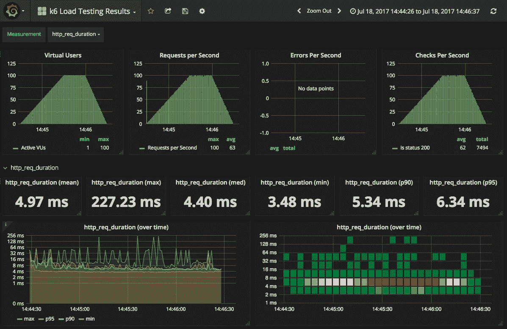
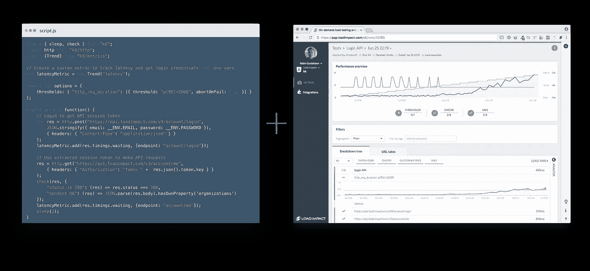
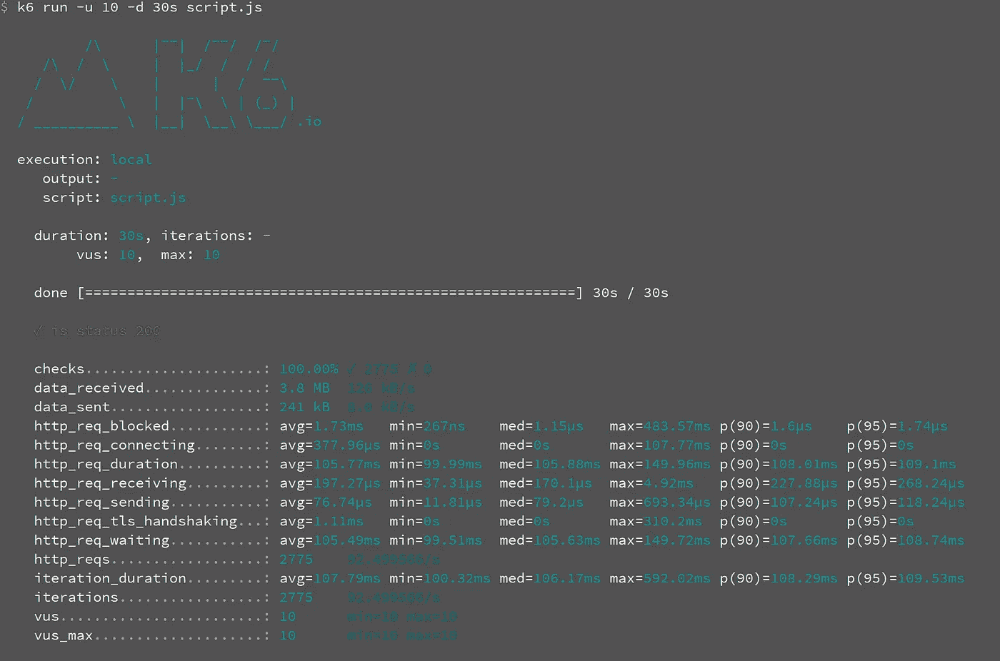

# k6 负载测试初学者指南

> 原文：<https://medium.com/swlh/beginners-guide-to-load-testing-with-k6-85ec614d2f0d>

## 第一部分—前奏



**Credits**: [https://grafana.com/dashboards/2587](https://grafana.com/dashboards/2587)

更新:本文是负载测试系列的一部分。我会尽量定期发布这个系列的相关话题。我不会在每篇文章上重复这个目录，所以请检查第一篇文章以获得新的更新。此外，我会尝试将文章链接在一起，这样你就可以很容易地了解这个系列的下一篇文章。于是乎，这些陆续发布:

> [第一部——前奏](/swlh/beginners-guide-to-load-testing-with-k6-85ec614d2f0d)
> 
> [第 2 部分—绩效目标和 k6 指标](/swlh/beginners-guide-to-load-testing-with-k6-73d55ee23723)
> 
> [第 3 部分——如何编写&使用 k6](/swlh/beginners-guide-to-load-testing-with-k6-ff155885b6db) 运行负载测试

让我们从一些问题开始:

*   您是否考虑过如何发现您的基础架构设置是否能够承受高用户负载？
*   您曾经能够在不处理当前测试工具的如此多的配置和陡峭的学习曲线的情况下运行负载测试吗？
*   您是否考虑过通过测试编写脚本的方法，无论是针对负载/性能还是其他方面？
*   您是否想过性能测试可以简化，并作为 CI/CD 流程的一部分？

你并不孤单。我记得我是一个团队的首席开发人员，致力于开发一个 API，为我们不断增长的应用程序集提供许多微服务，如内容和用户管理、计费、分析等。那时，我们在源代码控制和 CI/CD 过程中使用软件工程中最新的最佳实践。我们已经使用 docker 和托管 GitLab 建立了 CI/CD 流程，并使用 GitLab CI 处理 CI 流程。经过一段时间的测试和代码推送，我们决定采用 alpha-stage API，它可以满足我们开发新应用的需求。

经过一段时间的开发、测试和改进，我们决定在负载下测试我们的 API，看看它是否能兑现承诺。因为我们已经看到，在 200，000 个用户订阅并且其中 60，000 个用户使用我们的其他应用程序之后，对其他 API 的请求/响应流会变慢，而其他 API 的设置大致相同。

因此，为了不错过在客户到来之前进行(负载)测试的机会，我们决定研究负载测试我们的 API 的方法。在我们调查了 Locust、Apache JMeter 等之后，我们决定使用 Apache JMeter，它曾经是(现在仍然是)这个行业的工具。我们认为这是一个很好的选择。我们花了将近三天的时间才学会使用 GUI 版本执行简单的负载测试。我们能够从一台服务器产生负载测试并分析结果。结果很好，因为它让我们更深入地了解了在并发用户数量和 API 在负载下的响应时间方面，我们应该从 API 中得到什么。

但后来我们没有使用该工具，因为当时没有明确的方法将其集成到我们的 CI/CD 流程中，我们也没有足够的时间来学习和使用它。我们想要一些对开发者更友好，更能融入我们的工作流程，更容易学习的东西。现在，它已经有了很大的改进，并且很容易与 CI/CD 管道集成。

现在，我在一家公司工作， [Load Impact](https://loadimpact.com/) ，以负载和性能测试为核心业务。他们有一个自由/开源、易于脚本化的工具(JavaScript)，叫做 [k6](https://k6.io/) ，可以用于负载测试。他们还在*的基础上提供了一个云服务，同样的工具*，用于供应和运行来自世界不同地区的测试([云执行](https://loadimpact.com/cloud-execution/))，它最终会给你一个漂亮的仪表板( [Insights](https://loadimpact.com/insights/) )，上面有闪亮的图表显示测试的分析结果。它还与 CI/CD 工具和平台有很好的集成。



**Left**: load test script written in JavaScript, **Right**: Cloud service of Load Impact (Insights), **Credits**: [https://loadimpact.com/](https://loadimpact.com/)

说够了！让我们深入了解什么是负载测试，以及我们如何使用 k6 在我们的基础设施上进行负载测试。我以后也会试着写更多关于云服务的东西。

## 什么是负载/性能测试？

性能测试是计算机科学实践中性能工程的一个子集，它通过手动或自动对软件施加压力和工作负载来处理软件的质量保证，以观察软件的行为并确保它在该负载下足够响应和稳定。这都是关于期望。例如，您希望您的 API 或网站同时为 10K 用户服务，但是当您对其施加压力时，很快就会发现您的计算与现实不符，事实证明情况正好相反。然后，您应该分析您的设计或设置中的弱点，看看如何从高负载中获益。

在性能测试中，有许多类型的测试满足不同的目的(来源:[https://en.wikipedia.org/wiki/Software_performance_testing](https://en.wikipedia.org/wiki/Software_performance_testing)):

*   **负载测试**:基本上，给系统加载负载，看看它的表现如何。
*   **压力测试**:负载测试，找出系统能够处理的最大负载量。
*   **浸泡测试**:持续对系统进行负载测试，监控内存泄漏和系统行为。
*   **尖峰测试**:负载突然增加或减少的负载测试。
*   **断点测试**:类似于压力测试，但随着时间的推移，会对系统施加递增的负载，以观察它的表现。
*   **配置测试**:改变配置，观察系统在不同配置、负载下的表现。
*   **隔离测试**:隔离故障域，重复测试确认故障。
*   **互联网测试**:大公司的全球负载测试，看看不同地区的系统表现如何。

性能测试最常见的目的是找出系统的可靠性、稳定性、性能和响应能力。像吞吐量和响应时间这样的指标是这种系统的一个很好的度量。

## k6:编写脚本和运行负载测试并解释结果

k6 是一个用 Go 编写的免费/开源工具，它可以接收用 JavaScript (ES5.1+)编写的测试，并将其转化为对网站或 API 进行负载测试的请求。

使用 k6 最简单的方法是使用官方预建的二进制版本将其安装在你的机器上。k6 通过 *MSI* 安装程序支持微软 Windows，通过 *APT* 库支持 GNU/Linux，通过 *brew* 支持苹果 macOS。

还有一个官方码头工人形象。不建议初学者从源代码开始构建，但是您总是可以选择这样做。

然后，您可以使用以下脚本运行您安装的 k6 命令:

A sample test script for k6

一旦您将这个脚本保存到 k6 可以访问的地方，将其命名为`script.js`或您自己想要的文件名，您就可以用 10 个*虚拟用户* (VU)运行它，时间为 30 秒，如下所示:

```
k6 run -u 10 -d 30s script.js
```

它在 30 秒内使用 10 个虚拟用户在您的机器上运行 k6，并检查测试 URL 在所有测试中是否返回 *200 (OK)* 。

运行该命令的输出如下所示。我建议您看一看它，以便更好地理解不同的度量、检查和其他键值。这个输出将在下一篇文章中详细解释。

通过解释当前的输出，您可以看到脚本在本地执行了 30 秒的*并产生了 *10 个单独的虚拟用户(vu)*来测试 URL。您还可以看到突出显示的绿色已检查项目，“*是状态 200* ”，这表示我们的*检查已通过 100%的案例*，即所有案例。*

还显示了 2775 个请求中发送和接收的总数据。对于每个 HTTP 请求，都有一个具有 5 个不同值的 *http_req_** 度量(key ),每个值对应于所有请求的*平均值、最小值、中值、最大值、第 90 个百分点和第 95 个百分点*。



Terminal output of the sample test script for k6

这是对性能/负载测试和 k6 工具的简短介绍。我会试着写一些更高级的负载测试文章，向你展示如何对你的网站和/或 API 进行负载测试。

本系列将继续提供更深入的性能/负载测试文章，假设读者以前没有这方面的经验。

[在本系列的下一篇文章](/swlh/beginners-guide-to-load-testing-with-k6-73d55ee23723)中，我将尝试谈论性能目标和 k6 度量，它们是负载测试的构建块。

一如既往，我真的很感谢你的建议，意见和投入。我要感谢 Pepe Cano 和 Robin Gustafsson 对本文和系列文章提出的宝贵意见和建议。

**穆斯塔法·莫拉迪安**
Sr. SWE @ [负载冲击](https://medium.com/u/7df2fe2c0bfd?source=post_page-----85ec614d2f0d--------------------------------)
[GitHub](http://github.com/mostafa)|[LinkedIn](https://www.linkedin.com/in/mostafa-moradian/)|[Twitter](https://twitter.com/MosiMoradian)