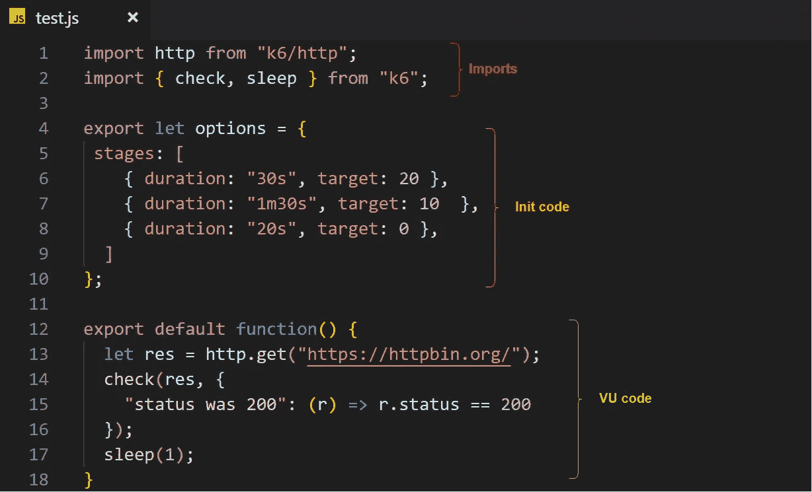

# k6 负载测试初学者指南

> 原文：<https://medium.com/swlh/beginners-guide-to-load-testing-with-k6-ff155885b6db>

## 第 3 部分——如何使用 k6 编写和运行一个基本的负载测试


既然您已经了解了[基础知识](/swlh/beginners-guide-to-load-testing-with-k6-85ec614d2f0d)并定义了您的[性能目标](/swlh/beginners-guide-to-load-testing-with-k6-73d55ee23723)，现在是时候编写您的负载测试脚本并使用 k6 运行它了。因为 k6 脚本可以用 JavaScript 编写，所以如果您对这种编程语言有一点了解，就可以很容易地编写它们。

## k6 测试生命周期

每个测试脚本都有三个部分(实际上有更多)，如下面的截图所示:



Different parts of the k6 script

1.  ***导入*** :这显然是你可以导入 [k6 脚本 API](https://docs.k6.io/docs/init-context) ，以及你想要使用的其他 [JavaScript 模块](https://docs.k6.io/docs/modules)(库)的地方。这些模块可以使用各种方法加载:[本地机器上的捆绑 NPM 模块](https://docs.k6.io/docs/modules#section-npm-modules)(已通过浏览器验证，但不支持浏览器 API)和[远程模块](https://docs.k6.io/docs/modules#section-remote-modules)(从 URL，甚至 CDNJS 和 GitHub)。*提示*:确保通过挂载的卷使库对[dockered 版本的 k6](https://hub.docker.com/r/loadimpact/k6) 可用，否则你的脚本找不到导入。
2.  ***Init 代码*** :这是脚本的一部分，在导出的*默认*函数之外。它通常用于为整个测试提供选项，如何运行测试，如何在云上分发测试，等等。显然，它用于整个测试本身的初始化。
3.  ***VU 代号*** : k6 支持一个叫虚拟用户的特性。这意味着你可以使用*单独的*“智能”虚拟用户来测试你的系统。这个部分中的代码位于导出的“*默认*”函数中，在每个 VU 中反复运行，所有这些 vu 的汇总结果由 k6 处理和报告。这是您定义测试场景的地方，这将在本文中详细解释。

在 k6 测试的生命周期[中还有其他阶段，包括*设置*和*拆除*，很明显，它们与初始化和 VU 代码是分开的。](https://docs.k6.io/docs/test-life-cycle)

## k6 怎么跑？

k6 的运行方法有很多种。由于 k6 分布在[源代码](https://github.com/loadimpact/k6)和[二进制](https://github.com/loadimpact/k6/releases)中，你可以很容易地在你的机器上抓取并安装一个二进制版本并运行它。支持的操作系统包括 GNU/Linux、微软 Windows 和苹果 macOS。还有一个[docker 化版本](https://hub.docker.com/r/loadimpact/k6)，你可以在你的 docker 设置上运行。

无论您在哪里运行 k6，它都会为您提供相同的体验。下面是 k6 命令的帮助:


k6 help

运行 k6 的格式就像“k6 [command]”，然后你可以传递你想要的命令，让它由 k6 运行。从版本 0.25.1 开始，可用的基本命令如下。此外，您可以通过以下组合获得每个命令的帮助:

```
k6 <command> --help
```

*   **帮助**:显示上面的帮助，嗯，很明显。
*   **暂停**:暂停正在运行的测试。
*   **恢复**:恢复暂停的测试。
*   **运行**:使用各种标志运行测试，例如- *暂停*在暂停模式下运行脚本。
*   **stats** :显示当前运行或暂停的测试中 vu 数量的统计数据。
*   **状态**:显示当前 k6 实例的状态，运行、暂停、感染和 vu 数量。
*   **版本**:猜猜看？

这些是更高级的命令，我将在接下来的文章中介绍:

*   **存档**:创建一个你的脚本的捆绑 *tar* 文件以及所有的依赖项，你可以在以后使用“k6 run”。
*   **登录**:使用[负载影响洞察](https://loadimpact.com/insights/)云服务进行认证，并提供一个认证令牌供 k6 使用。
*   **cloud** :在 k6 云服务上运行您的认证测试。
*   **转换**:浏览器可以将请求/响应记录为 HAR (HTTP Archive)文件，然后您可以使用 k6 将它转换为 HAR 文件。k6 从 HAR 文件创建一个脚本，您可以在本地或云端编辑并运行它。
*   **检查**:基本输出该脚本的合并脚本选项或。焦油包。
*   **scale** :用新数量的虚拟用户(vu)来扩展暂停/运行的测试。它可以为本地或云执行实现这一点。

为了控制 k6 的行为，每个命令都有一组丰富的选项/标志要传递。我强烈建议你看看它们，因为有时你会在里面发现宝石。

## 测试场景和结果解释

测试场景是每个测试不可分割的一部分。如果你想测试你的 API 或者网站，你得有一个场景，最终把它变成一个脚本，然后传给 k6 运行。

让我们举个例子:

1.  用户检查 API 是否启动，因此检查我们的 API 的心跳，然后尝试发送进一步的消息。
2.  然后他们试图创建一个令牌来访问我们 API 的其他部分或私有区域。
3.  最后，他们试图访问我们 API 的一个端点。

```
[heart-beat]->[generate-token]->[get-list-of-users]
```

您还想添加一些更多的标准和阈值，以便能够从 k6 中发现更有意义的结果。虽然有些信息，比如 threshold，在本文中是新的，但我将在接下来的文章中尝试完整地解释它们。您希望这个场景由 100 个单独的用户测试，从 10 个用户开始，逐渐增加到 100 个，然后逐渐减少到 0 个，并将所有请求的响应时间保持在 500 毫秒以下。

脚本应该是这样的:

Example of k6 scenario script

我用 httpbin.org 作为厨房水槽来测试 k6 的这个脚本。运行测试五分钟的结果如下:


Output of k6 scenario script

输出从打印到屏幕上的 k6 徽标开始。接下来是执行方法，在我的例子中是“本地”的。输出被重定向到终端，脚本的名称是“test.js”。

持续时间和迭代次数为空，因为它们是根据阶段自动计算的。(最大)vu 数为 100，进度条显示五分钟内完成。

“v1 API 测试”和其他组名后面是一个白色的全形符号“█”,所有的检查都是绿色的，表示它们在所有情况下都通过了。

测试中的所有检查都通过了，特别是 33741 个请求中的 56213 个检查。还显示了发送和接收的数据量、vu、迭代和一些其他指标。

非常重要的部分是以 *http* 开头的指标。它们表示每个请求或一组请求完成所用时间的平均值、最小值、最大值、p(90)和 p(95)。

因为我们已经将平均阈值定义为 500 毫秒。由于所有请求的平均时间没有那么长，所以测试通过了。

屏幕上显示的结果是所有测试的汇总结果。如果您希望能够使用所有生成的数据，而不仅仅是聚合的数据，您应该使用`-o`标志将输出发送到文件、软件或云服务。

可以使用 [JSON 插件](https://docs.k6.io/docs/results-output#section-json-output)将原始结果写入 JSON 文件。还有其他插件将指标推送给 [InfluxDB](https://docs.k6.io/docs/results-output#section-influxdb-output) 、[阿帕奇卡夫卡](https://docs.k6.io/docs/results-output#section-apache-kafka-output)、 [StatsD](https://docs.k6.io/docs/results-output#section-statsd-output) 或 [Datadog](https://docs.k6.io/docs/results-output#section-datadog-output) 。最后(也可能是最好的)选择是使用[负载影响插件](https://docs.k6.io/docs/results-output#section-load-impact-insights-output)，它将您的测试结果传输到负载影响云平台。

在本文中，我尽力向您展示了如何编写一个非常简单的测试场景脚本，以及如何使用 k6 运行负载测试。

在下一篇文章中，我将尝试把我在第二篇文章中谈到的概念——性能目标和 k6 度量——转化为 k6 支持的特性，您可以使用这些特性进行成功的负载或验收测试。

一如既往，我欢迎您的反馈。请不要犹豫，在下面写下您的评论、问题和反馈。

**穆斯塔法·莫拉迪安**
Sr. SWE @ [负载冲击](https://medium.com/u/7df2fe2c0bfd?source=post_page-----ff155885b6db--------------------------------)
[GitHub](http://github.com/mostafa)|[LinkedIn](https://www.linkedin.com/in/mostafa-moradian/)|[Twitter](https://twitter.com/MosiMoradian)