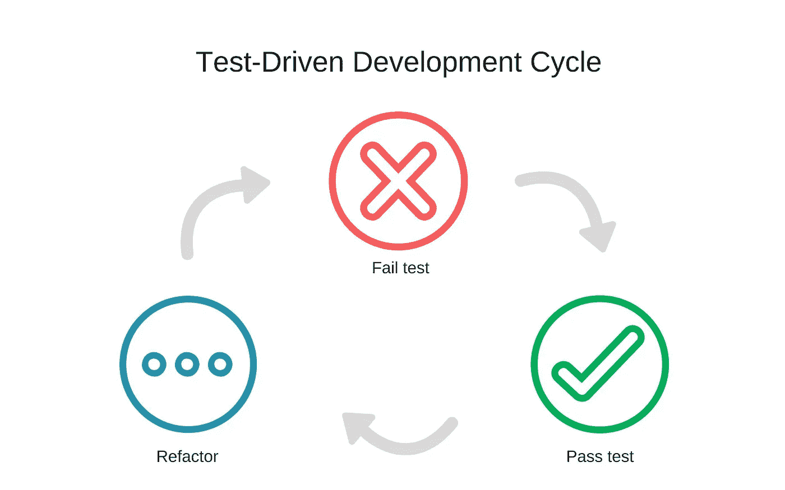

# 行为驱动开发和测试驱动开发

> 原文：<https://medium.com/swlh/behavior-driven-development-and-test-driven-development-ef9f406db542>

测试驱动开发(或 TDD)是一种软件开发，它使用开发人员编写的一系列测试来确认软件是否正常运行。

在 TDD 中，开发人员从一个目标开始，然后在编写任何代码之前，编写定义期望的代码，为了实现该目标，需要满足这些期望。在…之后