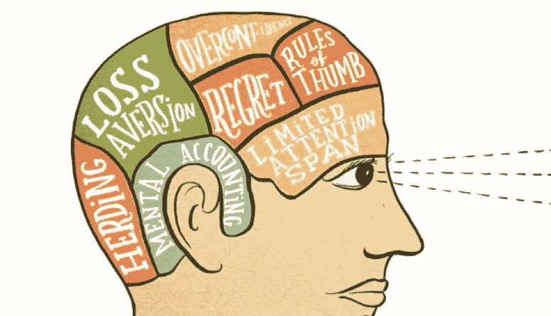
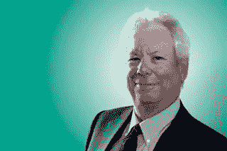
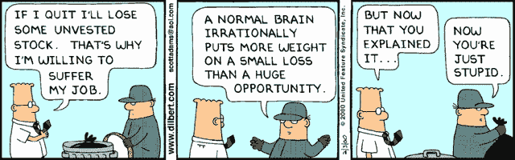
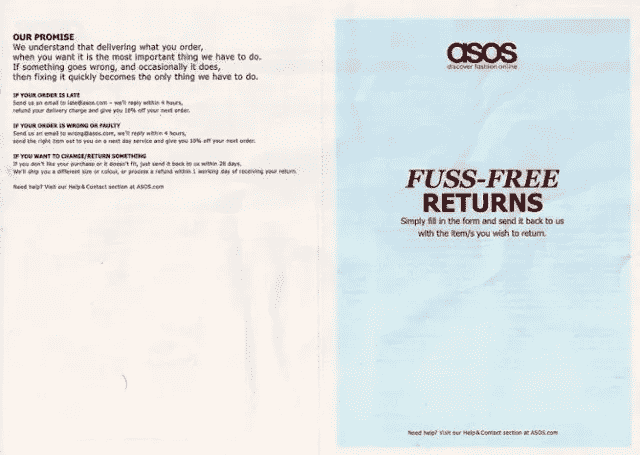
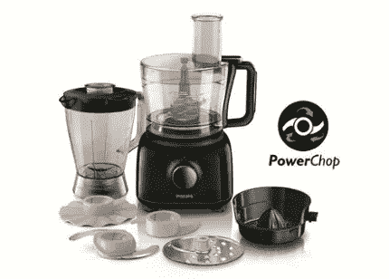
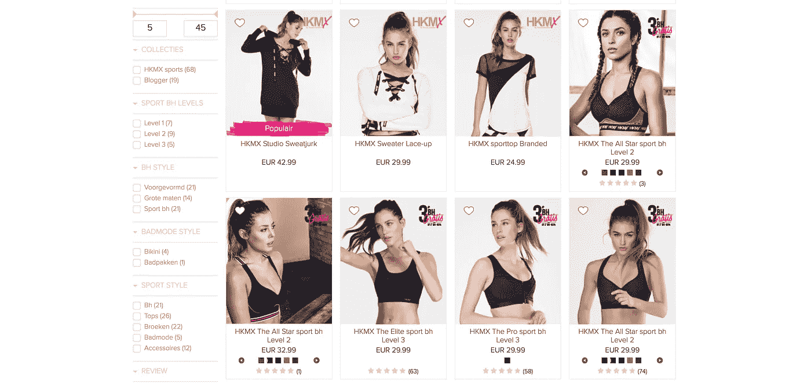

# 更有说服力营销的行为经济学方法

> 原文：<https://medium.com/swlh/behavioral-economics-approaches-for-more-persuasive-marketing-c5888dd70d19>

行为经济学在说服性营销中起着重要的作用。学习这种交易的技巧可能是你策略中改变游戏规则的因素。从禀赋效应到心理核算和推动，我们将涵盖这些如何与你的营销工作相关！

但是在我们开始之前，这里有一个让这些理论成为现实的人的简介。

理查德·塞勒是行为经济学的先驱之一。与丹尼尔·卡内曼和阿莫斯·特沃斯基等人一样，泰勒是最早将人类行为引入经济学世界的人之一。

通过这样做，消费者心理学和经济学研究领域都得出了一些突破性的结论。2017 年，他因在这一领域的工作获得了诺贝尔奖。

行为经济学家多年来一直在实施这些策略。但是谁说你不能在你的营销计划中做同样的事情呢？

让我们言归正传，理查德·塞勒最大的贡献是，你可以用它来让你的营销更有说服力。

# 1.禀赋效应

禀赋效应是损失厌恶和[现状偏差](https://www.behavioraleconomics.com/resources/mini-encyclopedia-of-be/status-quo-bias/)的延伸。在[前景理论](https://www.invespcro.com/blog/prospect-theory/)中解释的损失厌恶是证明个体非理性的最初理论。它发现，当一个人要在几个选择中做出选择时，他们会避免损失并确保胜利，因为损失的痛苦远比同等收益的满足感更有影响力。

但由于这是一个复杂的理论，我们将重点放在泰勒的贡献上，我将用最简单的话来说:人们避免损失的积极性远远高于他们寻求收益的积极性。

另一方面，现状偏见是人类的偏见，个人努力保持事物的现状，即保持现状。这种偏见解释了为什么个人会选择一个默认选项，而不是处理一个偏离未知的选项带来的变化。

为了将这些假设结合在一起，泰勒提出了禀赋效应。这一效应解释了当一个人拥有一件物品时，他们会赋予它更多的情感价值，而不是实际的经济价值。例如:

> 想象一下，你为€75 买了一把椅子放在你的客厅里。把它放在你家几天后，一个朋友会过来。她喜欢这把椅子，并提出以€200 英镑的价格购买。你拒绝了，即使你只付了不到一半的钱。

在这种情况下，以及许多类似的情况下，你拒绝在椅子上赚钱，因为失去椅子的情感价值的想法太难以承受了。短短几天后，你变得如此习惯于拥有这件物品，以至于你不再愿意通过赠送来改变“现状”。

# 营销应用

那么，如何将人类行为的这一要素落实到你的营销策略中呢？有几种方法可以做到这一点。一个相对标准的零售方式是在你的在线营销中提供无争议、免费的退货。

*ASOS return form*

ASOS 在这方面做得很好。在整个销售周期中，ASOS 宣传退货的便利性。当有人从网上商店购买了一件商品，并收到包裹内的预付退货袋时，这种说法就成立了。

消费者意识到，如果他们不喜欢某件商品，他们可以随时退货，因此在最初购买时看到的风险较小，有效地将他们的损失降至最低，从而确保了胜利。但是，当他们收到商品并声称对其拥有所有权时，与他们刚刚在商店试穿相比，他们可能更难退货。

捐赠效应也可以在网飞的免费试驾或汽车经销商的试驾等产品和服务中看到。最终，我们的目标是从一开始就让消费者产生一种拥有感，这样他们就更难放弃。

# 2.心理会计

1985 年，泰勒在其开创性的研究《心理账户和消费者选择》中挑战了经济学的传统方法。正是在这篇具有里程碑意义的文献中，他拒绝了许多将消费者视为理性效用最大化者的经典经济理论，并揭示了最终演变为推动理论的东西。

泰勒用几个场景打开了这件作品。其中一个姿势是:

*L 先生和夫人以及 H 先生和夫人去西北部钓鱼，钓到了一些鲑鱼。他们把鱼打包，用飞机送回家，但是鱼在运输途中丢失了。他们从航空公司收到 300 美元。这对夫妇拿了钱，出去吃饭，花了 225 美元。他们以前从未在餐馆花过那么多钱。*

根据你的背景，这种情况可能会令人惊讶(也就是经济学家)，或者看起来很直观(也就是我们其他人)。但是，你看，这种行为违背了消费者的经济人观点。如果消费者以理性效用最大化的方式行事，他们会将收入视为一笔总收入，而不会贴上标签。

“个人将更有可能把钱花在他们通常不会花的东西上。”

泰勒认为，事实上，夫妇们确实通过把这笔钱放入“意外收入”和“食物成本”的心理账户中，给这笔不明款项贴上了标签。他们觉得这笔钱可以用来“犒劳自己”,因为之前没有计划也没有预算。如果这笔钱是通过加薪提供的，那么这种铺张浪费的理由就不会*觉得*合理了。

这个例子表明，与意外收入相关的行为与固定收入非常不同。个人不会把他们的钱看成一个大池子；相反，他们设定与他们的目标相关的心理账户。

因此，当一笔额外的收入一次性收到，而不是分散在一段时间里，个人将更有可能把钱花在他们通常不会花的东西上。这种模式凸显了[框定](https://www.pagewiz.com/blog/online-marketing/framing-effect)的重要性，因为这可以改变花钱或收钱的方式。

# 营销应用

为了证明心理账户的相关性，让我给你讲一个个人轶事。几年前，我想给我的搭档买一台食品加工机作为生日礼物。我为此制定了一个€100 的预算。

在搜索了各种比较网站寻找最佳选择后，我把它缩小到两个选择。两者都在€100 左右，具有相同的评级和感知质量。最终的决定因素是，有了其中一个选项，我将获得€30 的回扣。因此给了我额外的€30 英镑，我可以自由支配。

这个折扣成为我购买的额外动力，并且让我更加满意。这种效应也导致了更积极的品牌联想和质量认知。最后，我觉得我得到了最好的交易，没有损害质量。如果最初的价格是€70，我可能不会认为它具有与其他选择相同的质量水平。然而，事后看来，我发现自己只是聪明框架的另一个受害者。

# 3.推动

这种心理账户的思想和框架的方法导致了泰勒对营销人员最有影响力的贡献。泰勒和桑斯坦在他们的书《推动:改善关于健康、财富和幸福的决定》中把推动定义为:

*选择架构的任何方面，以可预测的方式改变人们的行为，而不禁止任何选择或显著改变他们的经济激励。如果仅仅算一次推动，这种干预必须容易避免且成本低廉。*

用通俗的语言来说，这是指一种微妙的推动，旨在以一种个体没有意识到的方式改变一个人的行为。轻推并不禁止期权或使用明显的激励措施。相反，他们只是“轻推”人们到他们喜欢的方向，帮助他们做出更好的选择。

轻推并不局限于一种特定的方式，它可以发生在各种环境中，从杂货店和[自助餐厅](https://foodpsychology.cornell.edu/discoveries/nudging-lunchroom)到[网上商店](https://blog.crobox.com/article/persuasive-design-bfm)和广告。

# 营销应用

Crobox 的软件使用轻推来减少选择超载，并在销售漏斗中移动个人。为此，我们在整个客户旅程中使用智能标签和通知，巧妙地将网店访问者推向下一步。就像你在上面的照片中看到的，其中一个项目被突出显示为受欢迎。

这种轻推最适合那些易受[社会证明原则](https://blog.crobox.com/article/social-proof)影响的人，会促使浏览者点击该项目。在此之后，会有其他通知被发现对产品详情页面上容易受到社交证明影响的个人有吸引力。

这种微妙的推动使个人能够更轻松地处理选择过多的问题，而不会感到他们被迫以某种方式行事。结果是更积极的客户体验和更高的网店优化(双赢！).

# 我们做到了！

正如你所看到的，理查德·塞勒对行为科学的影响是巨大的。他的发现继续塑造着健康、经济和商业战略(就像我们自己的一样)，并迫使个人从更人性化的角度来看待结果。意识到这些原则可以帮助你成为一个更精明的营销者和一个更有意识的消费者。

*想进一步了解我们如何在产品中运用这些理论吗？* [*查看我们的白皮书！*](https://blog.crobox.com/persuasive-personalization-wp) *。*

*原载于 blog.crobox.com***。**

**

## *这篇文章发表在 [The Startup](https://medium.com/swlh) 上，这是 Medium 最大的创业刊物，有+411，714 人关注。*

## *订阅接收[我们的头条](http://growthsupply.com/the-startup-newsletter/)。*

**