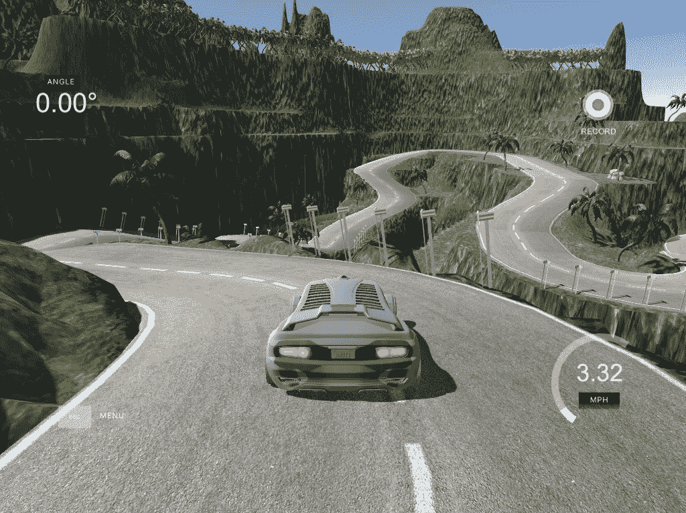

# 行为克隆——自动驾驶汽车的端到端学习。

> 原文：<https://medium.com/swlh/behavioural-cloning-end-to-end-learning-for-self-driving-cars-50b959708e59>

行为克隆实际上就是克隆司机的行为。该想法是基于来自驾驶员驾驶的训练数据来训练卷积神经网络(CNN)以模仿驾驶员。NVIDIA 发布了一篇[论文](https://images.nvidia.com/content/tegra/automotive/images/2016/solutions/pdf/end-to-end-dl-using-px.pdf)，其中他们训练 CNN 将单个前置摄像头的原始像素直接映射到转向命令。令人惊讶的是，结果非常强大，因为汽车…