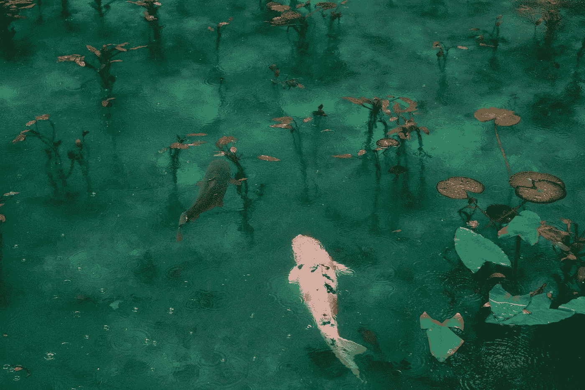

# 看哪，活生生的世界！

> 原文：<https://medium.com/swlh/behold-the-living-world-2781d3f8c9d>

## 自然常常被定义为人类思想和观念的产物。生物世界还大自然应有的权威。

Photo by [Sora Sagano](https://unsplash.com/@s_sagano?utm_source=medium&utm_medium=referral) on [Unsplash](https://unsplash.com?utm_source=medium&utm_medium=referral)

最近我一直在读乔治·蒙比尔特的优秀散文集 [*我们是如何陷入这种困境的？*](https://www.monbiot.com/2017/08/01/how-did-we-get-into-this-mess-2/) 这本书里的一句话——确切地说是一个短语——打动了我，所以我决定写下它。