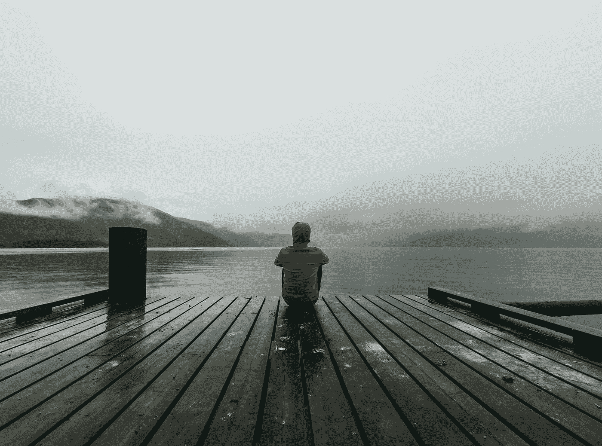

# 孤独和寂寞

> 原文：<https://medium.com/swlh/being-alone-and-loneliness-168f1139a032>

## INFJ 的祝福和诅咒

Photo by [Fabrizio Verrecchia](https://unsplash.com/@fabrizioverrecchia?utm_source=medium&utm_medium=referral) on [Unsplash](https://unsplash.com?utm_source=medium&utm_medium=referral)

今天我醒来时非常难过。事实上，令人不安的是。我无论如何也摆脱不了这种感觉。我通常很擅长在困难的情况下保持镇静。我也获得了一种能力，将自己从一种情绪中分离出来，客观地看待它，从而找到它积极的一面，并专注于此。不要误会我…