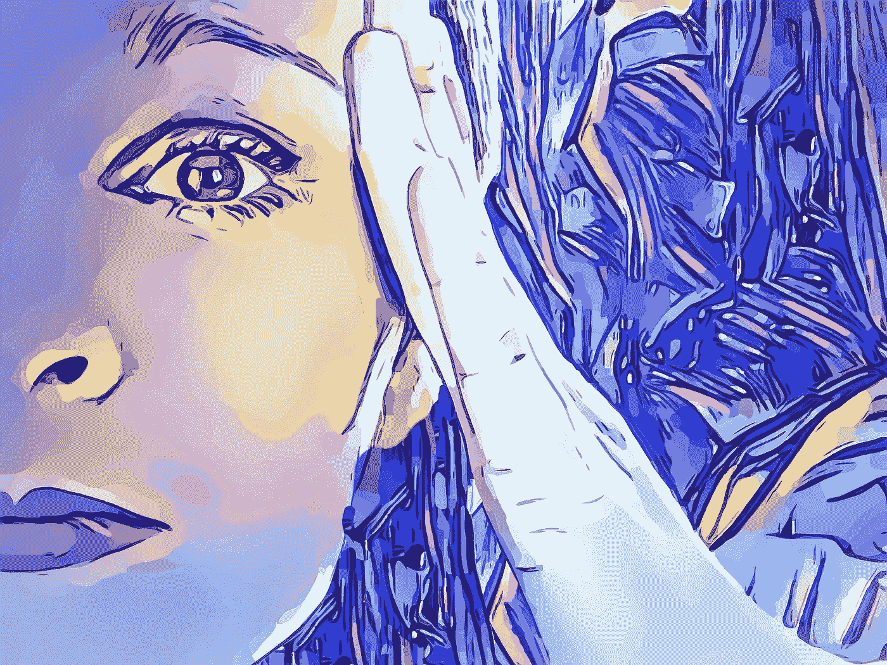

# 做一个情绪内向的人:真的很糟糕吗？

> 原文：<https://medium.com/swlh/being-an-emotional-introvert-does-it-really-suck-fe289b26909>

## 因为你不仅仅是反社会的，你是一个随时准备爆发的情绪大袋

Image by [Prettysleepy2](https://pixabay.com/users/Prettysleepy2-2973588/?utm_source=link-attribution&utm_medium=referral&utm_campaign=image&utm_content=3275328) from [Pixabay](https://pixabay.com/?utm_source=link-attribution&utm_medium=referral&utm_campaign=image&utm_content=3275328)

你有没有让你的朋友惊讶于你独自思考了一个晚上却没有和任何人讨论就做出的轻率决定或超凡脱俗的结论，以至于他们不知道这是从哪里来的？是的，你是一个…