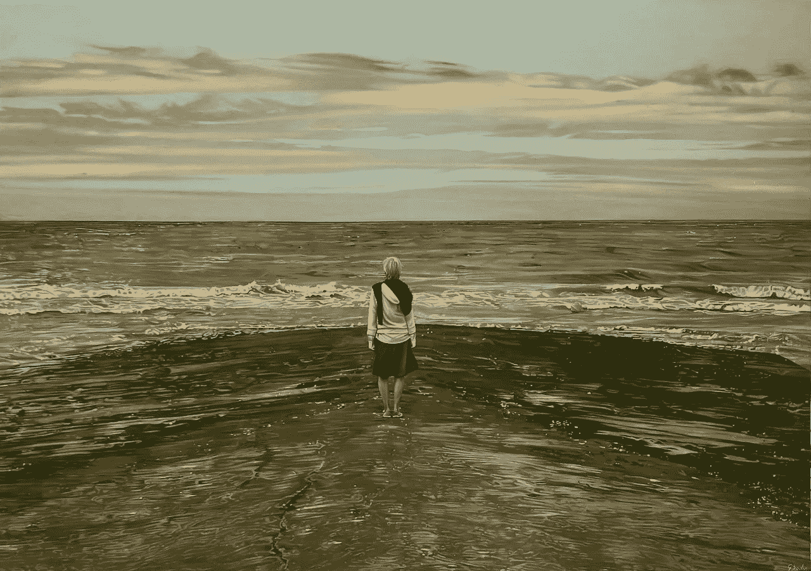

# 在外向的世界里做一个内向的人

> 原文：<https://medium.com/swlh/being-an-introvert-in-an-extrovert-world-4c11e887186e>

By Hyperreal — Own work, CC BY-SA 4.0, [https://commons.wikimedia.org/w/index.php?curid=62754304](https://commons.wikimedia.org/w/index.php?curid=62754304)

> “我们的文化把只做外向的人作为一种美德。我们不鼓励内心的旅程，对中心的追求。所以我们失去了我们的中心，必须重新找到它。”~Anais Nin

我们在本质上和性情上是什么样的人是我们成为什么样的人的根本基础。在这个“成为”的过程中，生活的变迁经常让我们偏离真实的自我。在核心层，这…