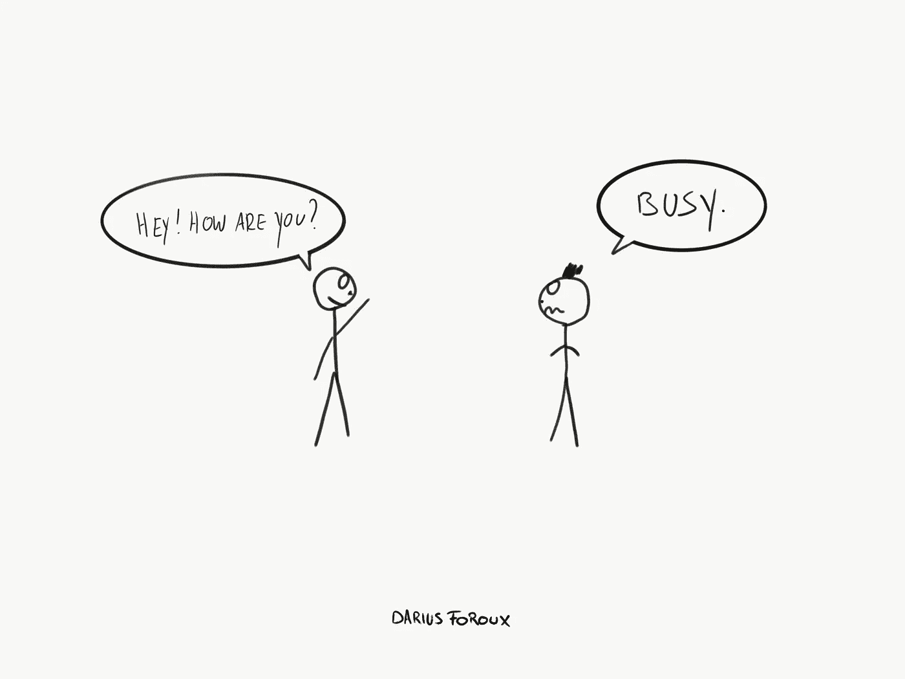

# “忙碌”并不意味着你成功了

> 原文：<https://medium.com/swlh/being-busy-doesn-t-mean-you-re-successful-57f54461ddcf>

你知道那种忙得时间一眨眼就过去的感觉吗？我们忙于各种各样的事情——工作、朋友、外出、度假等等。但是忙一点都不是好事。

尤其是因为我们把大部分时间浪费在无意义的事情上。我们说我们很忙，但事实上，我们的生活充满了垃圾。